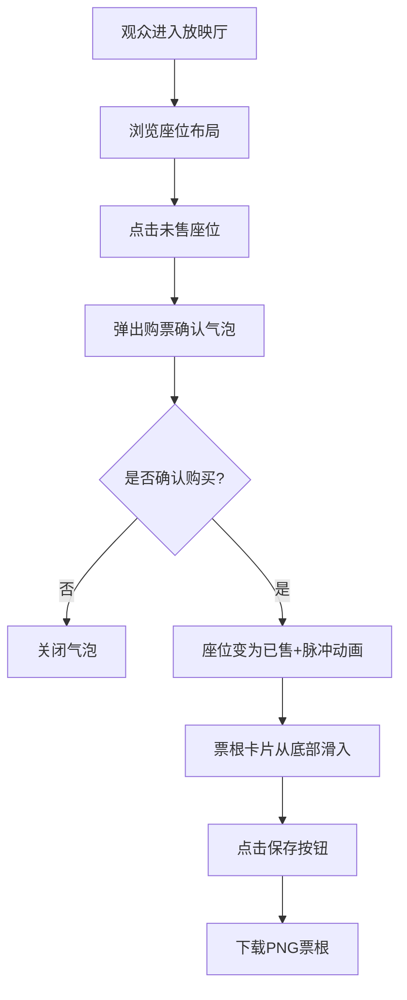

## 1. 产品概述

虚拟放映厅是一个面向小型私人影院运营者的浏览器应用，用于构建沉浸式的虚拟放映厅并实现在线选座购票功能。

- 解决传统选座页面枯燥、缺乏沉浸感和影院氛围的问题
- 运营者可像布置真实影院一样拖拽设计座位布局，观众能在虚拟放映厅中选座购票并获得虚拟票根

## 2. 核心功能

### 2.1 用户角色

| 角色 | 注册方式 | 核心权限 |
|------|----------|----------|
| 运营者 | 无需注册 | 编辑座位布局、管理座位状态、配置放映信息 |
| 观众 | 无需注册 | 浏览放映厅、选座购票、获取票根 |

### 2.2 功能模块

1. **座位布局编辑器**：网格画布、拖拽添加/删除座位、批量复制、平移缩放
2. **放映厅浏览与选座**：银幕墙展示、座位渲染、行号标签、购票确认气泡
3. **虚拟票根生成**：票根卡片渲染、动画展示、PNG下载功能

### 2.3 页面详情

| 页面名称 | 模块名称 | 功能描述 |
|----------|----------|----------|
| 布局编辑器 | 工具栏 | 拖拽添加座位、删除座位、批量选择复制 |
| 布局编辑器 | 网格画布 | 座位矩阵渲染、平移缩放、碰撞检测 |
| 放映厅页面 | 银幕墙 | 弧形渐变背景、金色装饰边线 |
| 放映厅页面 | 座位区域 | 行号标签、座位状态显示、点击交互、脉冲动画 |
| 放映厅页面 | 购票气泡 | 座位号、票价、确认按钮、毛玻璃效果 |
| 票根弹窗 | 票根卡片 | 电影信息、场次、座位号、渐变色二维码、斜条纹纹理 |
| 票根弹窗 | 保存功能 | 下载PNG图片 |

## 3. 核心流程

### 运营者编辑流程
运营者进入编辑器 → 在画布上拖拽添加座位 → 选择矩形或扇形排布 → 右键删除/ctrl+多选批量复制 → 平移缩放调整视图 → 完成布局

### 观众购票流程
观众进入放映厅 → 浏览座位布局 → 点击未售座位 → 弹出购票确认气泡 → 确认购买 → 座位脉冲动画变为已售 → 票根卡片滑入展示 → 点击保存下载票根

## 4. 用户界面设计

### 4.1 设计风格

- **主色调**：暗色调影院主题，主背景 `#0F0F23`
- **主色按钮**：`#E94560`，悬停 `#FF6B6B`，点击缩小0.95倍
- **座位颜色**：未售 `#2D2D44`、已售 `#E94560`、预留 `#FFB347`
- **装饰色**：银幕边线 `#FFD700`
- **字体**：现代无衬线字体，行号12px颜色 `#888`
- **布局**：居中最大宽度1200px，座位区域背景 `#1A1A2E`，过道 `#2A2A44` 宽40px
- **动画**：fade-in 200ms、脉冲400ms弹性缓动、票根滑入300ms ease-out

### 4.2 页面设计概述

| 页面名称 | 模块名称 | UI元素 |
|----------|----------|--------|
| 布局编辑器 | 工具栏 | 左侧垂直工具栏、图标按钮、操作提示 |
| 布局编辑器 | 画布 | 网格背景、圆形座位色块、右键菜单 |
| 放映厅页面 | 银幕墙 | 顶部80%宽度、弧形渐变、#FFD700装饰边线 |
| 放映厅页面 | 座位区 | 左右过道、行号标签、圆形座位、脉冲动画 |
| 放映厅页面 | 购票气泡 | 200px宽、圆角12px、毛玻璃rgba(255,255,255,0.15) |
| 票根弹窗 | 票根卡片 | 280x160px、#2D2D44斜条纹、logo占位、渐变色二维码 |
| 全局 | 版权栏 | 底部40px高版权信息 |

### 4.3 响应式

- 桌面优先设计，最大宽度1200px居中显示
- 画布区域自适应容器高度
- 弹窗和气泡居中对齐

### 4.4 性能要求

- 座位数量≤500时，画布拖拽平移帧率≥30FPS
- 编辑模式下点击选座响应时间<100ms
