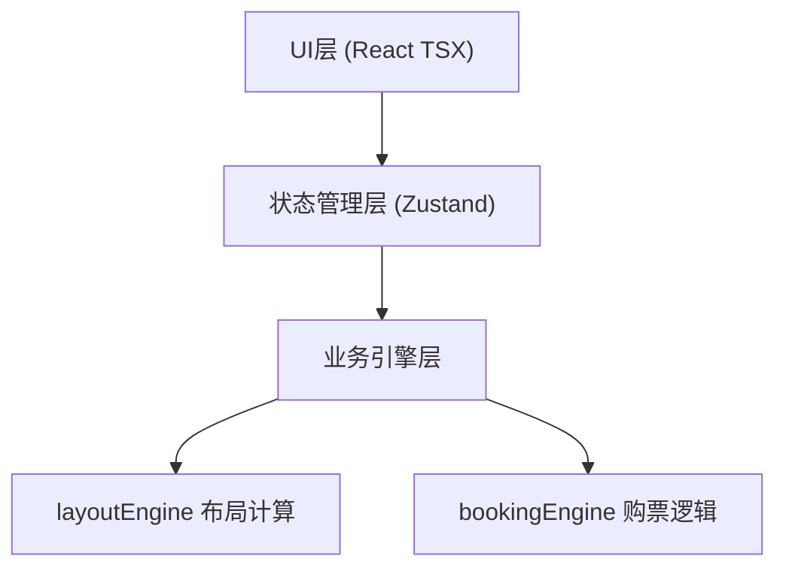

## 1. 架构设计



## 2. 技术描述

- **前端框架**：React 18 + TypeScript
- **构建工具**：Vite + @vitejs/plugin-react
- **状态管理**：Zustand
- **辅助库**：uuid（座位ID生成）
- **纯前端应用**：无后端服务，所有逻辑在浏览器端完成

## 3. 模块组织

| 路径 | 用途 |
|------|------|
| `src/engine/layoutEngine.ts` | 座位矩阵生成、拖拽平移、缩放、碰撞检测 |
| `src/engine/bookingEngine.ts` | 选座、购票确认、票根数据生成 |
| `src/ui/seatGrid.tsx` | 座位网格渲染、行号、银幕、交互事件绑定 |
| `src/ui/ticketCard.tsx` | 票根卡片渲染和保存功能 |
| `src/stores/theaterStore.ts` | 全局状态管理：座位列表、选中座位、购票状态 |
| `src/App.tsx` | 应用主入口，页面切换 |
| `src/main.tsx` | React挂载入口 |
| `src/index.css` | 全局样式和动画定义 |

## 4. 核心数据模型

```typescript
// 座位状态
type SeatStatus = 'available' | 'sold' | 'reserved';

// 座位数据
interface Seat {
  id: string;
  row: number;
  col: number;
  x: number;      // 画布坐标
  y: number;      // 画布坐标
  status: SeatStatus;
  price: number;
}

// 票根数据
interface TicketData {
  movieName: string;
  theaterNumber: string;
  showTime: string;
  seatNumber: string;
  seatId: string;
  orderId: string;
  purchaseTime: string;
}

// 画布视口
interface Viewport {
  offsetX: number;
  offsetY: number;
  scale: number;  // 0.5 ~ 2.0
}
```

## 5. 状态管理

Zustand Store 包含：
- `seats: Seat[]` - 座位列表
- `selectedSeatId: string | null` - 当前选中座位
- `viewport: Viewport` - 画布视口状态
- `mode: 'editor' | 'viewer'` - 当前模式
- `currentTicket: TicketData | null` - 当前生成的票根
- `showTicketModal: boolean` - 票根弹窗显示状态
- `showBookingPopup: boolean` - 购票气泡显示状态

Actions：
- `addSeat(row, col, x, y)` - 添加座位
- `removeSeat(id)` - 删除座位
- `batchAddSeats(seats)` - 批量添加座位
- `setViewport(viewport)` - 更新视口
- `selectSeat(id)` - 选中座位
- `confirmBooking(seatId)` - 确认购票
- `showTicket(ticket)` - 显示票根
- `hideTicket()` - 隐藏票根
- `toggleMode()` - 切换模式

## 6. 性能优化方案

1. **Canvas渲染或DOM虚拟化**：500+座位时采用高效渲染策略
2. **事件委托**：父容器统一处理座位点击事件，避免500+独立监听器
3. **requestAnimationFrame**：拖拽和平移动画使用rAF确保帧率
4. **CSS transform**：座位动画使用GPU加速属性
5. **Zustand selector**：组件只订阅需要的状态片段，避免不必要重渲染
