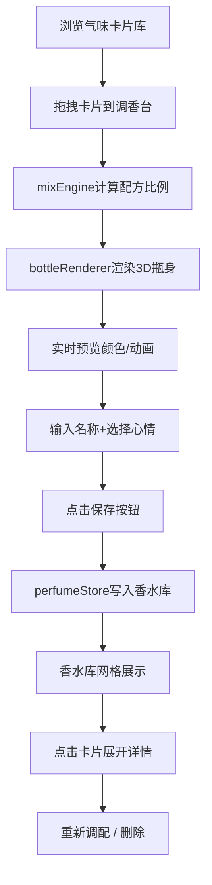

## 1. 产品概述

气味实验室是一款交互式虚拟调香Web应用，用户通过拖拽气味卡片在调香台上混合配方，实时预览3D动态香水瓶效果，保存个性化香水作品并管理个人香水库。

- 核心目标：为用户提供沉浸式、视觉化的虚拟调香体验，将抽象的气味概念转化为可触摸、可调配的视觉交互
- 目标用户：香水爱好者、创意工作者、追求个性化体验的年轻群体

## 2. 核心功能

### 2.1 功能模块清单

1. **主调香界面**：左侧调香台区域 + 右侧3D预览区
2. **气味卡片库**：水平可滚动的气味卡片，支持拖拽、悬停详情
3. **配方管理面板**：配方列表、比例显示、单项移除、整体重置
4. **3D香水瓶预览**：CSS 3D瓶身、液体颜色渐变、浮动动画、微光粒子、点击放光
5. **香水保存**：名称输入、心情标签选择、保存交互反馈
6. **个人香水库**：网格卡片浏览、悬停效果、展开详情、重新调配、删除

### 2.2 页面详情

| 页面名称 | 模块名称 | 功能描述 |
|-----------|-------------|---------------------|
| 主界面 | 气味卡片库 | 水平滚动展示4种气味卡片（花香、木质、柑橘、海洋），60x60px尺寸，悬停300ms弹出毛玻璃工具卡片显示描述 |
| 主界面 | 调香台面板 | 占左侧区域2/3，接受拖拽卡片，释放时500ms bounce弹性动画嵌入，显示配方列表 |
| 主界面 | 配方列表 | 每项显示气味名称+浅灰进度条（8px高，圆角4px）表示比例，右侧圆形红底白叉移除按钮（200ms缩小淡出） |
| 主界面 | 总比例控制 | 总比例渐变色进度条（10px高）+ 重置文本按钮 |
| 主界面 | 3D香水瓶预览 | CSS 3D变换模拟瓶身瓶盖，液体3s上下浮动，右侧微光粒子2s闪烁，点击800ms放光动画 |
| 主界面 | 保存区域 | 名称输入框（聚焦主色边框）+ 心情标签下拉（4种心情配颜色圆点）+ 保存按钮（按压+成功对勾提示） |
| 香水库 | 网格卡片列表 | 两列网格，220x280px卡片，渐变背景+阴影，悬停阴影加深位移 |
| 香水库 | 卡片详情展开 | 点击展开至420px高（300ms ease-out），显示完整配方、重新调配、删除按钮 |

## 3. 核心流程

### 3.1 调香与保存流程

用户从气味卡片库拖拽卡片到调香台面板，系统自动计算各气味比例并实时更新3D香水瓶颜色和液体效果。用户输入名称与心情标签后保存作品至香水库，可浏览、展开详情、重新调配或删除。

## 4. 用户界面设计

### 4.1 设计风格

- **主色调**：优雅紫 #6C5CE7（品牌色/按钮），暖米白 #F8F6F3（调香台背景），浅灰 #FAFAFA（预览区）
- **气味主题色**：花香 #F4A7A7、木质 #A0B2A0、柑橘 #F7D794、海洋 #8EC8E8
- **心情主题色**：宁静 #A8D8A8、兴奋 #FFB3B3、忧郁 #A0C4E8、优雅 #D4A8D4
- **按钮风格**：圆角为主（调香台20px、面板16px、卡片12px），保存按钮带按压scale效果
- **字体**：正文选用优雅无衬线字体，卡片文字12px，香水名称16px粗体
- **布局**：左右分栏（左侧调香台500px + 右侧预览400px），下方两列网格香水库
- **动效**：CSS transition/animation为主，bounce弹性嵌入、缩放淡出、液体浮动、微光闪烁、放光脉冲

### 4.2 页面设计概览

| 页面名称 | 模块名称 | UI元素 |
|-----------|-------------|-------------|
| 主界面 | 调香台 | 500px宽，#F8F6F3背景，20px圆角，1px #E0D8CC边框 |
| 主界面 | 气味卡片 | 60x60px，12px圆角，按气味类型着色，#333文字12px |
| 主界面 | 悬停工具卡 | 3D毛玻璃效果，300ms ease-in-out过渡 |
| 主界面 | 调香台面板 | 2/3区域，#FFFFFF背景，16px圆角，drop阴影 |
| 主界面 | 配方进度条 | 8px高，4px圆角，#E8E8E8背景，填充色对应气味 |
| 主界面 | 移除按钮 | 圆形红底白叉，直径24px |
| 主界面 | 总比例条 | 10px高，5px圆角，配方渐变色 |
| 主界面 | 预览区 | 400px宽，#FAFAFA背景，20px圆角 |
| 主界面 | 3D瓶身 | 透明玻璃，高200px宽80px，8px圆角，1px #CCC边框 |
| 主界面 | 瓶盖 | 金属渐变#C0C0C0→#A0A0A0，高30px，4px圆角 |
| 主界面 | 微光粒子 | 径向渐变，透明度0.3-0.6循环，2s周期 |
| 主界面 | 保存按钮 | #6C5CE7底色，白字，10px圆角，悬停#7B6FEF，按压scale 0.95 100ms |
| 香水库 | 卡片 | 220x280px，#E8E8E8→#FFF渐变，底部15px阴影，悬停y+10px blur20px |
| 香水库 | 展开卡片 | 高度420px，300ms ease-out过渡 |

### 4.3 响应式设计

- 桌面优先设计，最小支持1280px宽度
- 调香台+预览区水平排列（约900px），下方香水库两列（约500px含边距）
- 整体容器居中，预留左右padding

### 4.4 性能要求

- 所有拖拽操作和动画FPS保持55以上
- 优先使用CSS transform/opacity动画（GPU加速）
- 避免频繁重排重绘，液体和粒子动画使用transform
- Zustand状态更新最小化，避免不必要的组件重渲染
