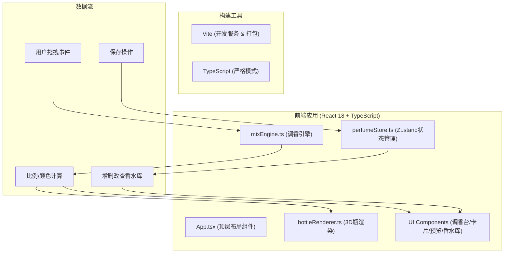

## 1. 架构设计



## 2. 技术栈描述

- **前端框架**：React@18 + ReactDOM@18
- **开发语言**：TypeScript@5（严格模式 strict: true）
- **构建工具**：Vite@5 + @vitejs/plugin-react
- **状态管理**：Zustand@4
- **工具库**：uuid（生成香水唯一ID）
- **CSS方案**：原生CSS + CSS Modules（组件级样式隔离）
- **3D实现**：纯CSS 3D Transform（无需three.js，轻量高性能）

## 3. 核心模块职责

| 模块 | 文件路径 | 职责 |
|------|----------|------|
| 调香引擎 | src/engine/mixEngine.ts | 计算配方比例、生成液体渐变色、总比例校验、辅助工具函数 |
| 状态管理 | src/stores/perfumeStore.ts | 气味库数据、用户香水库CRUD、当前调香台配方状态 |
| 3D渲染 | src/renderer/bottleRenderer.ts | CSS 3D瓶身JSX生成、动画控制函数（浮动/放光/粒子） |
| 顶层组件 | src/App.tsx | 左右分栏布局、组装调香台+预览+香水库、事件绑定 |

## 4. 数据模型定义

### 4.1 核心类型

```typescript
// 气味类型枚举
type ScentType = 'floral' | 'woody' | 'citrus' | 'ocean';

// 心情类型枚举
type MoodType = 'calm' | 'excited' | 'melancholy' | 'elegant';

// 气味卡片定义
interface ScentCard {
  id: string;
  type: ScentType;
  name: string;
  description: string;
  color: string;        // 卡片背景色
  liquidColor: string;  // 液体主色
}

// 配方项
interface FormulaItem {
  id: string;           // 实例ID（uuid）
  scentId: string;      // 关联ScentCard.id
  type: ScentType;
  name: string;
  color: string;
  liquidColor: string;
  ratio: number;        // 占比例 0-100
}

// 香水作品
interface Perfume {
  id: string;           // uuid
  name: string;
  mood: MoodType;
  formula: FormulaItem[];
  gradientColors: string[];  // 派生：液体渐变颜色数组
  createdAt: number;
}

// 调香引擎输出
interface MixResult {
  formula: FormulaItem[];
  totalRatio: number;
  gradient: string;     // CSS linear-gradient字符串
  dominantColor: string;
}
```

### 4.2 Zustand Store 接口

```typescript
interface PerfumeStore {
  // 气味库
  scentLibrary: ScentCard[];
  
  // 当前调香台配方
  currentFormula: FormulaItem[];
  
  // 用户香水库
  perfumeLibrary: Perfume[];
  
  // Actions
  addScentToFormula: (scent: ScentCard) => void;
  removeFromFormula: (formulaItemId: string) => void;
  resetFormula: () => void;
  
  addPerfume: (data: { name: string; mood: MoodType }) => void;
  removePerfume: (perfumeId: string) => void;
  updatePerfume: (perfumeId: string, patch: Partial<Perfume>) => void;
  getPerfumeList: () => Perfume[];
  
  loadPerfumeToFormula: (perfumeId: string) => void;  // 重新调配
}
```

## 5. 调香引擎算法 (mixEngine.ts)

- **比例均等分配**：每次新增卡片，所有配方项比例重新均分（n项各 100/n %）
- **移除重算**：移除某项后，剩余项重新均分
- **渐变生成**：按配方顺序 + 比例权重生成 linear-gradient 多色值
- **主色提取**：取比例最高项的 liquidColor 作为微光粒子主色

## 6. 构建配置

### vite.config.js
- 使用 @vitejs/plugin-react
- 默认端口 5173
- 输出目录 dist

### tsconfig.json
- strict: true
- target: ESNext
- module: ESNext
- jsx: react-jsx
- moduleResolution: bundler
- skipLibCheck: true

## 7. 文件结构

```
auto164/
├── package.json
├── index.html
├── tsconfig.json
├── vite.config.js
└── src/
    ├── App.tsx
    ├── engine/
    │   └── mixEngine.ts
    ├── stores/
    │   └── perfumeStore.ts
    ├── renderer/
    │   └── bottleRenderer.tsx
    └── components/
        ├── ScentCardLibrary.tsx
        ├── PerfumeMixingPanel.tsx
        ├── BottlePreview.tsx
        ├── SavePerfumeForm.tsx
        └── PerfumeLibraryGrid.tsx
```

## 8. 性能优化策略

1. **CSS动画GPU加速**：液体浮动、粒子闪烁使用transform而非top/left
2. **will-change提示**：瓶身、液体、粒子元素加will-change: transform
3. **Zustand选择器**：组件使用store selector精确订阅所需状态，避免全量重渲染
4. **React.memo**：纯展示组件（ScentCard、PerfumeCard）包裹memo
5. **拖拽优化**：dragover事件节流或使用passive监听器
6. **动画合成层**：关键动画元素独立合成层，减少重排
