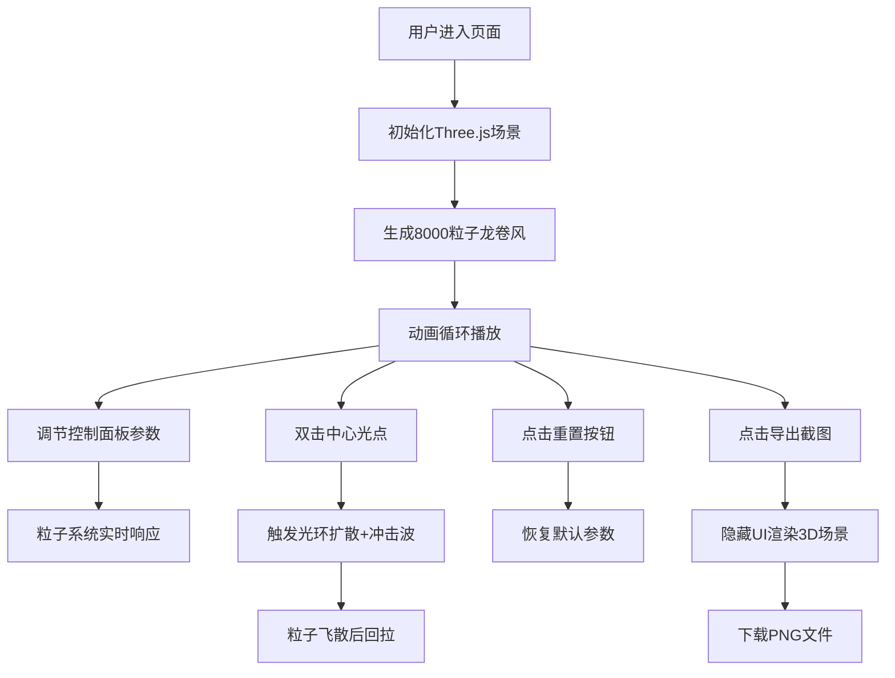

## 1. 产品概述
风暴调音台是一个基于Three.js的3D粒子风暴交互式演示应用，让用户像操控微型气象站一样观察和改变粒子风暴的形态与颜色。解决现有粒子特效演示工具参数调节方式单一、缺乏动态环境反馈和叙事感的问题。

- 目标用户：创意设计师、视觉艺术家、Three.js学习者、科技爱好者
- 产品价值：提供沉浸式、可交互的粒子特效体验，通过细腻的微交互和动态反馈创造叙事感

## 2. 核心功能

### 2.1 功能模块

| 模块名称 | 核心功能 |
|----------|----------|
| 3D粒子风暴系统 | 8000个粒子圆柱体分布、螺旋上升龙卷风形态、Z轴高度颜色渐变 |
| 控制面板 | 漩涡强度、粒子速度、粒子大小、环境风力滑块，背景色选择器 |
| 光点爆发交互 | 中心区域随机闪烁光点、双击触发光环扩散、300粒子冲击波效果 |
| 标题栏功能 | 重置按钮、PNG截图导出（隐藏UI） |
| 响应式适配 | 桌面端侧边面板、窄屏抽屉式面板 |

### 2.2 页面详情

| 页面名称 | 模块名称 | 功能描述 |
|----------|----------|----------|
| 主页面 | 3D场景渲染 | Three.js渲染粒子风暴，支持鼠标旋转视角 |
| 主页面 | 右侧控制面板 | 半透明毛玻璃面板，实时调节粒子参数 |
| 主页面 | 顶部标题栏 | 应用名称、重置按钮、导出截图按钮 |
| 主页面 | 中心光点交互 | 随机闪烁光点，双击触发爆发动画 |

## 3. 核心流程

用户进入页面 → 自动播放粒子风暴动画 → 调节控制面板滑块实时观察变化 → 双击中心闪烁光点触发爆发效果 → 点击重置恢复默认状态 → 点击导出保存场景截图

## 4. 用户界面设计

### 4.1 设计风格
- **主色调**：深空蓝 #0D0D1A（背景）、#1A1A2E（标题栏）、#4FC3F7 / #E57373 / #FFD54F（粒子渐变色）
- **强调色**：#00BCD4（导出按钮）、#444/#555（重置按钮）、#FFFFFF（滑块、光点）
- **字体**：等宽字体 'Courier New'，颜色浅灰 #E0E0E0
- **面板风格**：半透明毛玻璃 rgba(255,255,255,0.08)，圆角12px，发光边框 rgba(255,255,255,0.15)
- **交互反馈**：滑块悬停/拖拽微变化、按钮悬停变色、点击缩放效果

### 4.2 页面设计概述

| 页面名称 | 模块名称 | UI元素 |
|----------|----------|----------|
| 主页面 | 3D场景 | 全屏Canvas，圆柱体粒子风暴，中心闪烁光点 |
| 主页面 | 右侧控制面板 | 宽260px毛玻璃面板，4个滑块+颜色选择器，标签+数值显示 |
| 主页面 | 顶部标题栏 | 高56px深色背景，左侧应用名，右侧两个按钮 |
| 主页面 | 爆发动画 | 白色光环扩散（1.2秒），粒子冲击波飞散回拉（0.6秒ease-out） |

### 4.3 响应式设计
- **桌面端（≥1024px）**：右侧固定显示控制面板，宽260px
- **平板/窄屏（<1024px）**：控制面板折叠为右侧抽屉，点击展开/收起
- **最小支持**：1280x720分辨率
- **全屏适配**：100%填充视口，无滚动条

### 4.4 3D场景设计
- **环境**：深空背景 #0D0D1A，无额外光源（粒子自发光）
- **相机**：PerspectiveCamera，初始位置距离中心约25单位，可OrbitControls旋转
- **粒子系统**：BufferGeometry + ShaderMaterial，8000-12000粒子，GPU驱动动画
- **动画**：粒子螺旋上升运动，Z轴颜色渐变，参数变化平滑过渡
- **性能**：目标60FPS，12000粒子时性能下降≤20%
- **后处理**：轻微辉光效果增强视觉冲击力
