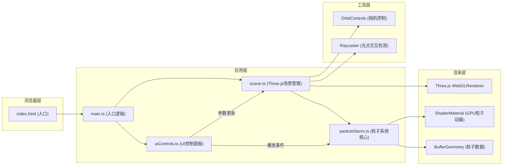

## 1. 架构设计



## 2. 技术描述

- **前端框架**：原生 TypeScript + Three.js（不使用React，保持轻量高性能）
- **构建工具**：Vite 5.x + @vitejs/plugin-basic-ssl
- **核心依赖**：
  - `three` ^0.160.0 - 3D渲染引擎
  - `typescript` ^5.3.0 - 类型安全
  - `vite` ^5.0.0 - 构建工具
  - `@types/three` ^0.160.0 - Three.js类型定义

## 3. 文件结构

```
auto165/
├── package.json          # 项目依赖和脚本
├── vite.config.js        # Vite配置（路径别名）
├── tsconfig.json         # TypeScript配置（严格模式）
├── index.html            # 入口HTML（全屏Canvas）
├── src/
│   ├── main.ts           # 应用入口（初始化各模块）
│   ├── scene.ts          # Three.js场景、相机、渲染器
│   ├── particleStorm.ts  # 粒子系统核心逻辑
│   └── uiControls.ts     # UI控制面板和交互
└── .trae/documents/      # 项目文档
```

## 4. 核心数据结构

### 4.1 粒子参数接口

```typescript
interface ParticleParams {
  vortexStrength: number;    // 漩涡强度 0.0-2.0
  particleSpeed: number;     // 粒子速度 0.5-5.0
  particleSize: number;      // 粒子大小 0.1-0.8
  windForce: number;         // 环境风力 -1.0-1.0
  backgroundColor: string;   // 背景色
}
```

### 4.2 粒子数据结构

```typescript
interface ParticleData {
  basePosition: Float32Array;   // 初始位置 (x,y,z) * 粒子数
  currentOffset: Float32Array;  // 当前偏移量 (用于冲击波)
  colors: Float32Array;         // 颜色值 (r,g,b) * 粒子数
  angles: Float32Array;         // 旋转角度
  heights: Float32Array;        // 高度值 (用于颜色渐变)
  shockwavePhase: Float32Array; // 冲击波相位 (-1=未受影响, 0-1=动画中)
}
```

### 4.3 光点数据结构

```typescript
interface FlarePoint {
  mesh: THREE.Points;
  position: THREE.Vector3;
  flickerPhase: number;
  isActive: boolean;
}
```

## 5. 核心算法

### 5.1 粒子生成算法

1. 在圆柱体空间（半径15，高度8）内随机分布8000个粒子
2. 每个粒子计算：
   - 极坐标角度：`angle = Math.random() * Math.PI * 2`
   - 半径：`radius = Math.sqrt(Math.random()) * 15`
   - 高度：`height = Math.random() * 8 - 4`（中心在原点）
   - 转换为笛卡尔坐标

### 5.2 螺旋上升动画

每帧更新：
```
angle += vortexStrength * particleSpeed * deltaTime
height += particleSpeed * deltaTime * 0.5
if height > 4: height = -4  // 循环回到底部
x = radius * cos(angle) + windForce * height
y = height
z = radius * sin(angle)
```

### 5.3 颜色渐变算法

根据Z轴高度（-4到4）在三色间渐变：
- 底部（-4 ~ -1）：#4FC3F7 → #E57373
- 中部（-1 ~ 2）：#E57373 → #FFD54F
- 顶部（2 ~ 4）：#FFD54F → 保持

### 5.4 冲击波动画（ease-out曲线）

```typescript
function easeOut(t: number): number {
  return 1 - Math.pow(1 - t, 3);
}

// 冲击波相位 0-0.4 向外飞散, 0.4-1.0 回拉
if (phase < 0.4) {
  const t = phase / 0.4;
  offset = direction * easeOut(t) * maxDistance;
} else {
  const t = (phase - 0.4) / 0.6;
  offset = direction * maxDistance * (1 - easeOut(t));
}
```

## 6. 性能优化策略

1. **GPU驱动动画**：使用ShaderMaterial在顶点着色器中计算粒子位置
2. **BufferGeometry**：使用单个BufferGeometry存储所有粒子数据，减少draw call
3. **Frustum Culling**：禁用粒子系统的视锥体剔除（alwaysVisible）
4. **对象池**：光点和光环对象复用，避免频繁创建销毁
5. **节流更新**：UI参数变化使用requestAnimationFrame批量更新
6. **降采样**：截图时可临时降低分辨率提高导出速度

## 7. 关键模块职责

### 7.1 scene.ts
- 初始化Scene、PerspectiveCamera、WebGLRenderer
- 创建OrbitControls允许用户旋转视角
- 管理动画循环（requestAnimationFrame）
- 处理窗口resize事件
- 提供参数更新接口供UI调用
- 管理光点生成和Raycaster双击检测

### 7.2 particleStorm.ts
- 创建粒子BufferGeometry和ShaderMaterial
- 初始化8000粒子的位置、颜色、角度数据
- 实现update(deltaTime, params)方法更新粒子状态
- 实现triggerBurst(center, radius)方法触发冲击波
- 处理光环动画的创建和销毁

### 7.3 uiControls.ts
- 创建DOM元素：控制面板、滑块、按钮、颜色选择器
- 绑定事件监听器（input、click、dblclick）
- 实现响应式布局检测（<1024px切换抽屉模式）
- 参数变化时平滑过渡（避免跳变）
- 导出截图时临时隐藏UI元素
