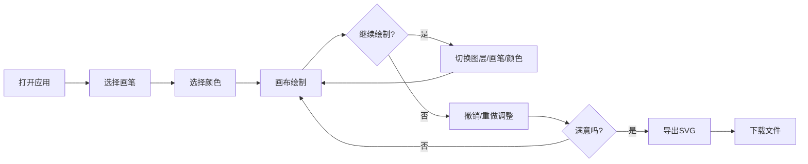

## 1. 产品概述

数字画匣是一款面向数字插画师社区的在线矢量插画工具，让用户能像摆弄真实画具一样，在网页上铺开画纸、挑选画笔和颜料，完成一幅完整的插画作品，并支持导出为SVG矢量格式。

- 主要用途：提供轻量级的在线矢量绘制体验，无需安装专业软件即可创作
- 目标用户：数字插画师、设计爱好者、创意工作者
- 产品价值：降低创作门槛，提供流畅的绘制体验，支持矢量格式导出便于后续编辑

## 2. 核心功能

### 2.1 用户角色
| 角色 | 注册方式 | 核心权限 |
|------|----------|----------|
| 普通用户 | 无需注册 | 使用所有绘制功能，导出SVG文件 |

### 2.2 功能模块
1. **画布区域**：SVG画布、自由绘制、实时渲染
2. **画笔系统**：5种预设画笔、橡皮擦模式、压力感应模拟
3. **颜色系统**：颜色选择器、最近使用颜色、自定义调色
4. **图层系统**：最多5个独立图层、图层切换、图层标签
5. **历史记录**：20步撤销/重做、进度条显示
6. **导出功能**：SVG格式导出、时间戳命名、进度指示器

### 2.3 页面详情
| 页面名称 | 模块名称 | 功能描述 |
|----------|----------|----------|
| 主画布页 | 顶部工具栏 | 画笔选择、颜色拾取、撤销/重做、导出按钮 |
| 主画布页 | 侧边颜色面板 | 颜色选择器、最近使用颜色快照 |
| 主画布页 | 画布区域 | SVG绘制画布、鼠标/触控绘制 |
| 主画布页 | 底部图层条 | 图层切换、当前图层高亮 |

## 3. 核心流程

用户打开应用 → 选择画笔类型 → 选择颜色 → 在画布上绘制 → 可切换图层继续绘制 → 可撤销/重做操作 → 完成后导出SVG文件

## 4. 用户界面设计

### 4.1 设计风格
- 主色调：深色主题（背景#1A1A2E），强调色#00B4D8
- 按钮风格：圆角方形，选中态底色为强调色
- 字体：现代无衬线字体，清晰易读
- 布局：顶部工具栏 + 右侧边栏 + 中心画布 + 底部图层条
- 动效：平滑过渡、微交互反馈

### 4.2 页面设计概述
| 页面名称 | 模块名称 | UI元素 |
|----------|----------|--------|
| 主画布页 | 顶部工具栏 | 5个画笔按钮（48x48px）、颜色区域、撤销/重做按钮、导出按钮 |
| 主画布页 | 侧边颜色面板 | 宽200px，背景#2C2C3E，圆角12px，颜色选择器，6个最近颜色色块 |
| 主画布页 | 画布区域 | 纯白背景#FFFFFF，宽100%高100vh，十字准星光标 |
| 主画布页 | 底部图层条 | 高40px，背景#2C2C3E，5个图层标签（80x30px），高亮下划线动画 |

### 4.3 响应式
- 桌面端：完整布局，右侧边栏展开
- 移动端（<768px）：侧边栏折叠为底部抽屉，工具栏图标缩小至32x32px
- 触控优化：支持触摸绘制，按钮尺寸适配触摸操作

### 4.4 微交互细节
- 所有按钮hover：半透明高亮覆盖层（rgba(255,255,255,0.1)），圆角8px，过渡200ms ease
- 颜色色块点击：从画布边缘刷过的放大缩小动画，持续300ms
- 图层标签切换：0.2s缩放反馈，高亮下划线从左到右划入300ms
- 撤销/重做按钮：按下效果（scale 0.9，持续100ms）
- 导出进度：圆形旋转指示器（一周2s）
