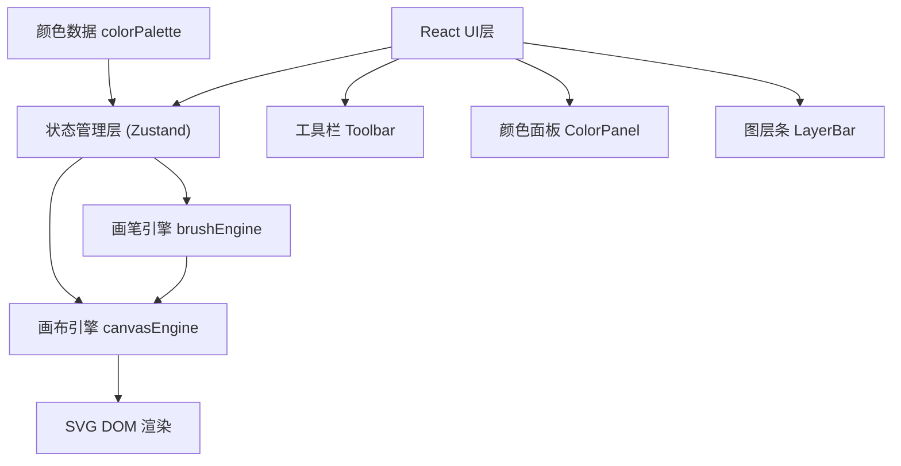

## 1. 架构设计



## 2. 技术描述

- 前端框架：React 18 + TypeScript
- 构建工具：Vite
- 状态管理：Zustand
- 渲染技术：原生 SVG 操作
- 样式方案：CSS Modules / 内联样式（按需求）
- 图标库：lucide-react

## 3. 模块划分与文件结构

```
src/
├── engine/
│   ├── canvasEngine.ts    # 画布引擎：SVG绘制状态管理、路径生成
│   └── brushEngine.ts     # 画笔引擎：笔刷参数计算、轨迹采样
├── data/
│   └── colorPalette.ts    # 色板数据与颜色管理
├── ui/
│   ├── Toolbar.tsx        # 顶部工具栏
│   ├── ColorPanel.tsx     # 侧边颜色面板
│   └── LayerBar.tsx       # 底部图层条
├── store/
│   └── useCanvasStore.ts  # Zustand状态管理
├── types/
│   └── index.ts           # TypeScript类型定义
├── App.tsx                # 主应用组件
├── main.tsx               # 入口文件
└── index.css              # 全局样式
```

## 4. 核心数据结构

### 4.1 画笔类型
```typescript
type BrushType = 'pencil' | 'ink' | 'marker' | 'highlighter' | 'eraser';

interface BrushConfig {
  type: BrushType;
  name: string;
  defaultColor: string;
  baseWidth: number;
  opacity: number;
  pressureSensitive: boolean;
}
```

### 4.2 路径数据
```typescript
interface PathPoint {
  x: number;
  y: number;
  pressure?: number;
}

interface CanvasPath {
  id: string;
  layerId: string;
  brushType: BrushType;
  color: string;
  width: number;
  opacity: number;
  points: PathPoint[];
  d: string; // SVG path d属性
}
```

### 4.3 图层数据
```typescript
interface Layer {
  id: string;
  name: string;
  color: string; // 标签颜色
  visible: boolean;
  paths: CanvasPath[];
}
```

### 4.4 历史记录
```typescript
interface HistoryState {
  layers: Layer[];
  activeLayerId: string;
}
```

## 5. 核心算法

### 5.1 贝塞尔曲线平滑
- 采样间隔：10像素
- 使用三次贝塞尔曲线插值
- 控制点计算：基于前后点的切线方向

### 5.2 画笔宽度计算
- 基础宽度 + 压力感应调整
- 不同笔刷有不同的宽度变化范围

### 5.3 撤销/重做
- 最多20步历史栈
- 快照式保存图层状态
- 操作粒度：每次鼠标按下-释放为一个操作单元

## 6. 性能优化策略

1. **绘制性能**：
   - 鼠标移动事件节流/防抖
   - 实时预览使用临时path元素
   - 释放鼠标后才生成最终path

2. **SVG渲染优化**：
   - 合理使用SVG组元素（<g>）
   - 避免不必要的重绘

3. **内存管理**：
   - 历史记录限制20步
   - 及时清理临时数据

4. **导出优化**：
   - 合并可见图层到一个<g>组
   - 简化路径数据（可选）
