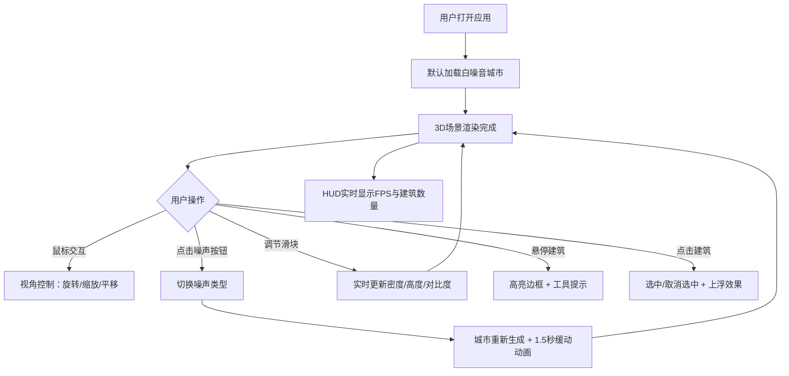

## 1. 产品概述

城市音景编织机是一款交互式3D可视化应用，让用户通过调节参数实时生成并探索一座由建筑高度、密度和颜色构成的虚拟城市天际线。建筑会根据用户选择的底噪音频（白噪音、粉红噪音、布朗噪音）的频谱特征生成对应的轮廓和排列模式，打造沉浸式的音景可视化体验。

- 面向音乐可视化爱好者、数字艺术创作者和城市规划研究者
- 融合声学特性与城市美学，创造独特的视听交互体验

## 2. 核心功能

### 2.1 功能模块

1. **3D城市场景**：50x50网格建筑区域，支持实时渲染与交互
2. **噪声驱动生成**：白噪音、粉红噪音、布朗噪音三种模式切换
3. **参数控制面板**：密度、高度幅度、颜色对比度三个调节滑块
4. **视角交互系统**：轨道旋转、缩放、平移控制
5. **建筑交互**：悬停高亮、工具提示、点击选中与上浮
6. **HUD信息**：实时FPS、可视建筑数量显示

### 2.2 页面详情

| 页面名称 | 模块名称 | 功能描述 |
|---------|---------|---------|
| 主场景 | 3D城市渲染 | 50x50网格建筑群，高度颜色渐变，顶部发光效果 |
| 主场景 | 噪声切换面板 | 三种噪声类型按钮，1.5秒缓动动画过渡 |
| 主场景 | 参数滑块组 | 密度（20%-100%）、高度幅度（0.5-2.0）、颜色对比度（0.5-2.0） |
| 主场景 | 视角控制 | 鼠标拖拽旋转、滚轮缩放、右键平移 |
| 主场景 | HUD显示 | FPS计数器、建筑数量统计 |
| 主场景 | 建筑交互 | 悬停高亮边框、工具提示、点击选中上浮 |

## 3. 核心流程

用户打开应用 → 默认加载50x50白噪音城市 → 鼠标拖拽/滚轮探索视角 → 切换噪声类型（城市1.5秒动画重建）→ 调节参数滑块（实时更新城市特征）→ 悬停建筑查看详情 → 点击建筑选中/取消 → 持续观察FPS和建筑数量

## 4. 用户界面设计

### 4.1 设计风格

- **主色调**：深空蓝紫 (#1A1A2E) 背景，青色 (#81ECEC) 强调色，砖红 (#FF6B6B) 选中色，金黄 (#FFD93D) 高亮色
- **按钮风格**：圆角8px，深色背景 (#16213E)，悬停/选中态有明确的视觉反馈
- **字体**：现代无衬线字体，字号12-16px层次分明
- **布局**：全屏3D场景左侧紧贴边缘，右侧毛玻璃控制面板悬浮
- **视觉特征**：毛玻璃效果、发光边框、渐变色彩、缓动动画

### 4.2 页面设计概览

| 页面名称 | 模块名称 | UI元素 |
|---------|---------|--------|
| 主场景 | 3D容器 | 全屏背景 #1A1A2E，原点居中建筑群 |
| 主场景 | 控制面板 | 宽280px/220px响应式，圆角16px，毛玻璃rgba(255,255,255,0.06) |
| 主场景 | 噪声标题 | 加粗16px #81ECEC，显示当前噪声类型 |
| 主场景 | 滑块样式 | 背景#2D3436，轨道4px，按钮16px圆形#81ECEC，数值实时显示 |
| 主场景 | 按钮组 | 宽80px高32px圆角8px，三种状态样式 |
| 主场景 | HUD区域 | 左下角半透明黑，圆角6px，字号16px #A0A0A0 |
| 主场景 | 工具提示 | 宽120px，rgba(0,0,0,0.7)，圆角6px，字号12px |

### 4.3 响应式设计

- Desktop-first设计，断点1024px
- 宽度≥1024px：控制面板宽280px，标准字号
- 宽度<1024px：控制面板缩小到220px，字体相应缩小
- 3D场景始终占满剩余空间

### 4.4 3D场景指导

- **环境**：深空蓝紫背景 (#1A1A2E)，无HDRI，营造赛博朋克夜景氛围
- **光照**：环境光 + 方向光组合，建筑顶部带自发光效果（强度0.2）
- **相机**：默认位置(0,30,40)俯视，轨道控制旋转灵敏度0.004，缩放范围15-80，平移速度0.3
- **构图**：城市居中，50x50网格形成正方形轮廓，0.2单位建筑间距
- **交互动画**：建筑升/降1.5秒 easeOutCubic，选中上浮0.5单位，悬停边框高亮
- **后处理**：建筑顶部轻微发光，整体色调偏冷
- **性能**：建筑≤2500个，密度100%时≤2000个，稳定60FPS，内存≤400MB
