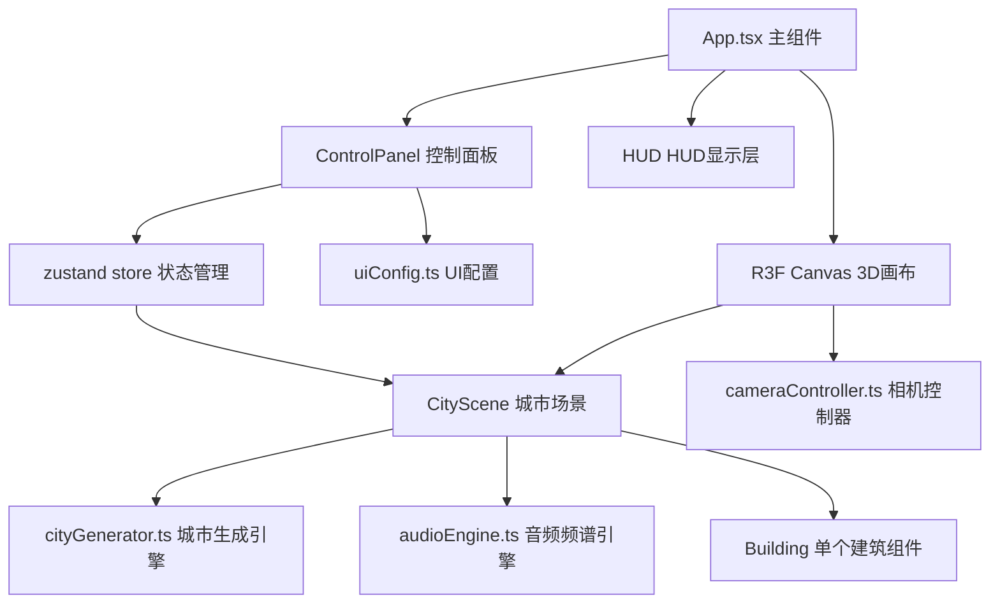

## 1. 架构设计



## 2. 技术说明

- **前端框架**：React@18 + TypeScript + Vite
- **3D渲染**：Three.js + @react-three/fiber + @react-three/drei
- **状态管理**：zustand
- **构建工具**：Vite@5 + @vitejs/plugin-react
- **路径别名**：@ 指向 src/ 目录

## 3. 目录结构

```
.
├── index.html                     # 入口HTML
├── package.json                   # 依赖配置
├── vite.config.js                 # Vite构建配置
├── tsconfig.json                  # TypeScript配置
└── src/
    ├── App.tsx                    # 主应用组件
    ├── main.tsx                   # React入口
    ├── components/
    │   ├── CityScene.tsx          # 3D城市场景组件
    │   ├── Building.tsx           # 单个建筑组件
    │   ├── ControlPanel.tsx       # 右侧控制面板
    │   ├── HUD.tsx                # 左下角HUD信息
    │   └── Tooltip.tsx            # 建筑悬停工具提示
    ├── engine/
    │   ├── cityGenerator.ts       # 城市网格生成模块
    │   ├── audioEngine.ts         # 音频频谱解析模块
    │   └── cameraController.ts    # 相机控制模块
    ├── data/
    │   └── uiConfig.ts            # UI配置与状态定义
    ├── store/
    │   └── useAppStore.ts         # zustand状态管理
    ├── hooks/
    │   └── useFrameAnimation.ts   # 动画钩子
    └── types/
        └── index.ts               # TypeScript类型定义
```

## 4. 核心数据模型

### 4.1 建筑数据类型

```typescript
interface BuildingData {
  id: number;          // 建筑索引
  gridX: number;       // 网格X坐标
  gridZ: number;       // 网格Z坐标
  position: [number, number, number];  // 世界坐标 [x, y, z]
  size: [number, number, number];      // 尺寸 [width, height, depth]
  baseHeight: number;  // 基础高度（未受滑块影响）
  targetHeight: number; // 目标高度（动画用）
  color: string;       // 十六进制颜色
  selected: boolean;   // 是否选中
  hovered: boolean;    // 是否悬停
}

type NoiseType = 'white' | 'pink' | 'brown';

interface CityConfig {
  gridSize: number;       // 网格大小 (50)
  density: number;        // 密度 0.2-1.0
  heightScale: number;    // 高度幅度 0.5-2.0
  colorContrast: number;  // 颜色对比度 0.5-2.0
  noiseType: NoiseType;   // 噪声类型
}
```

### 4.2 状态管理 Store

```typescript
interface AppState {
  // 配置参数
  cityConfig: CityConfig;
  // UI状态
  fps: number;
  visibleBuildings: number;
  selectedBuildingId: number | null;
  hoveredBuildingId: number | null;
  tooltipPosition: { x: number; y: number } | null;
  // Actions
  setNoiseType: (t: NoiseType) => void;
  setDensity: (v: number) => void;
  setHeightScale: (v: number) => void;
  setColorContrast: (v: number) => void;
  updateFPS: (v: number) => void;
  updateVisibleBuildings: (v: number) => void;
  selectBuilding: (id: number | null) => void;
  hoverBuilding: (id: number | null, pos?: { x: number; y: number }) => void;
}
```

## 5. 性能优化策略

1. **InstancedMesh**：使用实例化渲染减少Draw Call
2. **帧率控制**：requestAnimationFrame + FPS节流更新HUD
3. **动画优化**：使用useFrame钩子，仅更新必要的建筑矩阵
4. **内存管理**：城市重建时正确dispose几何与材质
5. **生成性能**：城市生成≤50ms，使用数学算法避免DOM操作
6. **可视剔除**：利用Three.js视锥剔除（frustum culling）
