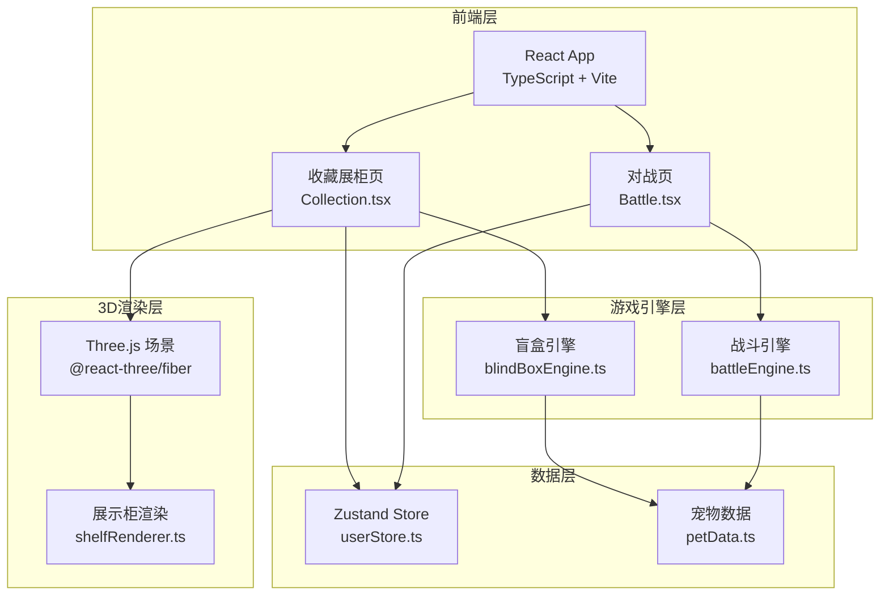
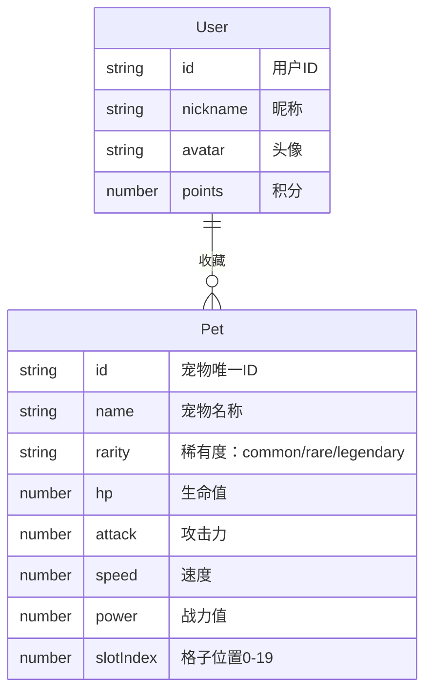

## 1. 架构设计



## 2. 技术说明

- **前端框架**：React 18 + TypeScript + Vite
- **样式方案**：CSS Modules + Tailwind CSS
- **3D渲染**：Three.js + @react-three/fiber + @react-three/drei
- **状态管理**：Zustand
- **路由**：React Router DOM v6
- **初始化工具**：Vite Init (react-ts模板)
- **后端**：无（纯前端，模拟数据）
- **数据库**：无（Zustand内存状态 + localStorage持久化）

## 3. 路由定义

| 路由 | 用途 |
|------|------|
| / | 收藏展柜页，3D展示柜 + 用户面板 + 开盲盒 |
| /battle | 对战页，宠物对战 + 战斗动画 + 胜负结算 |

## 4. 数据模型

### 4.1 数据模型定义



### 4.2 数据定义

```typescript
type Rarity = 'common' | 'rare' | 'legendary';

interface PetTemplate {
  id: string;
  name: string;
  rarity: Rarity;
  baseHp: number;
  baseAttack: number;
  baseSpeed: number;
}

interface PetInstance {
  uid: string;
  templateId: string;
  name: string;
  rarity: Rarity;
  hp: number;
  attack: number;
  speed: number;
  power: number;
  slotIndex: number;
}

interface UserState {
  userId: string;
  nickname: string;
  avatar: string;
  points: number;
  pets: PetInstance[];
  selectedPetUid: string | null;
}
```

## 5. 模块职责

### 5.1 宠物数据模块 (src/data/petData.ts)

- 定义 PetTemplate、PetInstance、Rarity 类型接口
- 维护宠物模板列表（约10-15种宠物）
- 定义稀有度颜色映射和抽取概率

### 5.2 展柜渲染模块 (src/renderer/shelfRenderer.ts)

- Three.js场景搭建（相机、灯光、控制器）
- 展示柜几何体生成（四层五格结构）
- 宠物模型生成（球形头+柱形身体+锥形尾巴）
- 脉动呼吸动画循环
- 鼠标拖拽旋转与缩放控制
- 格子点击检测

### 5.3 盲盒逻辑模块 (src/engine/blindBoxEngine.ts)

- 积分扣除验证（每抽100积分）
- 加权随机抽卡（普通60%/稀有30%/传说10%）
- 生成宠物实例（属性随机浮动±10%）
- 返回抽取结果

### 5.4 战斗引擎模块 (src/engine/battleEngine.ts)

- 战力值计算
- 回合制攻击模拟
- 胜负判定
- 积分奖励计算

### 5.5 用户状态模块 (src/stores/userStore.ts)

- Zustand store定义
- 管理用户信息、积分、宠物收藏列表
- 管理当前选中宠物
- localStorage持久化

## 6. 文件结构

```
云宝阁/
├── package.json
├── vite.config.ts
├── tsconfig.json
├── index.html
├── src/
│   ├── data/
│   │   └── petData.ts
│   ├── renderer/
│   │   └── shelfRenderer.ts
│   ├── engine/
│   │   ├── blindBoxEngine.ts
│   │   └── battleEngine.ts
│   ├── stores/
│   │   └── userStore.ts
│   ├── pages/
│   │   ├── Collection.tsx
│   │   └── Battle.tsx
│   ├── components/
│   │   ├── ShelfScene.tsx
│   │   ├── PetModel.tsx
│   │   ├── PetDetailCard.tsx
│   │   ├── UserPanel.tsx
│   │   ├── BlindBoxAnimation.tsx
│   │   └── BattleCanvas.tsx
│   ├── App.tsx
│   ├── main.tsx
│   └── index.css
```
