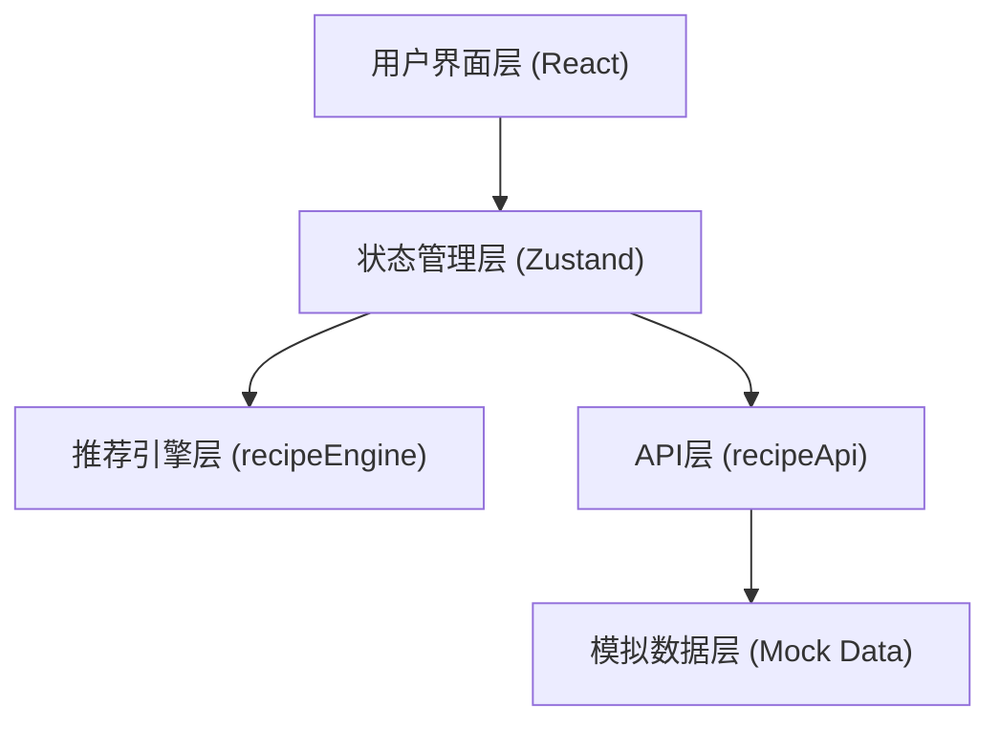

## 1. 架构设计



## 2. 技术描述

- **前端框架**：React 18 + TypeScript
- **构建工具**：Vite 5
- **状态管理**：Zustand 4
- **工具库**：uuid（唯一ID生成）
- **样式方案**：CSS Modules / 内联样式
- **后端**：无，使用模拟API
- **数据**：前端模拟数据（100条食谱、20种预设食材）

## 3. 项目结构

```
src/
├── main.tsx              # React挂载入口
├── App.tsx               # 根组件
├── stores/
│   └── appStore.ts     # 全局状态管理
├── api/
│   └── recipeApi.ts    # 模拟API模块
├── engine/
│   └── recipeEngine.ts  # 推荐引擎模块
└── components/
    ├── IngredientPanel.tsx  # 食材面板组件
    └── RecipeCard.tsx        # 食谱卡片组件
```

## 4. 核心数据模型

### 4.1 类型定义

```typescript
// 食材类型
interface Ingredient {
  id: string;
  name: string;
  icon: string;
}

// 食谱类型
interface Recipe {
  id: string;
  name: string;
  ingredients: string[];
  cookingTime: number;
  calories: number;
  protein: number;
  fat: number;
  carbs: number;
  tags: string[];
  steps: string[];
  isVegetarian: boolean;
  allergens: string[];
}

// 偏好设置类型
interface Preferences {
  dietType: 'unlimited' | 'vegetarian' | 'lowCalorie' | 'highProtein';
  allergens: string[];
}

// 推荐结果类型
interface RecommendationResult {
  recipe: Recipe;
  matchScore: number;
  matchedIngredients: string[];
  missingIngredients: string[];
}
```

## 5. 推荐引擎算法

### 5.1 匹配度公式

```
匹配度 = (已选食材数 / 食谱所需食材总数) × 100 × 饮食类型权重 × 过敏原过滤
```

- 食材覆盖率：已选食材数 / 食谱所需食材总数 × 100
- 饮食类型权重：匹配时×1.2，不匹配时×0.5
- 过敏原过滤：含过敏原时排除
- 匹配度低于30%的结果不展示

### 5.2 性能优化

- 使用 `useMemo` 缓存计算结果
- 食谱数据预加载
- 计算逻辑优化（提前终止、短路求值）

## 6. 状态管理设计

### 6.1 Zustand Store

```typescript
interface AppState {
  // 状态
  selectedIngredients: Ingredient[];
  recommendations: RecommendationResult[];
  preferences: Preferences;
  isGenerating: boolean;
  selectedRecipe: Recipe | null;
  
  // 动作
  addIngredient: (ingredient: Ingredient) => void;
  removeIngredient: (id: string) => void;
  setDietType: (type: Preferences['dietType']) => void;
  toggleAllergen: (allergen: string) => void;
  generateRecommendations: () => Promise<void>;
  selectRecipe: (recipe: Recipe | null) => void;
}
```
