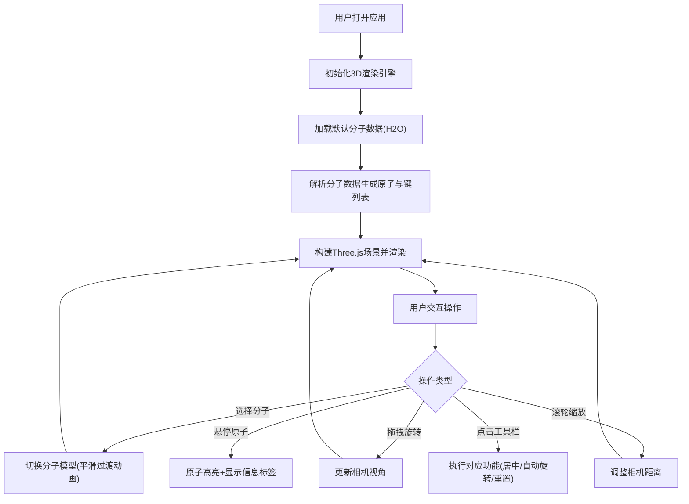

## 1. 产品概述

分子观察室是一个面向化学教育领域的交互式3D分子结构可视化工具，旨在通过沉浸式的3D交互体验替代传统静态图片教学，帮助学生直观理解分子的三维结构与化学键特性。

- **核心价值**：将抽象的化学分子结构转化为可交互的3D模型，提升课堂教学效果与学生学习兴趣
- **目标用户**：化学教师、中学生、大学生及化学爱好者
- **解决问题**：传统教学中分子结构难以直观展示，学生空间想象力受限的痛点

## 2. 核心功能

### 2.1 用户角色

| 角色 | 使用场景 | 核心需求 |
|------|----------|----------|
| 化学教师 | 课堂教学演示 | 快速切换分子模型、展示化学键细节、控制视角 |
| 学生 | 自主学习探索 | 自由旋转缩放、查看原子信息、理解空间结构 |

### 2.2 功能模块

1. **3D分子可视化场景**：实时渲染分子三维结构，支持交互式操作
2. **分子模型库**：预置H2O、CO2、CH4、C6H6等多种分子模型
3. **相机控制系统**：鼠标拖拽旋转、滚轮缩放、触摸屏手势支持
4. **右侧控制面板**：分子选择、原子标签开关、重置视角
5. **左侧工具栏**：居中对齐、自动旋转、重置视角快捷操作
6. **信息显示条**：实时显示分子信息与帧率
7. **悬停交互**：鼠标悬停显示原子信息与高亮效果

### 2.3 页面详情

| 页面名称 | 模块名称 | 功能描述 |
|-----------|-------------|---------------------|
| 主场景 | 3D渲染区域 | 全屏Canvas渲染分子结构，支持鼠标/触摸交互 |
| 主场景 | 左侧工具栏 | 一键居中、自动旋转开关、重置视角三个功能按钮 |
| 主场景 | 右侧控制面板 | 分子选择下拉框、原子标签开关、重置视角按钮、分子信息展示 |
| 主场景 | 顶部信息条 | 分子名称、原子总数、键总数、实时FPS显示 |
| 主场景 | 悬停提示 | 鼠标悬停原子时显示元素名称、符号信息 |

## 3. 核心流程

## 4. 用户界面设计

### 4.1 设计风格

- **主题色调**：暗色科幻主题，深色调背景搭配柔和光晕
- **主背景**：径向渐变从#0A0A1A到#1A1A2E
- **原子配色**：氧#FF3333、碳#555555、氢#FFFFFF、氮#3050F8
- **UI元素色**：面板背景rgba(255,255,255,0.06)、边框rgba(255,255,255,0.1)
- **按钮样式**：方形圆角6px，悬停背景#3A3A4A，点击缩放至0.92
- **字体**：现代无衬线字体，标题白色14px，选项浅灰色#B0B0B0
- **视觉效果**：毛玻璃半透明效果、柔和阴影、平滑过渡动画

### 4.2 页面设计详情

| 页面区域 | 模块名称 | UI元素细节 |
|-----------|-------------|-------------|
| 全屏背景 | 3D场景 | 径向渐变深色背景，环境光+方向光，阴影投射 |
| 左侧固定 | 工具栏 | 宽40px，背景#2A2A3A，圆角8px，3个32x32px方形按钮，SVG图标 |
| 右侧固定 | 控制面板 | 宽280px，圆角16px，毛玻璃背景，下拉选择框圆角8px |
| 左上角 | 信息条 | 背景rgba(40,40,50,0.7)，圆角12px，padding 10px 16px |
| 悬停层 | 原子标签 | 背景rgba(30,30,40,0.85)，圆角6px，白色文字，带小箭头指向原子 |

### 4.3 响应式设计

- **桌面端**：左侧工具栏40px，右侧控制面板280px，完整信息条
- **移动端(<768px)**：信息条折叠为仅显示分子名称的横幅
- **触摸支持**：单指旋转、双指捏合缩放，触摸事件不干扰原生滚动

### 4.4 3D场景设计

- **环境**：深色径向渐变背景，营造深邃科技感
- **光照**：环境光(intensity 0.4) + 方向光(intensity 0.8, position (5,10,7))
- **材质**：原子球体使用MeshStandardMaterial，roughness 0.4, metalness 0.1
- **相机**：PerspectiveCamera，初始距离根据分子大小自适应
- **动画**：分子切换缩放动画0.8s，透明度渐变0→1，悬停高亮0.3s过渡
- **性能**：帧率保持55FPS以上，内存控制在200MB以内
