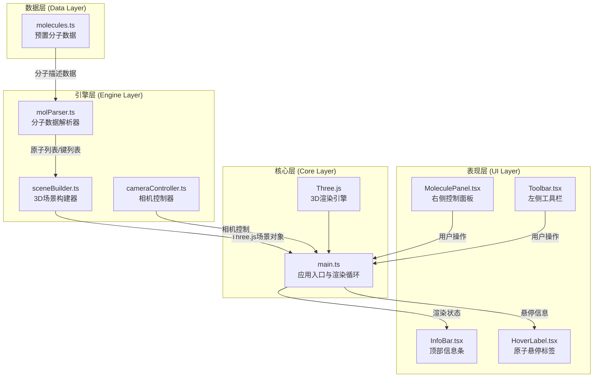

## 1. 架构设计



## 2. 技术栈说明

| 层级 | 技术选型 | 版本 | 用途说明 |
|------|----------|------|----------|
| 构建工具 | Vite | 5.x | 快速开发与构建，支持TypeScript |
| 前端框架 | React | 18.x | UI组件化开发 |
| 语言 | TypeScript | 5.x | 类型安全的JavaScript |
| 3D引擎 | Three.js | 0.160.x | WebGL 3D渲染 |
| 类型定义 | @types/three | 0.160.x | Three.js TypeScript类型 |
| Vite插件 | @vitejs/plugin-react | 4.x | React JSX支持 |

## 3. 目录结构

```
src/
├── engine/                 # 3D引擎核心模块
│   ├── molParser.ts       # 分子数据解析
│   ├── sceneBuilder.ts    # 场景构建
│   └── cameraController.ts # 相机控制
├── ui/                     # UI组件模块
│   ├── MoleculePanel.tsx  # 右侧控制面板
│   ├── Toolbar.tsx        # 左侧工具栏
│   ├── InfoBar.tsx        # 顶部信息条
│   └── HoverLabel.tsx     # 原子悬停标签
├── data/                   # 数据模块
│   └── molecules.ts       # 预置分子数据
├── types/                  # 类型定义
│   └── index.ts           # 全局类型
├── main.tsx               # React入口
├── main.ts                # Three.js初始化与主循环
└── index.css              # 全局样式
```

## 4. 模块职责与数据流向

### 4.1 数据流向总览

```
molecules.ts (预置数据)
    ↓
molParser.ts (解析) → Atom[], Bond[]
    ↓
sceneBuilder.ts (构建) → THREE.Group (分子模型)
    ↓
main.ts (组装) → THREE.Scene + Render Loop
    ↓
DOM (Canvas)
```

### 4.2 核心模块接口定义

#### molParser.ts
```typescript
// 原子类型定义
interface Atom {
  id: string;
  element: 'H' | 'C' | 'O' | 'N';
  position: [number, number, number];
  radius: number;
  color: string;
}

// 化学键类型定义
interface Bond {
  id: string;
  from: string; // atom id
  to: string;   // atom id
  type: 'single' | 'double' | 'triple';
}

// 分子数据定义
interface MoleculeData {
  name: string;
  formula: string;
  atoms: Array<{
    element: string;
    position: [number, number, number];
  }>;
  bonds: Array<{
    from: number;
    to: number;
    type: 'single' | 'double' | 'triple';
  }>;
}

// 解析函数
export function parseMolecule(data: MoleculeData): { atoms: Atom[]; bonds: Bond[] };
```

#### sceneBuilder.ts
```typescript
import * as THREE from 'three';
import { Atom, Bond } from './molParser';

// 构建场景返回分子模型组
export function buildMoleculeGroup(
  atoms: Atom[],
  bonds: Bond[]
): {
  group: THREE.Group;
  atomMeshes: Map<string, THREE.Mesh>;
  bondMeshes: THREE.Mesh[];
  center: THREE.Vector3;
  boundingRadius: number;
};

// 原子材质配置
const ATOM_MATERIAL_CONFIG = {
  roughness: 0.4,
  metalness: 0.1,
};

// 化学键配置
const BOND_CONFIG = {
  singleRadius: 0.08,
  doubleOffset: 0.12,
  opacity: 0.7,
  transparent: true,
};
```

#### cameraController.ts
```typescript
import * as THREE from 'three';
import { OrbitControls } from 'three/examples/jsm/controls/OrbitControls';

export class CameraController {
  constructor(camera: THREE.PerspectiveCamera, domElement: HTMLElement);
  
  // 控制参数
  setRotationSensitivity(sensitivity: number): void; // 默认0.005
  setZoomRange(min: number, max: number): void; // 默认3-30
  
  // 动画方法
  animateTo(position: THREE.Vector3, target: THREE.Vector3, duration: number): Promise<void>;
  resetView(): Promise<void>;
  centerOnTarget(target: THREE.Vector3, duration: number): Promise<void>;
  
  // 自动旋转
  setAutoRotate(enabled: boolean, speed: number): void; // 默认0.5弧度/秒
  
  // 生命周期
  dispose(): void;
  
  // 获取OrbitControls实例
  getControls(): OrbitControls;
}
```

### 4.3 UI组件Props定义

#### MoleculePanel.tsx
```typescript
interface MoleculePanelProps {
  currentMolecule: string;
  molecules: Array<{ id: string; name: string; formula: string }>;
  atomCount: number;
  bondCount: number;
  showLabels: boolean;
  onMoleculeChange: (id: string) => void;
  onToggleLabels: (show: boolean) => void;
  onResetView: () => void;
}
```

#### Toolbar.tsx
```typescript
interface ToolbarProps {
  autoRotate: boolean;
  onCenter: () => void;
  onToggleAutoRotate: () => void;
  onReset: () => void;
}
```

#### InfoBar.tsx
```typescript
interface InfoBarProps {
  moleculeName: string;
  atomCount: number;
  bondCount: number;
  fps: number;
}
```

## 5. 性能优化策略

### 5.1 渲染性能
- **几何体复用**：使用SphereGeometry和CylinderGeometry的实例化，避免重复创建
- **材质共享**：相同元素的原子共享材质实例
- **帧率监控**：实时监控FPS，低于55时动态降低渲染质量
- **阴影优化**：仅关键物体投射/接收阴影，使用适当的阴影贴图大小

### 5.2 内存管理
- **场景清理**：切换分子时正确dispose几何体和材质
- **事件解绑**：组件卸载时移除所有事件监听器
- **对象池**：可考虑使用THREE.ObjectPool复用3D对象

### 5.3 动画优化
- **使用requestAnimationFrame**：与浏览器刷新率同步
- **增量动画**：使用Clock.getDelta()计算帧间隔
- **平滑过渡**：使用线性插值(lerp)实现平滑动画

## 6. 性能指标

| 指标 | 目标值 | 测量方式 |
|------|--------|----------|
| 渲染帧率 | ≥ 55 FPS | performance.now() 计算帧间隔 |
| 模型切换时间 | ≤ 500ms | 从选择到场景完全渲染 |
| 内存占用 | ≤ 200MB | Chrome DevTools Memory面板 |
| 交互响应 | ≤ 16ms | 输入到渲染的延迟 |
