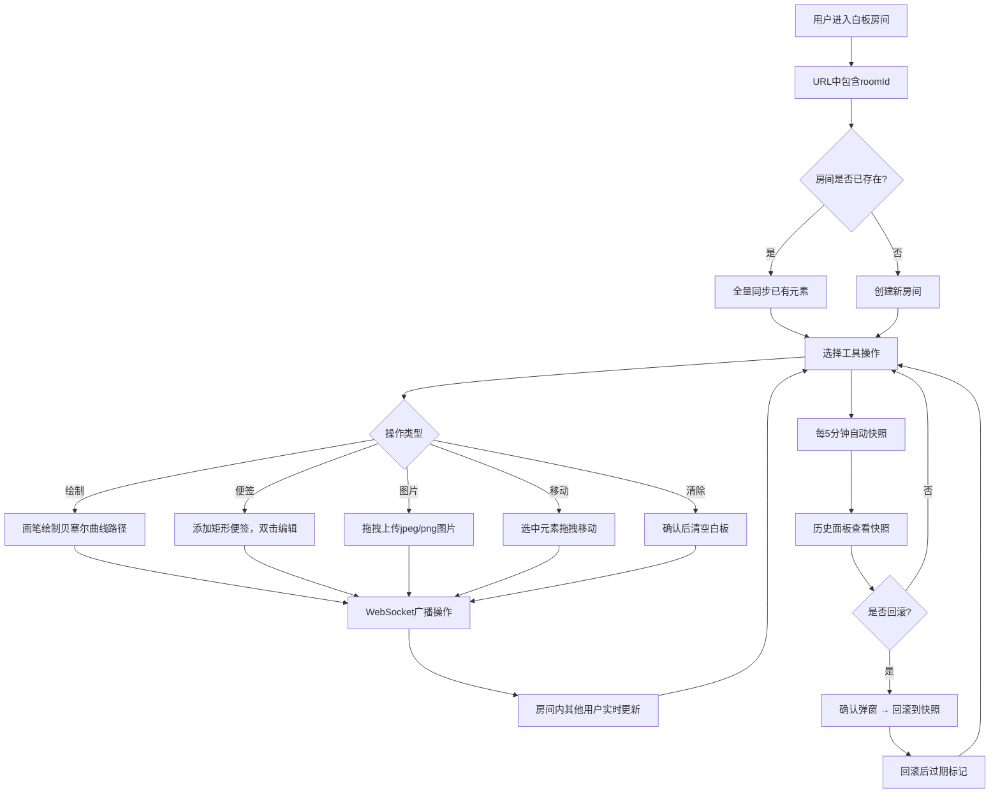

## 1. 产品概述

灵感黑板是一款在线协作白板应用，支持多用户实时协同绘制草图、添加便签和图片，并拥有独立的版本历史记录与撤销/重做功能。目标用户为需要远程协作的团队和创意工作者，通过实时同步和版本管理提升协作效率。

## 2. 核心功能

### 2.1 用户角色

| 角色 | 进入方式 | 核心权限 |
|------|----------|----------|
| 协作用户 | 通过URL中的roomId直接进入房间 | 绘制、添加便签/图片、移动元素、撤销/重做、查看/回滚历史、清除白板、导出图片 |

### 2.2 功能模块

1. **白板主界面**：全屏白板绘制区域，支持画笔绘制、便签添加、图片上传、元素选择与拖拽移动
2. **工具栏**：左侧横向工具栏，包含画笔、橡皮、便签、图片、清除、撤销、重做工具
3. **版本历史面板**：右侧面板，展示自动快照列表，支持回滚操作
4. **协作系统**：基于WebSocket的实时多人协作，房间管理

### 2.3 页面详情

| 页面名称 | 模块名称 | 功能描述 |
|----------|----------|----------|
| 白板主界面 | Canvas绘制区 | 全屏白板，网格背景，支持画笔自由绘制（贝塞尔曲线平滑）、便签添加（双击编辑）、图片拖拽上传（jpeg/png，≤2MB），元素选中（蓝色虚线边框2px）、拖拽移动（透明度0.8过渡0.15s） |
| 白板主界面 | 工具栏 | 左侧固定60px宽深灰工具栏，画笔（6色：#333333/#E53935/#43A047/#1E88E5/#FDD835/#8E24AA，3种粗细：3/6/12px）、橡皮、便签、图片上传、清除（红色圆形，确认弹窗）、撤销（Ctrl+Z）、重做（Ctrl+Shift+Z），按钮40x40px圆角8px，选中背景#4A4A4A，悬停#3C3C3C，过渡0.2s ease |
| 白板主界面 | 版本历史面板 | 右侧固定220px面板，标题"版本历史"14px加粗#333333，快照条目高44px从新到旧排列，显示HH:mm:ss时间戳，点击回滚确认弹窗，过期条目灰色斜体，回滚后过期标记，<1024px收起为44x44px悬浮按钮 |
| 白板主界面 | 文件菜单 | 左上角下拉菜单，"导出为图片"选项，导出PNG白色背景，隐藏操作界面 |
| 白板主界面 | 确认弹窗 | 白色背景圆角8px阴影，从中心缩放0.8→1.0 200ms ease-out，半透明黑色遮罩rgba(0,0,0,0.3) |

## 3. 核心流程

用户进入白板房间 → 通过URL中roomId区分房间 → 房间已有元素全量同步给新用户 → 用户选择工具进行绘制/添加便签/上传图片 → 操作通过WebSocket实时广播给房间内所有用户 → 每5分钟自动生成快照 → 用户可在历史面板查看和回滚快照 → 用户可撤销/重做自己的操作（独立栈，最多50步，不广播） → 用户可清除白板（确认弹窗，广播给其他用户） → 用户可导出白板为PNG图片

## 4. 用户界面设计

### 4.1 设计风格

- 主色调：深灰侧栏(#2C2C2C)与浅灰主背景(#F5F5F5/网格#E0E0E0)对比
- 强调色：蓝色(#1976D2)
- 画笔颜色：#333333、#E53935、#43A047、#1E88E5、#FDD835、#8E24AA
- 便签样式：背景#FFF9C4，边框1px实线#FBC02D，圆角8px，默认150x100px
- 选中边框：蓝色虚线2px
- 按钮风格：40x40px圆角8px，深色背景，过渡动画0.2s ease
- 弹窗风格：白色圆角8px阴影，中心缩放动画200ms ease-out
- 字体：14px加粗标题，系统无衬线字体

### 4.2 页面设计概览

| 页面名称 | 模块名称 | UI元素 |
|----------|----------|--------|
| 白板主界面 | Canvas绘制区 | 全屏白板，网格背景(#E0E0E0, 20px间距)，元素选中蓝色虚线，拖拽透明度0.8过渡0.15s |
| 白板主界面 | 左侧工具栏 | 固定宽60px背景#2C2C2C，工具按钮40x40px圆角8px居中排列，选中#4A4A4A悬停#3C3C3C，画笔颜色选择器，粗细选择器 |
| 白板主界面 | 右侧历史面板 | 固定宽220px背景#FAFAFA，左border 1px #E0E0E0，标题14px加粗#333，条目44px高从新到旧，选中#E3F2FD，过期灰色斜体#BDBDBD |
| 白板主界面 | 确认弹窗 | 白色圆角8px阴影，scale 0.8→1.0 200ms ease-out，遮罩rgba(0,0,0,0.3) |
| 白板主界面 | 文件菜单 | 左上角下拉菜单，导出为图片选项 |

### 4.3 响应式设计

- 桌面优先设计，屏幕宽度≥1024px时完整展示所有面板
- 屏幕宽度<1024px时，右侧历史面板自动收起为44x44px圆角22px悬浮按钮（时钟图标），点击从右向左滑出面板
- 白板区域始终占据剩余空间，Canvas自适应容器尺寸

### 4.4 动画与过渡

- 工具按钮：悬停/选中背景色过渡0.2s ease
- 元素拖拽：透明度0.8过渡0.15s
- 弹窗：中心缩放0.8→1.0，200ms ease-out
- 历史面板滑出：从右向左滑入动画
- 所有交互元素均需平滑过渡动画
