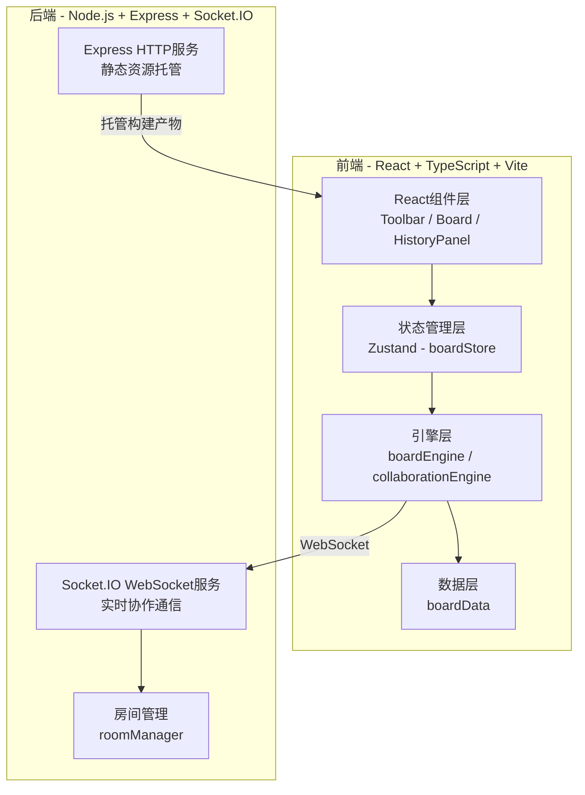
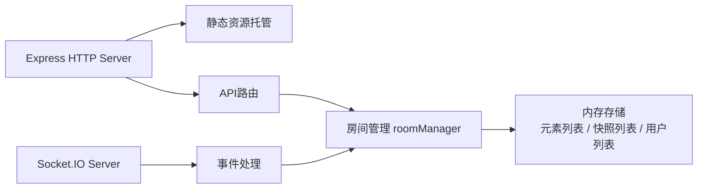
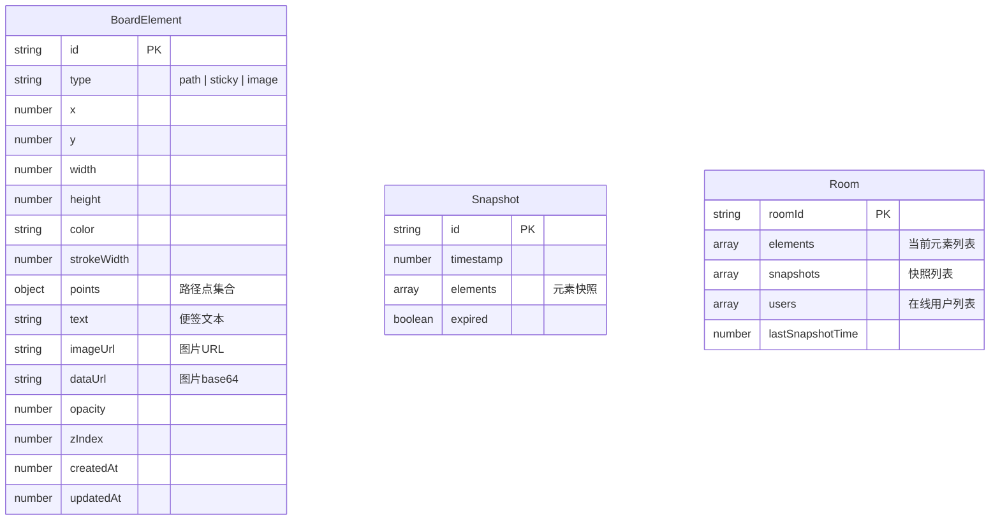

## 1. 架构设计



## 2. 技术说明

- **前端**：React 18 + TypeScript + Vite + Zustand + Tailwind CSS
- **初始化工具**：vite-init (react-express-ts模板)
- **后端**：Express 4 + Socket.IO
- **实时通信**：Socket.IO（WebSocket协议）
- **数据存储**：内存存储（房间元素数据 + 版本快照）
- **构建工具**：Vite

## 3. 路由定义

| 路由 | 用途 |
|------|------|
| `/` | 首页，创建/加入白板房间 |
| `/board/:roomId` | 白板主界面，roomId区分不同协作房间 |

## 4. API定义

### 4.1 WebSocket事件

```typescript
interface ServerToClientEvents {
  "room:state": (data: { elements: BoardElement[]; snapshots: Snapshot[] }) => void;
  "room:element:add": (element: BoardElement) => void;
  "room:element:update": (element: BoardElement) => void;
  "room:element:delete": (elementId: string) => void;
  "room:clear": () => void;
  "room:snapshot": (snapshot: Snapshot) => void;
  "room:rollback": (data: { elements: BoardElement[]; expiredSnapshotIds: string[] }) => void;
  "room:user:join": (userId: string) => void;
  "room:user:leave": (userId: string) => void;
}

interface ClientToServerEvents {
  "room:join": (roomId: string) => void;
  "room:element:add": (element: BoardElement) => void;
  "room:element:update": (element: BoardElement) => void;
  "room:element:delete": (elementId: string) => void;
  "room:clear": () => void;
  "room:rollback": (snapshotId: string) => void;
}
```

### 4.2 HTTP接口

| 方法 | 路径 | 用途 |
|------|------|------|
| GET | `/api/room/:roomId` | 获取房间信息 |
| POST | `/api/room` | 创建新房间 |

## 5. 服务端架构



## 6. 数据模型

### 6.1 数据模型定义



### 6.2 核心数据类型

```typescript
type ElementType = "path" | "sticky" | "image";

interface PathPoint {
  x: number;
  y: number;
}

interface BoardElement {
  id: string;
  type: ElementType;
  x: number;
  y: number;
  width: number;
  height: number;
  color?: string;
  strokeWidth?: number;
  points?: PathPoint[];
  text?: string;
  imageUrl?: string;
  dataUrl?: string;
  opacity: number;
  zIndex: number;
  createdAt: number;
  updatedAt: number;
}

interface Snapshot {
  id: string;
  timestamp: number;
  elements: BoardElement[];
  expired: boolean;
}

interface HistoryEntry {
  type: "add" | "update" | "delete" | "clear";
  element?: BoardElement;
  previousElement?: BoardElement;
  clearedElements?: BoardElement[];
}
```
