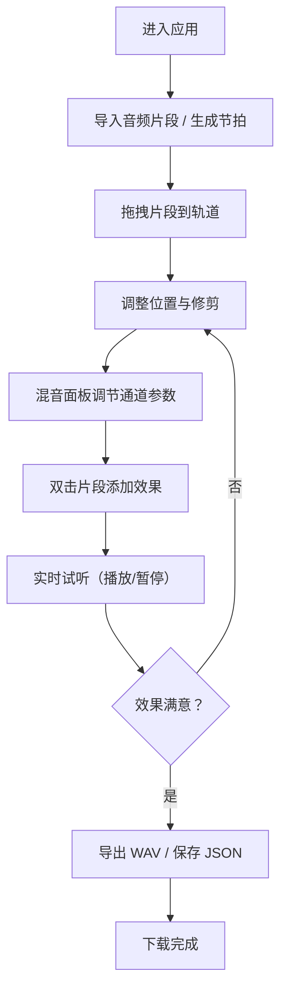

## 1. 产品概述

AudioCollage 是一款面向独立音乐人和音频爱好者的在线多轨道音乐混音工具，让用户能像拼贴照片一样快速构建和混音音乐片段。它解决了传统本地 DAW 软件功能臃肿、学习门槛高、团队协作不便的痛点。

- 核心价值：轻量、即时、零安装、可协作的浏览器级多轨混音体验
- 目标用户：独立音乐人、播客制作人、视频配乐师、音频创意爱好者

## 2. 核心功能

### 2.1 用户角色

| 角色 | 注册方式 | 核心权限 |
|------|----------|----------|
| 普通用户 | 无需注册，直接使用 | 导入音频、编排多轨道、添加效果、导出 WAV、保存/加载项目 JSON |

### 2.2 功能模块

1. **时间轴编辑区（左侧 70%）**：工具栏、轨道列表、播放头、网格线、片段修剪与拖拽
2. **混音面板（右侧 30%）**：通道条推子、声像旋钮、静音/独奏按钮、主输出推子、波形可视化
3. **节拍生成系统**：120 BPM 4/4 拍鼓点循环（底鼓 + 军鼓），独立音量控制
4. **效果系统**：淡入/淡出、回声、滤波，气泡面板参数调节
5. **导出与分享**：离线渲染 44.1kHz/16bit WAV、JSON 项目保存与加载

### 2.3 页面详情

| 页面名称 | 模块名称 | 功能描述 |
|----------|----------|----------|
| 主编辑页 | 工具栏 | 导入音频、生成节拍、导出 WAV、撤销/重做、保存/加载项目 |
| 主编辑页 | 轨道区 | 4 条轨道（80px 高），轨道头部可编辑名称、颜色标记，上下拖拽排序，第 1 条为节拍轨道 |
| 主编辑页 | 时间轴片段 | 拖拽移动、左右边缘修剪（黄色手柄）、重叠自动混音、双击打开效果面板 |
| 主编辑页 | 播放头 | 点击时间轴移动播放头位置并闪烁，播放时实时移动 |
| 主编辑页 | 混音通道条 | 垂直推子（140px）、36px 声像旋钮、静音/独奏按钮、波形预览 |
| 主编辑页 | 主输出 | 全局音量推子、240×60px 频谱波形显示区 |
| 主编辑页 | 传输控制栏 | 播放/暂停按钮、播放头时间显示、BPM 显示 |
| 效果气泡面板 | 效果参数 | 淡入/淡出（0-3s）、回声（100-500ms / 0-0.8 反馈）、滤波（低通/高通 20-20000Hz） |

## 3. 核心流程

用户打开页面 → 导入本地音频片段（或点击生成节拍）→ 将片段拖拽到轨道时间轴 → 调整片段位置和修剪边界 → 通过混音面板调节各轨道音量、声像、静音/独奏 → 双击片段添加效果（淡入/淡出、回声、滤波）→ 实时试听效果 → 点击导出按钮离线渲染 WAV → 自动下载文件 / 保存项目 JSON 以便后续编辑

## 4. 用户界面设计

### 4.1 设计风格

- 主色调：深色背景 `#16161E`，轨道背景 `#1E1E2E`，强调色 `#E94560`（悬停 `#FF6B6B`），文本 `#FFFFFF`
- 边框与网格：`1px #2A2A3E` 边框，网格线 `#2A2A3E` 透明度 0.5
- 按钮风格：圆角 4-6px，悬停有 `transform: scale(0.97) 0.1s` 按压效果
- 字体：现代无衬线字体，使用 JetBrains Mono 等宽字体显示时间和数值
- 动效：所有交互元素 0.2s 过渡，推子拖拽阴影扩展 0.1s，播放头闪烁 0.3s

### 4.2 页面设计概述

| 页面名称 | 模块名称 | UI 元素 |
|----------|----------|---------|
| 主编辑页 | 工具栏 | 48px 高 `#1A1A2E` 背景，水平排列按钮组，图标 + 文字，间距 12px |
| 主编辑页 | 轨道头部 | 80px 高度内垂直居中，左侧 12px 彩色方块 + 可编辑名称 + 删除按钮 |
| 主编辑页 | 通道条 | 260px 宽 `#16161E` 背景 12px 圆角，垂直布局：名称 → 静音/独奏 → 声像 → 推子 → 波形 |
| 主编辑页 | 推子组件 | 4×140px 垂直轨道，16px 圆形滑块 `#E94560`，拖拽变 `#FF6B6B` + 阴影 |
| 主编辑页 | 声像旋钮 | 36px 直径圆形旋钮，L→R 刻度，步长 5%，悬停轻微放大 |
| 效果面板 | 参数滑块 | 水平滑块，实时数值显示，底部确认/取消按钮（8px 圆角） |

### 4.3 响应式设计

- **≥1560px**：左右分栏（70% / 30%），混音面板右侧常驻
- **<1560px**：混音面板折叠为底部抽屉，高度可拖拽（最小 180px），点击展开按钮显示
- **<768px**：纵向布局，时间轴在上，混音面板在下（固定高度抽屉），触摸优化拖拽区域

### 4.4 性能要求

- 音频播放延迟 ≤ 50ms（使用 AudioContext.currentTime 精准调度）
- 推子/旋钮操作响应 ≤ 16ms（60FPS，使用 requestAnimationFrame 批量更新）
- 频谱可视化：FFT 2048，Hann 窗口，Canvas 逐帧绘制
