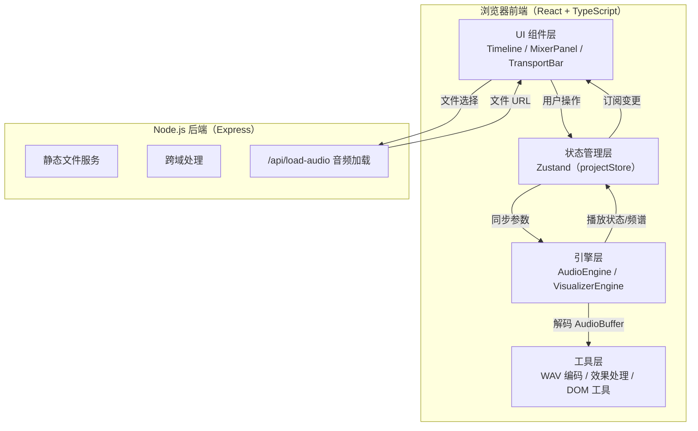
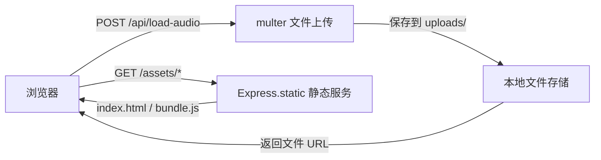

## 1. 架构设计



## 2. 技术选型说明

| 层级 | 技术 | 版本 | 用途 |
|------|------|------|------|
| 前端框架 | React | ^18 | UI 组件化构建 |
| 语言 | TypeScript | ^5 | 类型安全 |
| 构建工具 | Vite | ^5 | 快速开发构建 |
| 状态管理 | Zustand | ^4 | 轻量级全局状态（轨道、片段、效果） |
| 音频引擎 | Web Audio API | - | 原生 AudioContext / OfflineAudioContext |
| 可视化 | Canvas 2D | - | 波形、频谱、播放头绘制 |
| 后端 | Express | ^4 | 静态服务 + 跨域音频加载 |
| ID 生成 | uuid | ^9 | 轨道、片段唯一标识 |
| 跨域 | cors | ^2 | 后端跨域中间件 |

## 3. 路由定义

| 路由 | 用途 |
|------|------|
| `/` | 主编辑器页面（唯一页面，SPA） |
| `/api/load-audio` | POST，处理用户上传音频文件并返回可访问 URL |

## 4. API 定义

### 4.1 上传音频

```typescript
// 请求：multipart/form-data
// field: "audio" (File, ≤ 30s WAV/MP3)

interface LoadAudioResponse {
  success: boolean;
  url: string;           // 音频文件访问 URL
  originalName: string;
  size: number;
  duration?: number;     // 服务端可选探测
}
```

### 4.2 项目 JSON 格式（本地保存/加载）

```typescript
interface ProjectJSON {
  version: string;
  bpm: number;
  masterVolume: number;  // 0..1
  tracks: TrackJSON[];
}

interface TrackJSON {
  id: string;
  name: string;
  color: string;
  volume: number;        // 0..1
  pan: number;           // -1..1
  muted: boolean;
  solo: boolean;
  isBeatTrack: boolean;
  clips: ClipJSON[];
}

interface ClipJSON {
  id: string;
  trackId: string;
  audioUrl?: string;     // 非节拍片段
  isBeat: boolean;       // 是否为节拍片段
  startAt: number;       // 时间轴起点（秒）
  trimStart: number;     // 片段内修剪起点（秒）
  trimEnd: number;       // 片段内修剪终点（秒）
  duration: number;      // 原音频时长（秒）
  effects: EffectConfig[];
}

type EffectType = 'fadeIn' | 'fadeOut' | 'echo' | 'lowpass' | 'highpass';

interface EffectConfig {
  type: EffectType;
  params: Record<string, number>;
  // fadeIn/fadeOut: { duration: number (0..3) }
  // echo: { delay: number (0.1..0.5), feedback: number (0..0.8) }
  // lowpass/highpass: { frequency: number (20..20000) }
}
```

## 5. 后端架构



- 服务器端口：4000
- 开发期 Vite（3000）→ 代理 `/api` 到 4000
- `uploads/` 目录存放用户上传音频（开发期）

## 6. 前端数据模型（Zustand Store）

### 6.1 projectStore 核心状态

```typescript
interface ProjectState {
  tracks: Track[];
  masterVolume: number;
  bpm: number;
  playing: boolean;
  playhead: number;        // 秒
  selectedClipId: string | null;
  history: HistoryEntry[]; // 撤销栈
  future: HistoryEntry[];  // 重做栈
  // Actions
  addTrack: () => void;
  removeTrack: (id: string) => void;
  reorderTrack: (fromIdx: number, toIdx: number) => void;
  renameTrack: (id: string, name: string) => void;
  setTrackVolume: (id: string, v: number) => void;
  setTrackPan: (id: string, p: number) => void;
  toggleMute: (id: string) => void;
  toggleSolo: (id: string) => void;
  addClip: (trackId: string, clip: Partial<Clip>) => void;
  removeClip: (id: string) => void;
  moveClip: (id: string, newStartAt: number, newTrackId?: string) => void;
  trimClip: (id: string, trimStart?: number, trimEnd?: number) => void;
  updateEffect: (clipId: string, effectType: EffectType, params: Record<string,number>) => void;
  removeEffect: (clipId: string, effectType: EffectType) => void;
  generateBeatClip: () => void;
  setPlayhead: (t: number) => void;
  setPlaying: (p: boolean) => void;
  undo: () => void;
  redo: () => void;
  exportProject: () => ProjectJSON;
  importProject: (json: ProjectJSON) => void;
  exportWAV: () => Promise<Blob>;
}
```

### 6.2 核心文件结构

```
src/
├── main.tsx              # React 入口
├── App.tsx               # 根组件（左右分栏 + 响应式）
├── index.css             # 全局样式 + CSS 变量
├── stores/
│   └── projectStore.ts   # Zustand 状态管理
├── engine/
│   ├── audioEngine.ts    # Web Audio 封装（播放/停止/节拍/导出）
│   └── visualizerEngine.ts # 频谱/波形 Canvas 绘制
├── ui/
│   ├── Timeline.tsx      # 时间轴主组件
│   ├── MixerPanel.tsx    # 混音面板主组件
│   ├── TrackRow.tsx      # 单条轨道渲染
│   ├── ClipBlock.tsx     # 单个音频片段
│   ├── TrimHandle.tsx    # 修剪手柄
│   ├── Fader.tsx         # 推子组件
│   ├── PanKnob.tsx       # 声像旋钮
│   ├── TransportBar.tsx  # 传输控制栏
│   ├── Toolbar.tsx       # 顶部工具栏
│   ├── EffectPanel.tsx   # 效果气泡面板
│   ├── SpectrumDisplay.tsx # 主输出频谱显示
│   └── Drawer.tsx        # 响应式底部抽屉
├── utils/
│   ├── wavEncoder.ts     # 16bit PCM → WAV Blob
│   ├── effects.ts        # AudioNode 图构建
│   └── dom.ts            # 拖拽、坐标转换等 DOM 工具
└── server/
    └── server.js         # Express 服务器
```

## 7. 性能优化策略

- **音频图复用**：静态片段使用连接好的 AudioNode 图，参数变化仅修改 `AudioParam.value`
- **批量渲染**：混音面板推子变化使用 `requestAnimationFrame` 合并写入 `GainNode.gain`
- **离屏绘制**：波形预览在片段导入时一次性绘制到离屏 Canvas 缓存
- **节流**：拖拽修剪手柄使用 16ms 节流更新状态
- **AudioContext 生命周期**：用户首次交互时才创建 `AudioContext`（浏览器自动播放策略）
- **垃圾回收**：停止播放时断开不再使用的 `AudioBufferSourceNode`
