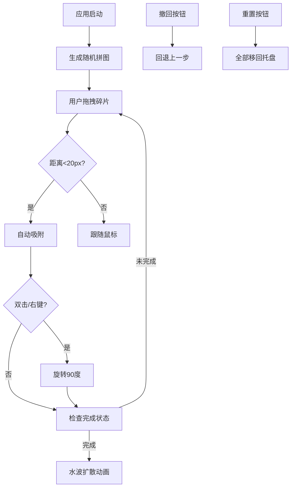

## 1. 产品概述
像素碎片漂流记是一款基于Web的交互式拼图应用，用户将打散的抽象画碎片在网格上拖动拼合，完成后触发水波扩散动画效果。
- 主要面向休闲娱乐用户，提供艺术化拼图体验
- 结合Canvas高性能渲染与精美动画，打造沉浸式拼图游戏

## 2. 核心功能

### 2.1 功能模块
1. **主界面**：左侧拼图工作区、右侧碎片托盘、顶部工具栏
2. **拼图引擎**：碎片数据管理、碰撞检测、吸附算法
3. **渲染引擎**：Canvas绘制、阴影效果、边框渲染、水波动画
4. **状态管理**：碎片列表、选中状态、完成判定、撤销堆栈

### 2.3 页面详情
| 页面名称 | 模块名称 | 功能描述 |
|---------|---------|---------|
| 主界面 | 拼图工作区 | Canvas绘制4x4网格，支持碎片拖拽、吸附、旋转 |
| 主界面 | 碎片托盘 | 右侧滚动网格展示未放置碎片，60x60px缩略图 |
| 主界面 | 工具栏 | 重置按钮、撤回按钮、完成提示气泡 |

## 3. 核心流程
用户从右侧托盘拖拽碎片到左侧工作区，当碎片中心距离目标网格位置小于20px时自动吸附对齐。双击或右键碎片可旋转90度。当所有碎片位置和旋转均正确时，触发水波扩散动画和成功提示。支持撤销操作（最多20步）和重置功能。

## 4. 用户界面设计

### 4.1 设计风格
- **主色调**：深色端子主题 #1E1E2E（工具栏、托盘背景）
- **浅色区**：#F0F0F0（工作区背景）
- **点缀色**：#4A90D9（按钮、提示气泡）
- **碎片颜色**：#E57373、#4FC3F7、#81C784（抽象画色块）
- **按钮**：白色字体，圆角6px，悬停#3A3A4E
- **字体**：现代无衬线字体，层级清晰

### 4.2 页面设计概述
| 页面名称 | 模块名称 | UI元素 |
|---------|---------|--------|
| 主界面 | 工具栏 | 高48px，深色背景，左侧标题、中间撤回/重置按钮、右侧状态指示 |
| 主界面 | 工作区 | 70%宽度，浅灰背景，160px间距网格线，Canvas绘制 |
| 主界面 | 碎片托盘 | 30%宽度（最小240px），深色背景，滚动网格，悬停边框变亮缩放1.05 |

### 4.3 响应式
- Desktop-first设计，最小宽度768px
- 托盘宽度不小于240px，左右分栏布局
- 触屏设备优化拖拽体验
