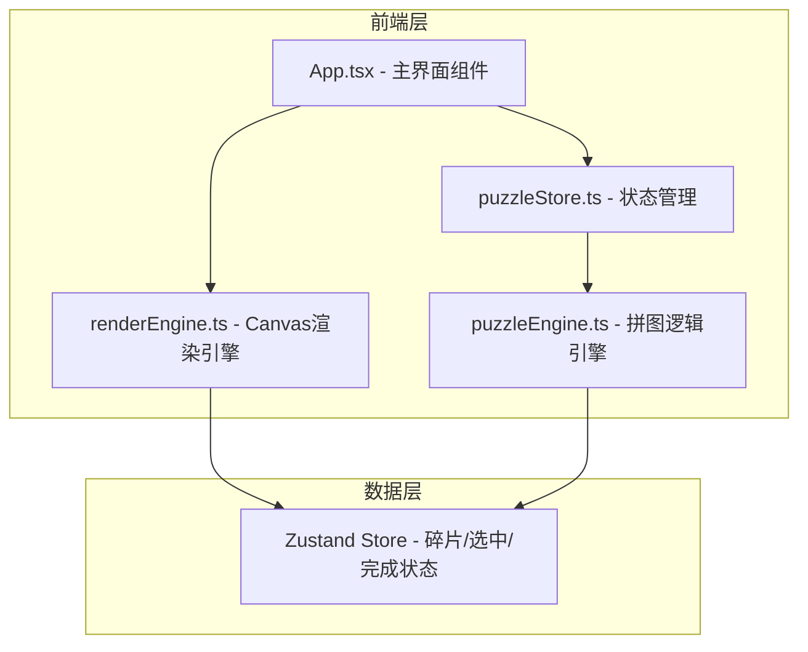

## 1. 架构设计



## 2. 技术描述
- **前端**：React 18 + TypeScript + Vite
- **状态管理**：Zustand
- **渲染**：HTML5 Canvas 2D API
- **项目初始化**：Vite react-ts 模板

## 3. 项目文件结构
```
├── package.json
├── vite.config.js
├── tsconfig.json
├── index.html
└── src/
    ├── engine/
    │   ├── puzzleEngine.ts    # 拼图网格数据、碰撞检测、吸附算法
    │   └── renderEngine.ts    # Canvas绘制、阴影、水波动画
    ├── stores/
    │   └── puzzleStore.ts     # Zustand状态管理、撤销堆栈
    ├── App.tsx                # 主界面组件
    └── main.tsx               # React入口
```

## 4. 核心数据模型

### 4.1 碎片数据结构
```typescript
interface PuzzlePiece {
  id: number;
  row: number;           // 正确行位置 (0-3)
  col: number;           // 正确列位置 (0-3)
  currentX: number;      // 当前X坐标（工作区像素）
  currentY: number;      // 当前Y坐标（工作区像素）
  rotation: number;      // 当前旋转角度 (0/90/180/270)
  isPlaced: boolean;     // 是否已放置在工作区
  isSelected: boolean;   // 是否被选中
  imageData: ImageData;  // 碎片图像数据
}
```

### 4.2 状态结构
```typescript
interface PuzzleState {
  pieces: PuzzlePiece[];
  selectedPieceId: number | null;
  isComplete: boolean;
  undoStack: PuzzlePiece[][];
  maxUndoSteps: number;
}
```

## 5. 核心算法说明

### 5.1 吸附算法
- 计算碎片中心点与最近网格交叉点的欧氏距离
- 距离阈值：20px
- 吸附过渡：0.15s ease-out 动画
- 吸附后锁定位置（isPlaced = true）

### 5.2 完成判定
- 遍历所有碎片，检查：
  1. currentX/currentY 是否匹配目标网格位置（±2px容差）
  2. rotation 是否为 0（正确方向）
- 全部满足时触发 isComplete = true

### 5.3 水波扩散动画
- 以拼合中心点为圆心
- 半径随时间线性扩展（0 → 画布对角线）
- 透明度随半径增大递减
- 持续时间：1.2s
- 使用 requestAnimationFrame 逐帧渲染

## 6. 性能优化
- Canvas离屏渲染缓存静态图像
- requestAnimationFrame 保证60fps
- 最小化状态更新频率，拖拽时只更新坐标不触发完整重渲染
- 碎片吸附判定使用空间哈希避免O(n²)复杂度
