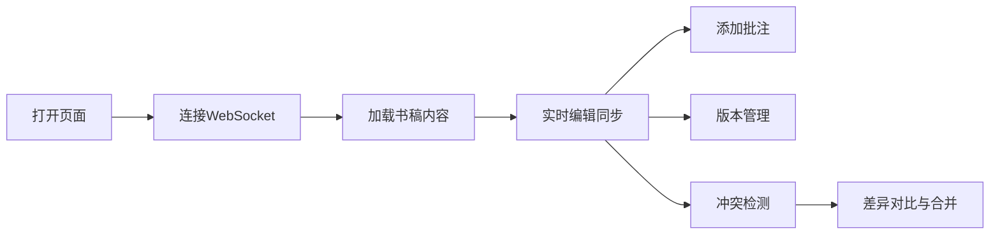

## 1. 产品概述

协作书坊是一款面向小型独立出版社的在线协同编辑平台，支持作者与编辑实时共同编辑书稿，提供批注、版本追踪和冲突解决功能。

- 核心目标：解决多人远程协作编辑书稿时的同步、批注和版本管理问题
- 目标用户：出版社作者、编辑人员
- 市场价值：提升协作效率，降低沟通成本，完整保留修改历史

## 2. 核心功能

### 2.1 用户角色
| 角色 | 接入方式 | 核心权限 |
|------|----------|----------|
| 作者 | 直接访问 | 编辑书稿、添加批注、查看版本 |
| 编辑 | 直接访问 | 编辑书稿、回复批注、管理版本 |

### 2.2 功能模块
1. **实时协同编辑**：多用户同时编辑、光标同步、选区同步
2. **批注与修订**：文字选中标注、批注回复、标记已解决
3. **版本历史与回退**：自动版本快照、手动保存、版本预览与恢复
4. **冲突检测与提示**：冲突检测、差异对比、手动合并

### 2.3 页面详情
| 页面名称 | 模块名称 | 功能描述 |
|---------|---------|----------|
| 主编辑页 | 左侧工具栏 | 保存、版本、批注按钮 |
| 主编辑页 | 编辑区域 | 书稿内容编辑、行号显示、多用户光标 |
| 主编辑页 | 批注面板 | 批注列表、搜索、回复、解决 |
| 主编辑页 | 版本面板 | 时间线、版本预览、恢复 |
| 主编辑页 | 状态栏 | 连接用户数、保存时间、字数统计 |
| 主编辑页 | 冲突提示 | 警告条、冲突详情、差异对比 |

## 3. 核心流程

用户打开页面 → 连接WebSocket → 加载书稿内容 → 实时编辑同步 → 添加批注/查看版本 → 冲突时手动解决 → 保存/自动版本快照

## 4. 用户界面设计

### 4.1 设计风格
- **主色调**：深色工具栏 (#2D2D44) + 浅色编辑区 (#FAFAFA) 的明暗对比
- **强调色**：#FF6B6B、#4ECDC4、#FFD93D（用户光标色）
- **按钮风格**：圆角 8px，悬停过渡效果
- **字体**：正文 #333333，行高 1.8，等宽字体用于编辑区
- **布局风格**：三栏布局（左工具栏 + 中编辑区 + 右面板）
- **图标风格**：线性图标，24x24px

### 4.2 页面设计概览
| 页面名称 | 模块名称 | UI元素 |
|---------|---------|-------|
| 主编辑页 | 左侧工具栏 | 深色背景、图标按钮、点击反馈 |
| 主编辑页 | 编辑区域 | 行号列、文本内容、多色光标、闪烁动画 |
| 主编辑页 | 批注面板 | 搜索框、气泡列表、回复框、状态标记 |
| 主编辑页 | 版本面板 | 时间线、条目卡片、预览/恢复按钮 |
| 主编辑页 | 状态栏 | 用户数、保存时间、字数 |
| 主编辑页 | 冲突提示 | 黄色警告条、展开面板、左右分栏对比 |

### 4.3 响应式
- 桌面端优先，最小分辨率 1024px
- 右侧面板最小宽度 280px
- 编辑区自适应宽度

### 4.4 交互动效
- 光标平滑移动 (0.1s 过渡)
- 铅笔图标悬停放大至 36px (0.2s 过渡)
- 按钮点击背景色变化
- 批注气泡淡入效果
