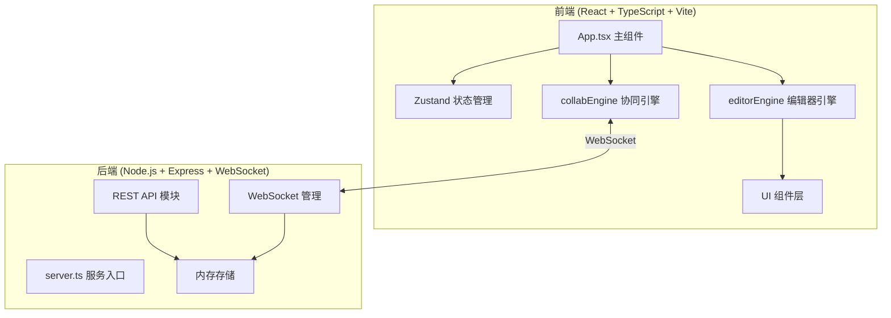
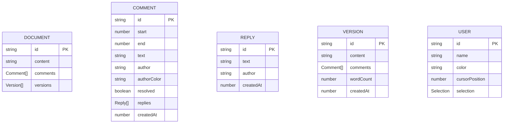

## 1. 架构设计



## 2. 技术选型
- **前端**：React 18 + TypeScript + Vite + Zustand
- **后端**：Express 4 + ws (WebSocket) + uuid
- **构建工具**：Vite
- **状态管理**：Zustand
- **实时通信**：WebSocket (ws 库)

## 3. 文件结构
```
├── package.json
├── vite.config.js
├── tsconfig.json
├── index.html
└── src/
    ├── server.ts              # 后端入口
    ├── engine/
    │   ├── editorEngine.ts    # 编辑器引擎
    │   └── collabEngine.ts    # 协同引擎
    └── ui/
        ├── App.tsx            # 主应用组件
        ├── store.ts           # Zustand 状态
        ├── components/
        │   ├── Toolbar.tsx
        │   ├── Editor.tsx
        │   ├── CommentPanel.tsx
        │   ├── VersionPanel.tsx
        │   ├── StatusBar.tsx
        │   └── ConflictAlert.tsx
        └── types.ts           # 类型定义
```

## 4. API 定义

### 4.1 REST API
| 方法 | 路径 | 描述 |
|------|------|------|
| GET | /api/document/:id | 获取书稿内容 |
| PUT | /api/document/:id | 保存书稿内容 |
| GET | /api/document/:id/versions | 获取版本列表 |
| POST | /api/document/:id/versions | 创建版本快照 |
| GET | /api/document/:id/versions/:versionId | 获取指定版本 |

### 4.2 WebSocket 消息类型
```typescript
// 客户端 -> 服务端
type ClientMessage = 
  | { type: 'join'; documentId: string; userId: string; userName: string }
  | { type: 'leave'; documentId: string; userId: string }
  | { type: 'edit'; documentId: string; userId: string; op: EditOp }
  | { type: 'cursor'; documentId: string; userId: string; position: number }
  | { type: 'selection'; documentId: string; userId: string; start: number; end: number }

// 服务端 -> 客户端
type ServerMessage =
  | { type: 'users'; users: UserInfo[] }
  | { type: 'edit'; userId: string; op: EditOp }
  | { type: 'cursor'; userId: string; position: number; color: string }
  | { type: 'selection'; userId: string; start: number; end: number; color: string }
  | { type: 'comment'; comment: Comment }
  | { type: 'conflict'; conflict: ConflictInfo }

interface EditOp {
  type: 'insert' | 'delete';
  position: number;
  text?: string;
  length?: number;
  timestamp: number;
}
```

## 5. 数据模型

### 5.1 数据模型定义


### 5.2 核心类型定义
```typescript
interface DocumentState {
  id: string;
  content: string;
  comments: Comment[];
  versions: Version[];
}

interface Comment {
  id: string;
  start: number;
  end: number;
  text: string;
  author: string;
  authorColor: string;
  resolved: boolean;
  replies: Reply[];
  createdAt: number;
}

interface Reply {
  id: string;
  text: string;
  author: string;
  createdAt: number;
}

interface Version {
  id: string;
  content: string;
  comments: Comment[];
  wordCount: number;
  createdAt: number;
}

interface UserInfo {
  id: string;
  name: string;
  color: string;
  cursorPosition: number;
  selectionStart?: number;
  selectionEnd?: number;
}
```

## 6. 引擎模块职责

### 6.1 editorEngine
- 管理文本内容、选区、光标位置
- 维护批注数据
- 操作历史栈（撤销/重做）
- 应用远端编辑操作

### 6.2 collabEngine
- WebSocket 连接管理
- 消息序列化/反序列化
- 冲突检测与处理
- 本地操作广播

### 6.3 状态管理 (Zustand)
- 编辑器状态
- WebSocket 连接状态
- 用户列表
- 批注列表
- 版本列表
- 冲突信息
