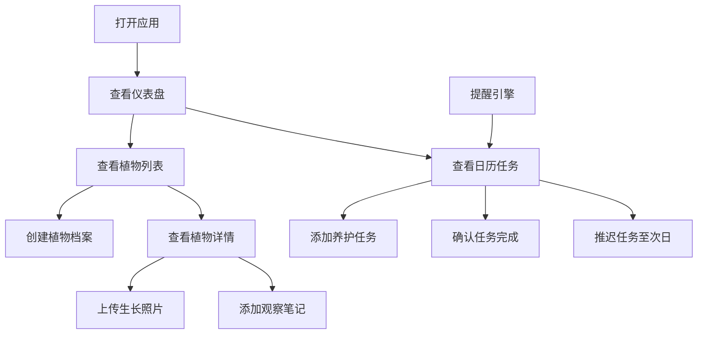

## 1. 产品概述

家庭园艺管理应用，帮助用户通过日历视图规划播种、浇水、施肥等养护任务，并记录每株植物的生长照片和观察笔记。

- 解决纸质记录易丢失、手机备忘录无法按植物分类管理、缺乏生长周期提醒的痛点
- 面向家庭园艺爱好者，提供植物档案管理、智能日历规划、生长日志记录、智能提醒推送等核心功能

## 2. 核心功能

### 2.1 用户角色
| 角色 | 注册方式 | 核心权限 |
|------|----------|----------|
| 普通用户 | 本地存储，无需注册 | 创建植物档案、规划养护任务、记录生长日志、查看提醒 |

### 2.2 功能模块
1. **主题仪表盘**：植物总数、本月已办任务、待办任务、枯死告警四块指标卡片
2. **植物档案管理**：创建/编辑植物卡片，瀑布流展示，状态标签标记
3. **智能日历规划器**：周/月视图切换，任务标记，任务操作面板
4. **生长日志**：照片时间线，双列网格展示，文字笔记
5. **提醒推送**：自动生成养护提醒，逾期标记，待办徽章

### 2.3 页面详情
| 页面名称 | 模块名称 | 功能描述 |
|----------|----------|----------|
| 首页仪表盘 | 指标卡片组 | 横向展示四块核心数据卡片，带数字滚动动画 |
| 首页仪表盘 | 导航栏 | 固定顶部导航，右上角待办任务徽章 |
| 植物列表页 | 植物卡片瀑布流 | 宽240px卡片瀑布流布局，悬停升起效果 |
| 植物列表页 | 状态标签 | 五种状态圆角标签，不同颜色区分 |
| 植物详情页 | 生长日志 | 双列照片网格，微光加载动画，文字笔记 |
| 日历页 | 日历网格 | 60x60px日期格，任务色点标记，任务数量徽章 |
| 日历页 | 任务操作面板 | 毛玻璃底部面板，高200px |
| 移动端 | 底部导航栏 | 固定底部，四个图标等距分布 |

## 3. 核心流程

用户打开应用 → 查看仪表盘了解整体养护状态 → 在日历中查看今日/本周待办任务 → 点击植物卡片查看详情和生长日志 → 上传新照片或添加观察笔记 → 在日历中添加新的养护任务 → 系统自动生成定期养护提醒 → 用户确认完成或推迟任务

## 4. 用户界面设计

### 4.1 设计风格
- **主色调**：浅色自然风格 #D4E9D7、#F0F7F4、#FFFFFF
- **强调色**：#4ECDC4（按钮、超链接）、#FF6B6B（警示、删除）
- **状态色**：幼苗#A8E6CF、生长#FFB347、开花#FF6B6B、结果#78C2AD、枯萎#8B4513
- **任务色**：播种#FFD93D、浇水#6C5CE7、施肥#3BCEAC、修剪#FF6B6B、换盆#A29BFE
- **按钮样式**：圆角设计，悬停缩放1.02，点击缩放0.98，0.2s ease过渡
- **字体**：系统默认无衬线字体
- **布局风格**：桌面端两栏布局（左flex 1，右flex 0 0 500px），移动端单栏堆叠
- **图标**：Lucide React 图标库

### 4.2 页面设计概述
| 页面名称 | 模块名称 | UI元素 |
|----------|----------|--------|
| 首页仪表盘 | 指标卡片 | 宽240px高100px卡片，36px大号数字，24px图标，数字滚动动画 |
| 植物列表 | 植物卡片 | 宽240px圆角12px卡片，1px边框，悬停升起4px阴影上移2px |
| 植物详情 | 照片网格 | 160x120px照片，圆角8px，2px边框，微光加载动画 |
| 日历视图 | 日期格 | 60x60px，圆角8px，背景#FAFAFA，左上角色点标记 |
| 日历视图 | 任务面板 | 毛玻璃效果rgba(255,255,255,0.8)，底部弹出 |
| 导航栏 | 顶部/底部 | 高56px，#FFFFFF背景，1px边框阴影 |
| 导航栏 | 待办徽章 | 红色圆形，直径20px，0.5s弹性放大动画 |

### 4.3 响应式
- 桌面端优先，768px断点切换为移动端布局
- 移动端页面底部固定导航栏，四个图标等距分布
- 所有可点击元素支持触摸操作，悬停/点击反馈一致

### 4.4 性能要求
- 首次加载时间不超过2秒（懒加载和缓存）
- 日历滚动FPS保持55帧以上
- 照片压缩至最大800px宽度，JPEG格式
