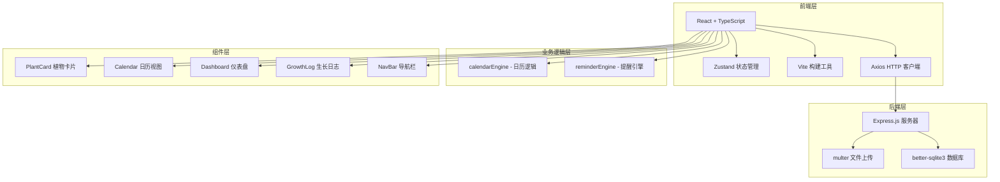
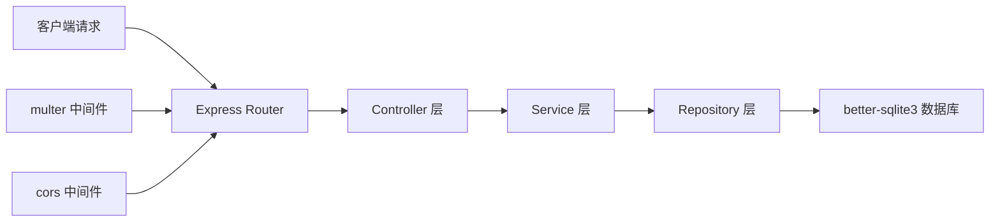
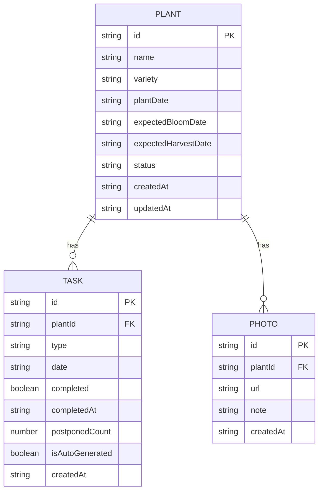

## 1. 架构设计



## 2. 技术说明

- **前端框架**：React@18 + TypeScript
- **构建工具**：Vite@5
- **状态管理**：Zustand（带 persist 中间件持久化到 localStorage）
- **HTTP 客户端**：Axios
- **后端框架**：Express@4
- **数据库**：better-sqlite3（本地文件数据库）
- **文件上传**：multer
- **中间件**：cors、uuid
- **图标库**：lucide-react

## 3. 路由定义

| 路由 | 用途 |
|------|------|
| / | 首页仪表盘 |
| /plants | 植物列表页 |
| /plants/:id | 植物详情页（生长日志） |
| /calendar | 日历规划页 |

## 4. API 定义

### 4.1 植物档案 API

```typescript
interface Plant {
  id: string;
  name: string;
  variety: string;
  plantDate: string;
  expectedBloomDate?: string;
  expectedHarvestDate?: string;
  status: 'seedling' | 'growing' | 'flowering' | 'fruiting' | 'withered';
  createdAt: string;
  updatedAt: string;
}

// GET /api/plants - 获取所有植物
// POST /api/plants - 创建植物
// PUT /api/plants/:id - 更新植物
// DELETE /api/plants/:id - 删除植物
```

### 4.2 任务 API

```typescript
interface Task {
  id: string;
  plantId?: string;
  type: 'sowing' | 'watering' | 'fertilizing' | 'pruning' | 'repotting';
  date: string;
  completed: boolean;
  completedAt?: string;
  postponedCount: number;
  isAutoGenerated: boolean;
  createdAt: string;
}

// GET /api/tasks - 获取所有任务
// POST /api/tasks - 创建任务
// PUT /api/tasks/:id - 更新任务
// DELETE /api/tasks/:id - 删除任务
// POST /api/tasks/:id/complete - 标记完成
// POST /api/tasks/:id/postpone - 推迟至次日
```

### 4.3 照片 API

```typescript
interface Photo {
  id: string;
  plantId: string;
  url: string;
  note?: string;
  createdAt: string;
}

// GET /api/plants/:id/photos - 获取植物照片
// POST /api/plants/:id/photos - 上传照片（multipart/form-data）
// DELETE /api/photos/:id - 删除照片
```

## 5. 服务端架构图



## 6. 数据模型

### 6.1 ER 图



### 6.2 DDL 语句

```sql
CREATE TABLE IF NOT EXISTS plants (
  id TEXT PRIMARY KEY,
  name TEXT NOT NULL,
  variety TEXT,
  plantDate TEXT NOT NULL,
  expectedBloomDate TEXT,
  expectedHarvestDate TEXT,
  status TEXT NOT NULL DEFAULT 'seedling',
  createdAt TEXT NOT NULL,
  updatedAt TEXT NOT NULL
);

CREATE TABLE IF NOT EXISTS tasks (
  id TEXT PRIMARY KEY,
  plantId TEXT,
  type TEXT NOT NULL,
  date TEXT NOT NULL,
  completed INTEGER NOT NULL DEFAULT 0,
  completedAt TEXT,
  postponedCount INTEGER NOT NULL DEFAULT 0,
  isAutoGenerated INTEGER NOT NULL DEFAULT 0,
  createdAt TEXT NOT NULL,
  FOREIGN KEY (plantId) REFERENCES plants(id) ON DELETE CASCADE
);

CREATE TABLE IF NOT EXISTS photos (
  id TEXT PRIMARY KEY,
  plantId TEXT NOT NULL,
  url TEXT NOT NULL,
  note TEXT,
  createdAt TEXT NOT NULL,
  FOREIGN KEY (plantId) REFERENCES plants(id) ON DELETE CASCADE
);

CREATE INDEX IF NOT EXISTS idx_tasks_date ON tasks(date);
CREATE INDEX IF NOT EXISTS idx_tasks_plantId ON tasks(plantId);
CREATE INDEX IF NOT EXISTS idx_photos_plantId ON photos(plantId);
```
