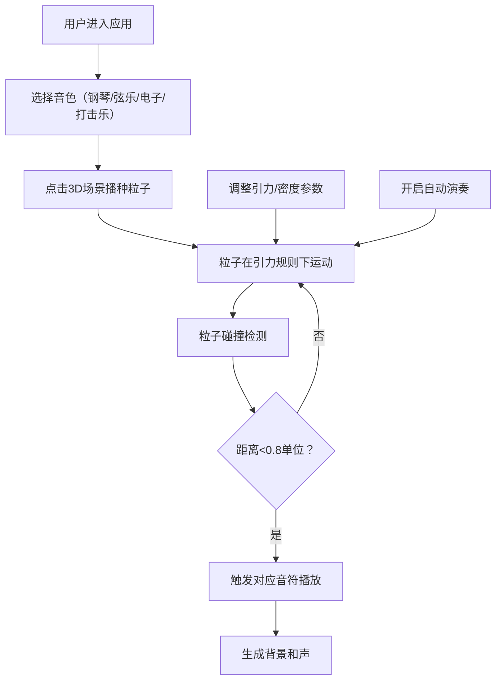

## 1. 产品概述
星尘共鸣器是一个沉浸式3D音乐创作应用，用户通过播种声音粒子并调整引力规则来创造动态音乐星群，实现可视化的音乐创作体验。

- **核心价值**：将抽象的音乐创作转化为直观的3D视觉体验，让用户像指挥家一样创造音乐
- **目标用户**：音乐爱好者、视觉艺术家、创意工作者
- **市场定位**：创新的交互音乐创作工具，融合视觉艺术与声音设计

## 2. 核心功能

### 2.1 功能模块
1. **3D主场景**：Three.js渲染的粒子星群、虚拟麦克风视角、星空背景、反射地面
2. **音色库面板**：四种乐器音色选择（钢琴、弦乐、电子、打击乐）
3. **控制面板**：引力强度滑块、粒子密度阈值滑块、自动演奏开关
4. **粒子系统**：粒子播种、引力运动、碰撞检测、音符触发
5. **音频引擎**：Web Audio API实时音色合成、背景和声生成
6. **响应式界面**：桌面端左右面板布局、移动端底部工具栏布局

### 2.2 页面详情
| 页面名称 | 模块名称 | 功能描述 |
|---------|---------|----------|
| 主页面 | 3D场景模块 | 渲染粒子星群、处理鼠标/触摸交互、实时更新粒子状态 |
| 主页面 | 音色库面板 | 四种音色选择、图标高亮反馈、播种模式切换 |
| 主页面 | 控制面板 | 引力强度调节（0.0-2.0）、密度阈值调节（1-20）、自动演奏开关 |
| 主页面 | 粒子引擎 | 粒子创建/生命周期管理、引力计算、碰撞检测、音符触发 |
| 主页面 | 音频引擎 | 音色合成、音符播放、背景和声生成 |

## 3. 核心流程

用户选择音色 → 点击3D场景播种粒子 → 粒子在引力作用下运动 → 粒子碰撞触发音符 → 用户调整参数改变音乐形态 → 开启自动演奏生成持续旋律

## 4. 用户界面设计

### 4.1 设计风格
- **主色调**：深紫色 #0D0B1A → #1A1635 渐变背景
- **强调色**：紫色 #7C6CE7、青色 #4ECDC4、浅紫 #B8A9FF
- **音色配色**：钢琴 #FF6B6B、弦乐 #4ECDC4、电子 #FFD93D、打击乐 #6C5CE7
- **文字色**：#E8E4FF
- **风格定位**：科幻宇宙主题、深邃神秘、精致流畅的交互动效
- **字体**：使用 Space Grotesk 作为展示字体，Inter 作为正文字体
- **圆角规范**：小元素8px、面板12-16px
- **动效节奏**：0.2s-0.3s ease-out 过渡

### 4.2 页面设计概述
| 页面名称 | 模块名称 | UI元素 |
|---------|---------|--------|
| 主页面 | 3D场景 | 悬浮虚拟麦克风视角（原点上方10单位，俯视45度）、200颗闪烁星光、半透明圆形反射地面（半径20，透明度0.15） |
| 主页面 | 音色库面板 | 固定左侧220px宽，毛玻璃效果rgba(20,18,40,0.75)，圆角16px，4个40x40px音色图标，悬停高亮rgba(255,255,255,0.1)+缩放1.05 |
| 主页面 | 控制面板 | 固定右侧260px宽，背景rgba(15,13,30,0.85)，1px边框#3A3560，圆角12px，内边距16px |
| 主页面 | 滑块控件 | 轨道高6px圆角3px背景#2A254A，手柄直径16px白色，悬停光晕#7C6CE7 |
| 主页面 | 开关控件 | 宽50px高28px圆角14px，开启#7C6CE7关闭#3A3560，内部滑块直径22px |

### 4.3 响应式设计
- **桌面端（≥768px）**：左侧音色库面板+中央3D场景+右侧控制面板
- **移动端（<768px）**：底部可滚动工具栏（高150px，背景rgba(15,13,30,0.9)），3D场景占满剩余高度
- **触摸操作**：单指拖拽旋转视角，双指缩放，单指长按2s弹出播种菜单

### 4.4 3D场景设计
- **环境**：深紫色渐变背景，200颗随机闪烁星光（大小1-3px，周期2-4s）
- **灯光**：微弱环境光，粒子自发光效果，地面接收粒子反射
- **相机**：默认位置(0,10,10)，俯视45度看向原点，支持鼠标拖拽旋转、滚轮缩放
- **粒子**：发光小球体半径0.3单位，带光晕效果，播种时环形扩散动画（半径0→2，0.5s，透明度0.6→0）
- **连接线**：超过密度阈值的粒子间绘制半透明细线，颜色为两粒子颜色混合，透明度随距离衰减
- **后期效果**：Bloom发光效果增强粒子视觉表现

## 5. 性能要求
- 120个粒子全活跃时保持30fps以上
- 粒子距离计算仅对距离<5单位的粒子对执行
- 碰撞检测每帧执行但做距离预筛选
- 粒子数量上限120个，超出时替换最远粒子
