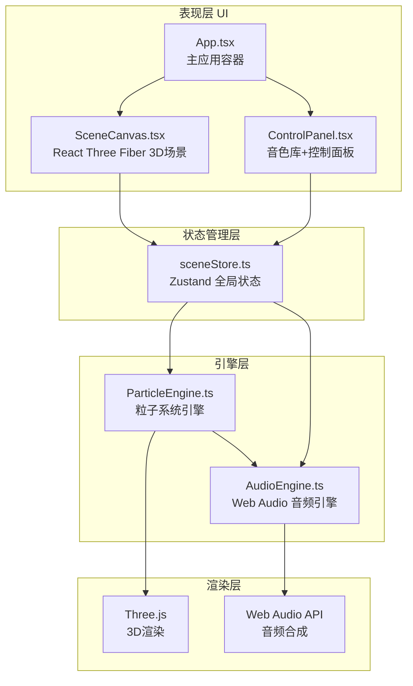

## 1. 架构设计



## 2. 技术栈说明

### 2.1 前端框架与工具
- **框架**：React 18 + TypeScript
- **构建工具**：Vite 5
- **3D渲染**：Three.js + @react-three/fiber + @react-three/drei + @react-three/postprocessing
- **状态管理**：Zustand
- **样式方案**：Tailwind CSS 3 + CSS Variables
- **图标库**：lucide-react

### 2.2 核心依赖版本
```json
{
  "three": "^0.160.0",
  "@react-three/fiber": "^8.15.0",
  "@react-three/drei": "^9.92.0",
  "@react-three/postprocessing": "^2.15.0",
  "react": "^18.2.0",
  "react-dom": "^18.2.0",
  "zustand": "^4.4.7",
  "typescript": "^5.3.0",
  "vite": "^5.0.0",
  "@vitejs/plugin-react": "^4.2.0",
  "tailwindcss": "^3.4.0"
}
```

## 3. 目录结构

```
src/
├── engine/
│   ├── ParticleEngine.ts    # 粒子系统引擎（创建、运动、碰撞、生命周期）
│   └── AudioEngine.ts       # 音频引擎（Web Audio API音色合成）
├── stores/
│   └── sceneStore.ts        # Zustand状态管理
├── ui/
│   ├── SceneCanvas.tsx      # 3D场景React组件
│   └── ControlPanel.tsx     # 控制面板React组件
├── components/
│   ├── Particle.tsx         # 单个粒子渲染组件
│   ├── ConnectionLines.tsx  # 粒子连接线组件
│   ├── StarField.tsx        # 星空背景组件
│   └── ReflectionFloor.tsx  # 反射地面组件
├── types/
│   └── index.ts             # 类型定义
├── utils/
│   ├── audio.ts             # 音频工具函数
│   └── math.ts              # 数学工具函数
├── App.tsx                  # 主应用组件
├── main.tsx                 # 应用入口
└── index.css                # 全局样式
```

## 4. 核心数据模型

### 4.1 粒子数据结构
```typescript
type TimbreType = 'piano' | 'strings' | 'electronic' | 'percussion';

interface Particle {
  id: string;
  timbre: TimbreType;
  position: THREE.Vector3;
  velocity: THREE.Vector3;
  color: string;
  radius: number;
  createdAt: number;
  lastCollisionTime: Map<string, number>;
}

interface ParticleState {
  particles: Particle[];
  connections: Array<{ from: string; to: string; distance: number }>;
}
```

### 4.2 全局状态结构
```typescript
interface SceneState {
  selectedTimbre: TimbreType;
  gravityStrength: number;      // 0.0 - 2.0, default 0.8
  densityThreshold: number;     // 1 - 20, default 8
  autoPlay: boolean;
  isPlaying: boolean;
  
  // Actions
  setSelectedTimbre: (timbre: TimbreType) => void;
  setGravityStrength: (value: number) => void;
  setDensityThreshold: (value: number) => void;
  setAutoPlay: (value: boolean) => void;
  togglePlaying: () => void;
}
```

### 4.3 音色配置
```typescript
const TIMBRE_CONFIG = {
  piano: {
    color: '#FF6B6B',
    oscillator: 'sine',
    envelope: { attack: 0.01, decay: 0.3, sustain: 0.1, release: 1.0 },
    pitchRange: ['C4', 'C6']
  },
  strings: {
    color: '#4ECDC4',
    oscillator: 'sawtooth',
    envelope: { attack: 0.1, decay: 0.5, sustain: 0.3, release: 2.0 }
  },
  electronic: {
    color: '#FFD93D',
    oscillator: 'square',
    frequencyRange: [200, 1000]
  },
  percussion: {
    color: '#6C5CE7',
    oscillator: 'triangle',
    envelope: { attack: 0.001, decay: 0.1, sustain: 0, release: 0.3 }
  }
} as const;
```

## 5. 核心模块设计

### 5.1 ParticleEngine 粒子引擎
```typescript
class ParticleEngine {
  private particles: Particle[] = [];
  private MAX_PARTICLES = 120;
  private NEIGHBOR_RADIUS = 5;
  private COLLISION_DISTANCE = 0.8;
  private MAX_SPEED = 0.5;

  constructor(private audioEngine: AudioEngine) {}

  // 播种新粒子
  spawnParticle(timbre: TimbreType, position: THREE.Vector3): Particle;

  // 每帧更新
  update(deltaTime: number, gravity: number, densityThreshold: number): void;

  // 引力计算（仅同类色粒子吸引）
  private calculateGravityForces(): void;

  // 距离检测优化（空间网格划分）
  private findNearbyParticles(particle: Particle, radius: number): Particle[];

  // 碰撞检测与音符触发
  private checkCollisions(): void;

  // 计算粒子间连接
  calculateConnections(densityThreshold: number): Connection[];

  // 获取最远粒子用于替换
  private findFarthestParticle(position: THREE.Vector3): Particle | null;
}
```

### 5.2 AudioEngine 音频引擎
```typescript
class AudioEngine {
  private audioContext: AudioContext | null = null;
  private masterGain: GainNode | null = null;

  init(): Promise<void>;

  // 触发钢琴音符（Y轴映射音高）
  triggerPianoNote(yPosition: number, velocity: number): void;

  // 触发弦乐音符（周围粒子数影响音色亮度）
  triggerStringsNote(particle: Particle, neighborCount: number): void;

  // 触发电子音符（X轴映射频率）
  triggerElectronicNote(xPosition: number): void;

  // 触发打击乐（距中心越远越重）
  triggerPercussion(distanceFromCenter: number): void;

  // 生成背景和声
  updateHarmony(particles: Particle[], density: number): void;

  private midiToFrequency(midi: number): number;
  private createEnvelope(gainNode: GainNode, config: EnvelopeConfig): void;
}
```

### 5.3 性能优化策略

1. **空间网格划分**：将3D空间划分为网格，每个网格维护粒子列表，距离检测仅检查相邻网格
2. **距离计算优化**：使用距离平方比较避免开方运算
3. **碰撞节流**：每个粒子对的碰撞检测有最小间隔时间（如100ms）
4. **渲染优化**：使用InstancedMesh渲染大量粒子，减少Draw Call
5. **音频节流**：限制同时播放的音符数量（最多8个）

## 6. 性能预算

| 资源类型 | 预算值 |
|---------|-------|
| JavaScript | < 15ms/帧 |
| WebGL Draw Call | < 50 |
| 内存占用 | < 100MB |
| 粒子数量上限 | 120 |
| 同时播放音符 | 8 |
| 目标帧率 | ≥ 30fps |

## 7. 构建配置

### 7.1 vite.config.ts
```typescript
import { defineConfig } from 'vite';
import react from '@vitejs/plugin-react';
import path from 'path';

export default defineConfig({
  plugins: [react()],
  resolve: {
    alias: {
      '@': path.resolve(__dirname, './src'),
    },
  },
  server: {
    port: 5173,
    open: true,
  },
});
```

### 7.2 tsconfig.json
```json
{
  "compilerOptions": {
    "target": "ES2020",
    "useDefineForClassFields": true,
    "lib": ["ES2020", "DOM", "DOM.Iterable"],
    "module": "ESNext",
    "skipLibCheck": true,
    "moduleResolution": "bundler",
    "allowImportingTsExtensions": true,
    "resolveJsonModule": true,
    "isolatedModules": true,
    "noEmit": true,
    "jsx": "react-jsx",
    "strict": true,
    "noUnusedLocals": true,
    "noUnusedParameters": true,
    "noFallthroughCasesInSwitch": true,
    "baseUrl": ".",
    "paths": {
      "@/*": ["src/*"]
    }
  },
  "include": ["src"],
  "references": [{ "path": "./tsconfig.node.json" }]
}
```
