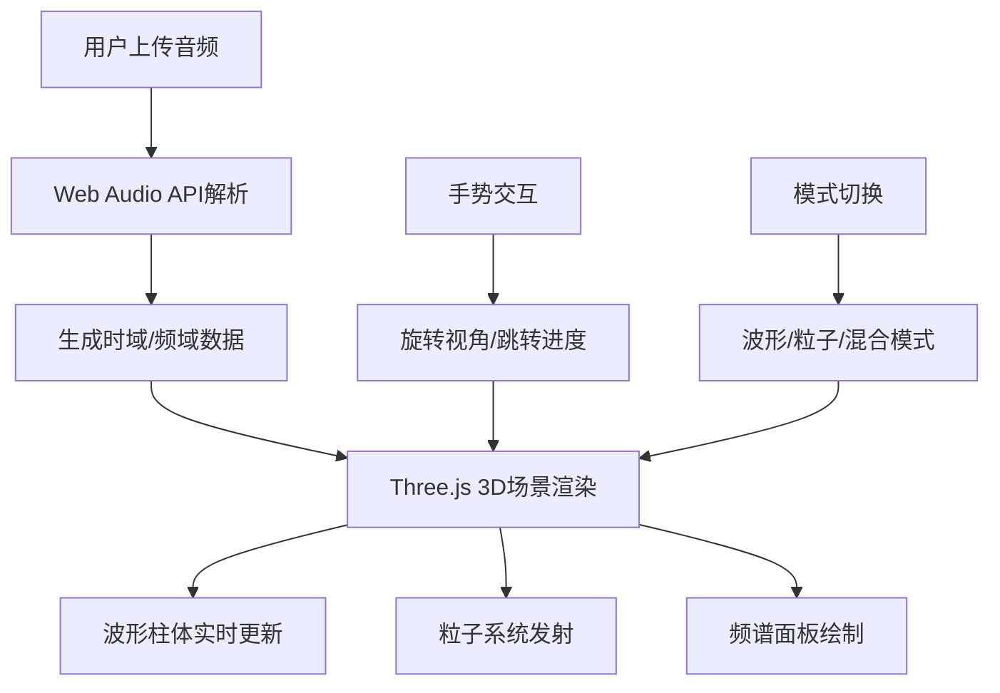

## 1. 产品概述

音频3D波形可视化应用是一款沉浸式音乐可视化工具，将用户上传的音频文件转化为环绕式3D波形场景，支持手势操控视角和播放进度，解决现有音乐可视化工具缺乏空间交互、波形呈现单一的问题。

- 核心价值：将音频数据转化为沉浸式3D视觉体验，通过直观的手势交互让用户"看见"音乐
- 目标用户：音乐爱好者、视觉设计师、内容创作者
- 差异化：环绕式圆柱波形 + 手势交互 + 粒子特效 + 多模式切换

## 2. 核心功能

### 2.1 功能模块

1. **音频上传与解析**：支持MP3/WAV格式上传，Web Audio API解析时域和频域数据
2. **3D波形柱体渲染**：Three.js实现的360°环绕圆柱波形，高度跟随振幅，颜色随频率渐变
3. **手势交互系统**：拖拽旋转视角、双击跳转播放进度、金色脉冲环反馈
4. **粒子特效系统**：从波形表面发射粒子，颜色随波形变化，切线方向飞散
5. **实时频谱面板**：左下角2D频谱条，64条频率可视化
6. **播放控制栏**：播放/暂停、进度条、音量、模式切换
7. **多模式可视化**：波形柱体模式、粒子星云模式、混合模式

### 2.3 页面详情

| 页面名称 | 模块名称 | 功能描述 |
|---------|---------|---------|
| 主场景页 | 3D渲染区 | Three.js全屏场景，圆柱波形+粒子+脉冲环 |
| 主场景页 | 上传按钮 | 左上角文件上传，图标+文字 |
| 主场景页 | 频谱面板 | 左下角64条频谱实时显示 |
| 主场景页 | 控制栏 | 底部居中浮动控制栏，播放/进度/音量 |
| 主场景页 | 模式切换 | 右上角三模式切换按钮组 |

## 3. 核心流程

用户上传音频文件 → 系统解析音频数据 → 初始化3D波形场景 → 实时更新波形和粒子 → 用户手势交互操控视角/进度 → 切换可视化模式

## 4. 用户界面设计

### 4.1 设计风格
- **主题色**：深紫蓝渐变（#0A0A1A → #1A1A3E）
- **波形渐变**：底部低频红色（#E53935）→ 顶部高频蓝色（#1E88E5）
- **强调色**：金色脉冲环（#FFD54F）
- **UI控件**：毛玻璃效果，背景rgba(255,255,255,0.08)，边框1px rgba(255,255,255,0.15)，圆角12px
- **整体风格**：科技感、沉浸感、暗色主题、精细描边、低透明度叠加

### 4.2 页面设计概览

| 页面名称 | 模块名称 | UI元素 |
|---------|---------|-------|
| 主场景 | 3D区域 | 全屏Three.js场景，圆柱波形居中，粒子环绕 |
| 主场景 | 上传按钮 | 左上角，图标+文字，悬停放大1.1倍 |
| 主场景 | 频谱面板 | 左下角，300×120px，半透明深色背景，64条频谱条 |
| 主场景 | 控制栏 | 底部居中，56px高，圆角20px，浮动毛玻璃 |
| 主场景 | 模式切换 | 右上角，三按钮水平排列，40×40px各 |

### 4.3 响应式适配
- **大屏（≥1920px）**：频谱面板400×160px，控制栏按钮间距增大
- **平板（768-1024px）**：控制栏48px高，频谱240×100px，上传按钮仅图标
- **手机（<768px）**：隐藏频谱面板，控制栏折叠为圆形悬浮按钮，点击展开

### 4.4 3D场景指引
- **环境**：深色渐变背景，无外部HDRI，自发光材质为主
- **光照**：环境光 + 方向光，突出波形起伏的立体感
- **相机**：透视相机，距离柱体约20单位，初始俯角30°
- **交互**：OrbitControls式拖拽旋转，水平360°，垂直-30°~60°
- **动效**：波形每帧更新，粒子切线飞散，脉冲环扩散淡出，模式切换0.8秒平滑过渡
- **性能**：60FPS目标，粒子上限2000颗，超出丢弃最旧粒子
