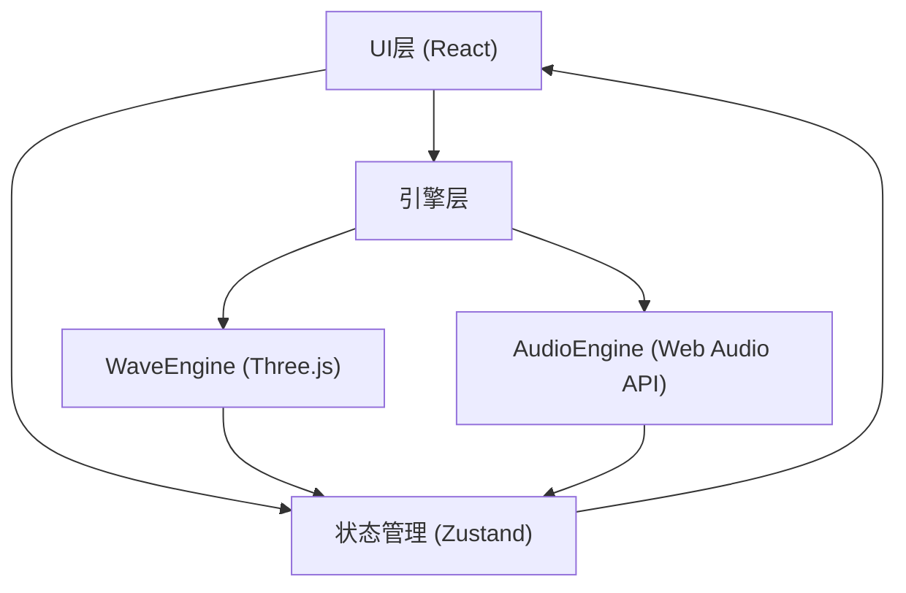

## 1. 架构设计



### 架构说明
- **UI层**：React组件，负责渲染控制栏、频谱面板、模式切换等界面元素
- **状态层**：Zustand store，统一管理音频状态、播放状态、可视化模式
- **引擎层**：
  - WaveEngine：管理Three.js场景、波形网格、粒子系统、脉冲效果
  - AudioEngine：Web Audio API解析音频，输出时域/频域数据，控制播放

## 2. 技术描述

- **前端框架**：React 18 + TypeScript
- **构建工具**：Vite 5
- **3D渲染**：Three.js 0.160+
- **音频处理**：Web Audio API（原生）
- **状态管理**：Zustand 4
- **样式方案**：原生CSS + CSS变量（毛玻璃效果用backdrop-filter）
- **图标**：lucide-react

## 3. 目录结构

```
src/
├── engine/
│   ├── WaveEngine.ts      # 3D波形引擎
│   └── AudioEngine.ts     # 音频解析引擎
├── ui/
│   ├── ControlBar.tsx     # 底部控制栏
│   ├── SpectrumPanel.tsx  # 频谱面板
│   ├── ModeSwitcher.tsx   # 模式切换器
│   └── UploadButton.tsx   # 上传按钮
├── store/
│   └── audioStore.ts      # Zustand状态
├── types/
│   └── index.ts           # 类型定义
├── App.tsx                # 主应用组件
├── main.tsx               # 入口
└── index.css              # 全局样式
```

## 4. 核心类型定义

```typescript
type VisualMode = 'wave' | 'particle' | 'hybrid';

interface AudioState {
  file: File | null;
  isPlaying: boolean;
  currentTime: number;
  duration: number;
  volume: number;
  mode: VisualMode;
  amplitudes: Float32Array;  // 360个振幅值
  frequencies: Float32Array; // 64个频率值
}

interface WaveConfig {
  cylinderHeight: number;    // 20
  cylinderRadius: number;    // 6
  segmentsX: number;         // 360
  segmentsY: number;         // 64
  waveHeight: number;        // 2
  colorLow: string;          // #E53935
  colorHigh: string;         // #1E88E5
}
```

## 5. 数据流向

1. 用户上传音频 → AudioEngine解码 → 更新store中的duration/amplitudes/frequencies
2. requestAnimationFrame循环 → AudioEngine每帧取时域/频域数据 → 更新store
3. store更新 → WaveEngine监听 → 更新波形网格顶点和粒子
4. UI组件订阅store → 刷新播放时间、进度条、频谱等

## 6. 关键实现要点

### WaveEngine
- CylinderGeometry创建柱体网格，segmentsX=360, segmentsY=64
- 顶点着色器根据振幅偏移顶点Y坐标
- 片元着色器实现从下到上的红-蓝渐变
- InstancedMesh实现粒子系统，上限2000
- 金色脉冲环：TorusGeometry + 缩放动画 + 透明度淡出

### AudioEngine
- AudioContext + AnalyserNode获取时域/频域数据
- getByteTimeDomainData → 映射到360个振幅
- getByteFrequencyData → 映射到64个频率
- 支持seek到指定时间点

### 性能优化
- 波形网格顶点位置直接修改BufferAttribute，避免重建
- 粒子使用InstancedMesh，单次draw call
- 频谱面板使用Canvas 2D离屏绘制
- requestAnimationFrame驱动，与浏览器刷新率同步
