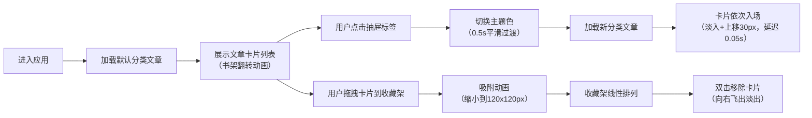

## 1. 产品概述

抽屉漫游者是一个沉浸式虚拟图书馆探索应用，用户通过点击不同的抽屉标签在知识海洋中漫游，发现和收藏精选文章，打造个人主题书单。

- 核心价值：以优雅的视觉设计和流畅的交互动画，为用户提供沉浸式的阅读探索体验
- 目标用户：喜欢深度阅读、追求审美体验的知识爱好者
- 市场定位：精品内容发现与收藏工具

## 2. 核心功能

### 2.1 用户角色
| 角色 | 注册方式 | 核心权限 |
|------|----------|----------|
| 普通用户 | 无需注册，本地存储 | 浏览文章、切换分类、收藏文章、管理书单 |

### 2.2 功能模块
1. **抽屉导航模块**：左侧半透明毛玻璃抽屉列表，支持分类切换与主题色联动
2. **文章展示模块**：中间内容区，书架翻转动画展示文章卡片列表
3. **收藏架模块**：右侧收藏架，支持拖拽添加、排序、双击移除
4. **主题系统**：每个分类独特主题色，切换时平滑过渡动画
5. **动画引擎**：统一管理入场动画、翻转动画、拖拽吸附动画

### 2.3 页面详情
| 页面名称 | 模块名称 | 功能描述 |
|----------|----------|------------|
| 主页面 | 顶部导航栏 | 64px高度，毛玻璃效果，滚动时阴影变化 |
| 主页面 | 抽屉列表 | 220px宽度，半透明毛玻璃，渐变标签悬停动效 |
| 主页面 | 文章卡片区 | 380x280px卡片，书架翻转动画，入场动画 |
| 主页面 | 收藏架 | 280px宽度，拖拽排序，双击移除动画 |

## 3. 核心流程

## 4. 用户界面设计

### 4.1 设计风格
- 主色调：深空紫蓝渐变，营造沉浸式阅读氛围
- 分类主题色：科技#00D2FF、生活#FF6B6B、艺术#A29BFE、历史#FFD93D
- 字体：标题使用 Playfair Display，正文使用 Inter
- 布局：三列栅格，左侧抽屉导航，中间内容流，右侧收藏栏
- 动画：3D书架翻转、卡片入场错峰、拖拽吸附、主题色平滑过渡
- 视觉细节：毛玻璃半透明、微妙阴影变化、渐变描边

### 4.2 页面设计概述
| 页面名称 | 模块名称 | UI元素 |
|----------|----------|--------|
| 主页面 | 抽屉列表 | 半透明背景rgba(30,30,60,0.7)、圆角12px、渐变标签、悬停偏移4px、过渡0.2s |
| 主页面 | 文章卡片 | 380x280px、背景#1A1A2E、1px边框、圆角16px、缩略图120px高度 |
| 主页面 | 收藏架 | 固定280px、卡片120x120px、线性排列、拖拽排序 |
| 主页面 | 动画效果 | perspective 1200px、Y轴90度翻转、cubic-bezier曲线、IntersectionObserver入场 |

### 4.3 响应式
- 桌面端：三列布局，抽屉220px，收藏架280px，内容自适应
- 移动端（<768px）：抽屉折叠为顶部导航，收藏架改为底部滑出面板
- 触摸优化：增加触摸热区，拖拽手势优化

### 4.4 性能要求
- 滚动帧率 ≥ 55fps
- 滚动响应延迟 < 16ms
- 使用 IntersectionObserver 实现按需入场动画
- CSS will-change 优化动画性能
