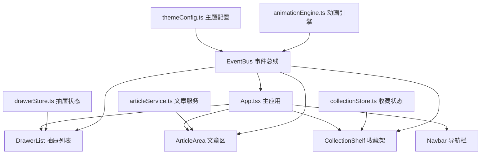

## 1. 架构设计



## 2. 技术描述
- 前端：React@18 + TypeScript + Vite + Zustand
- 状态管理：Zustand（drawerStore、collectionStore）
- 构建工具：Vite（端口3000）
- 动画：CSS 3D Transform + IntersectionObserver + 自定义动画引擎
- 数据：模拟JSON API + 本地缓存
- 后端：无（纯前端应用，模拟数据）

## 3. 目录结构
```
src/
├── config/
│   └── themeConfig.ts      # 主题配置、颜色映射、动画时长
├── engine/
│   └── animationEngine.ts  # 动画控制器、事件总线
├── services/
│   └── articleService.ts   # 文章数据加载与缓存
├── stores/
│   ├── drawerStore.ts      # 抽屉状态管理
│   └── collectionStore.ts  # 收藏架状态管理
├── components/
│   ├── Navbar.tsx          # 顶部导航栏
│   ├── DrawerList.tsx      # 抽屉列表
│   ├── ArticleCard.tsx     # 文章卡片
│   ├── ArticleArea.tsx     # 文章区容器
│   └── CollectionShelf.tsx # 收藏架
├── hooks/
│   ├── useIntersectionObserver.ts  # 入场动画hook
│   └── useDragAndDrop.ts          # 拖拽hook
├── types/
│   └── index.ts           # 类型定义
├── App.tsx
├── App.css
└── main.tsx
```

## 4. 核心模块职责

### 4.1 主题配置模块 (themeConfig.ts)
- 定义四个分类的主题色、渐变、CSS变量映射
- 动画时长统一配置
- 暴露主题切换方法

### 4.2 动画引擎模块 (animationEngine.ts)
- 单例模式，统一管理所有动画
- 事件总线实现（发布/订阅模式）
- 动画时序控制（stagger、delay、easing）
- 支持：卡片入场、书架翻转、拖拽吸附、移除飞出

### 4.3 文章服务模块 (articleService.ts)
- 模拟JSON接口返回文章数据
- 本地状态缓存（Map<drawerId, Article[]>）
- 支持：按抽屉ID获取、缓存命中、数据过期机制

### 4.4 抽屉状态管理 (drawerStore.ts)
- 管理抽屉列表数据
- 当前选中抽屉ID
- 抽屉展开/收起状态
- 与主题配置联动

### 4.5 收藏架状态管理 (collectionStore.ts)
- 收藏卡片列表（含添加时间戳）
- 增删操作
- 排序（拖拽排序）
- 本地持久化（localStorage）

## 5. 关键技术实现

### 5.1 书架翻转动画
```css
.book-flip-container {
  perspective: 1200px;
  transform-style: preserve-3d;
}

.book-flip {
  animation: flipInY 0.6s cubic-bezier(0.175, 0.885, 0.32, 1.275);
}

@keyframes flipInY {
  0% { transform: rotateY(90deg); opacity: 0; }
  100% { transform: rotateY(0); opacity: 1; }
}
```

### 5.2 IntersectionObserver 入场动画
```typescript
const useIntersectionObserver = (options = {}) => {
  const ref = useRef<HTMLDivElement>(null);
  const [isVisible, setIsVisible] = useState(false);

  useEffect(() => {
    const observer = new IntersectionObserver(([entry]) => {
      if (entry.isIntersecting) {
        setIsVisible(true);
        observer.disconnect();
      }
    }, { threshold: 0.1, ...options });

    if (ref.current) observer.observe(ref.current);
    return () => observer.disconnect();
  }, []);

  return { ref, isVisible };
};
```

### 5.3 拖拽吸附动画
```typescript
// 拖拽开始时记录原始位置
// 拖拽结束时计算到收藏架的位移
// 使用 Web Animations API 执行吸附动画
const animateSnap = (element: HTMLElement, targetX: number, targetY: number) => {
  return element.animate([
    { transform: 'scale(1) translate(0, 0)' },
    { transform: 'scale(0.315) translate(' + targetX + 'px, ' + targetY + 'px)' }
  ], {
    duration: 400,
    easing: 'cubic-bezier(0.25, 0.46, 0.45, 0.94)',
    fill: 'forwards'
  });
};
```

### 5.4 主题色平滑过渡
```css
:root {
  --primary-color: #6C5CE7;
  --accent-color: #A29BFE;
  --card-bg: #1A1A2E;
  --transition-duration: 0.5s;
  transition: all var(--transition-duration) ease-in-out;
}
```

## 6. 性能优化策略

1. **CSS will-change**：为动画元素预先声明，减少重排重绘
2. **IntersectionObserver**：仅在视口内触发入场动画
3. **transform3d**：启用GPU加速，避免触发布局
4. **requestAnimationFrame**：动画帧同步，确保60fps
5. **虚拟滚动**：卡片列表采用虚拟滚动（若数据量大）
6. **will-change** 与 **contain** 属性优化渲染性能
7. **debounce** 滚动事件处理，降低触发频率
