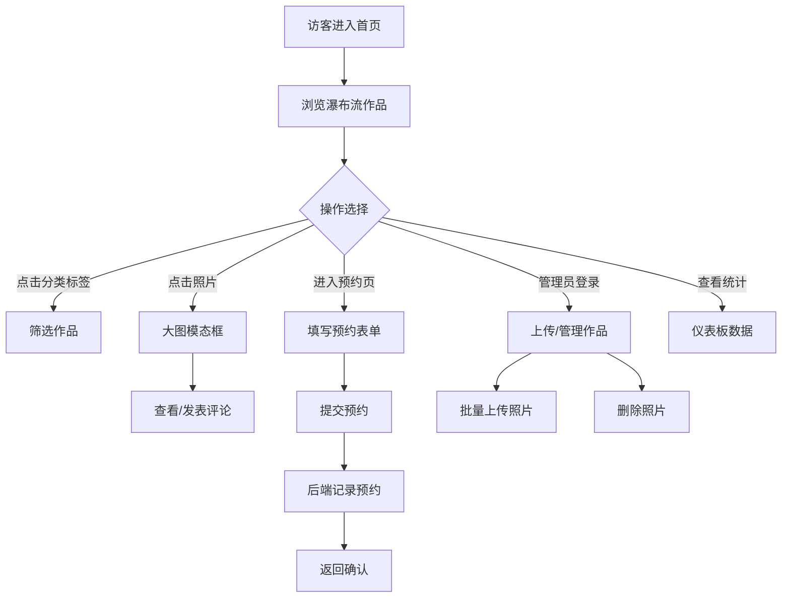

## 1. 产品概述
光匣是一个面向独立摄影工作室的全栈Web平台，提供作品展示、客户预约、评论互动和管理统计功能。
- 解决问题：摄影工作室需要一个统一的在线平台来展示作品、管理客户预约和收集反馈
- 目标用户：摄影工作室（管理员）和潜在客户（浏览、预约、评论）
- 产品价值：极简美学设计 + 完善的业务流程，提升工作室专业形象和运营效率

## 2. 核心功能

### 2.1 用户角色
| 角色 | 注册方式 | 核心权限 |
|------|----------|----------|
| 访客客户 | 无需注册 | 浏览作品集、筛选分类、查看大图、提交预约、发表评论 |
| 工作室管理员 | 预设登录 | 上传/删除照片、查看预约列表、查看评论、查看统计数据 |

### 2.2 功能模块
1. **首页作品集**：瀑布流照片展示、分类标签筛选、大图模态框查看
2. **预约页面**：服务类型选择、日期选择器、联系方式表单
3. **管理端上传**：批量上传照片、进度条显示、照片删除
4. **评论墙**：评论列表展示、发表评论表单
5. **统计仪表板**：总作品数、总预约数、总评论数卡片展示

### 2.3 页面详情
| 页面名称 | 模块名称 | 功能描述 |
|----------|----------|----------|
| 首页作品集 | 导航栏 | Logo、页面跳转、移动端汉堡菜单 |
| 首页作品集 | 分类筛选 | 人像/风光/静物标签点击筛选 |
| 首页作品集 | 瀑布流网格 | 响应式多列布局、图片卡片悬停效果 |
| 首页作品集 | 大图模态框 | 高清原图展示、前后翻页、关闭按钮、评论区 |
| 预约页面 | 预约表单 | 服务类型下拉、日期选择器（限制未来7天）、联系方式、留言框 |
| 预约页面 | 提交确认 | 成功/失败提示信息 |
| 管理上传页 | 上传组件 | 多文件选择（JPG/PNG≤10MB）、上传进度条、缩略图预览 |
| 管理上传页 | 作品列表 | 已上传照片展示、删除按钮 |
| 统计仪表板 | 数据卡片 | 三个统计数字卡片、依次滑入动画 |
| 评论组件 | 评论列表 | 用户名首字母头像、时间戳、评论内容、最新在上 |
| 评论组件 | 评论输入 | 文本框（≤200字）、提交按钮 |

## 3. 核心流程
### 3.1 客户浏览与预约流程
客户进入首页 → 浏览瀑布流作品 → 点击分类筛选 → 点击照片查看大图及评论 → 进入预约页面 → 选择服务和日期 → 填写信息提交 → 收到确认提示

### 3.2 管理员上传流程
管理员进入上传页面 → 选择多张照片 → 查看上传进度 → 上传完成自动刷新作品列表 → 可删除已有照片

## 4. 用户界面设计
### 4.1 设计风格
- **主色调**：深灰 `#2C3E50`、暖白 `#ECF0F1`
- **强调色**：复古金 `#D4AF37`
- **页面背景**：`#F9F9F9`
- **卡片/模态框**：毛玻璃效果 `rgba(255,255,255,0.6)`、`backdrop-filter: blur(8px)`、`1px #E0E0E0` 边框
- **按钮/卡片悬停**：`0.3s ease` 平滑缩放 `scale(1.02)`、阴影从 `0 2px 4px rgba(0,0,0,0.1)` 变为 `0 6px 12px rgba(0,0,0,0.2)`
- **输入框聚焦**：边框从 `#BDC3C7` 变为 `#D4AF37`，`0.3s` 过渡
- **模态框背景**：模糊淡入动画，`opacity` 0→0.6，`backdrop-filter` 0→`blur(4px)`
- **字体**：展示字体使用 Playfair Display，正文使用 Lato

### 4.2 页面设计概述
| 页面名称 | 模块名称 | UI元素 |
|----------|----------|--------|
| 首页作品集 | 导航栏 | 极简水平布局、Logo左对齐、导航右对齐、移动端汉堡图标 |
| 首页作品集 | 分类标签 | 圆角药丸按钮、选中态复古金背景 |
| 首页作品集 | 瀑布流 | 每列最小280px、间距16px、圆角8px、object-fit: cover |
| 大图模态框 | 图片容器 | 居中显示、左右翻页按钮、右上角关闭、底部评论区 |
| 预约表单 | 输入控件 | 圆角6px、标签左对齐、提交按钮复古金背景 |
| 统计卡片 | 数据展示 | 白色毛玻璃卡片、大数字、从左至右依次滑入（延迟0.1s/0.2s/0.3s） |

### 4.3 响应式
- 桌面端（≥768px）：瀑布流多列布局、完整导航菜单
- 移动端（<768px）：瀑布流单列、导航收起为汉堡菜单、按钮尺寸适配触控

### 4.4 性能约束
- 照片列表加载时间 ≤2s（本地20张照片）
- 模态框切换图片响应 ≤100ms
- 长列表使用虚拟化技术，滚动帧率 ≥50fps
