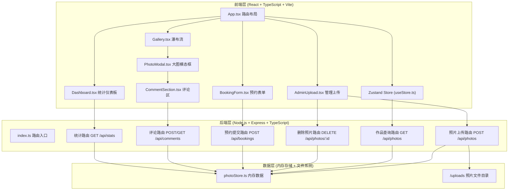
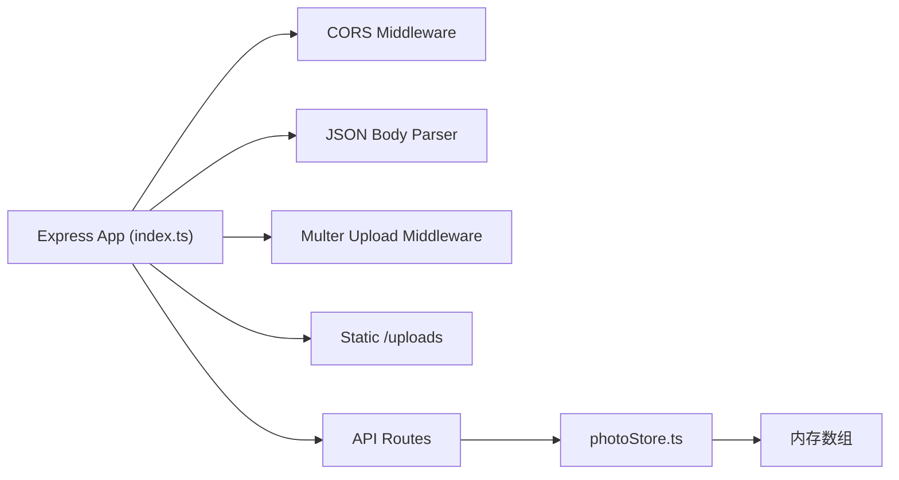

## 1. 架构设计


## 2. 技术栈描述
- **前端框架**：React 18 + TypeScript
- **构建工具**：Vite（@vitejs/plugin-react）
- **状态管理**：Zustand
- **后端框架**：Express 4 + TypeScript
- **文件上传**：Multer
- **图片处理**：Sharp
- **ID生成**：UUID
- **跨域**：CORS
- **样式方案**：原生CSS + CSS变量（无需Tailwind，保持极简风格）

## 3. 路由定义
| 前端路由 | 页面组件 | 用途 |
|----------|----------|------|
| `/` | Gallery | 首页作品集瀑布流 |
| `/booking` | BookingForm | 客户预约页面 |
| `/admin/upload` | AdminUpload | 照片上传管理页 |
| `/admin/dashboard` | Dashboard | 统计仪表板 |

## 4. API 定义
### 4.1 照片相关
```typescript
interface Photo {
  id: string;
  title: string;
  category: 'portrait' | 'landscape' | 'still_life';
  url: string;
  thumbnailUrl: string;
  width: number;
  height: number;
  createdAt: string;
}

// GET /api/photos?category=portrait
// Response: Photo[]

// POST /api/photos (multipart/form-data)
// Fields: category, title
// Files: photos[] (JPG/PNG, max 10MB each)
// Response: { success: true; photos: Photo[] }

// DELETE /api/photos/:id
// Response: { success: true }
```

### 4.2 预约相关
```typescript
interface Booking {
  id: string;
  serviceType: 'portrait' | 'wedding' | 'product';
  date: string;
  name: string;
  phone: string;
  email: string;
  message: string;
  createdAt: string;
}

// POST /api/bookings
// Request Body: Omit<Booking, 'id' | 'createdAt'>
// Response: { success: true; bookingId: string }
```

### 4.3 评论相关
```typescript
interface Comment {
  id: string;
  photoId: string;
  username: string;
  content: string;
  createdAt: string;
}

// GET /api/comments?photoId=xxx
// Response: Comment[]

// POST /api/comments
// Request Body: { photoId: string; username: string; content: string }
// Response: { success: true; comment: Comment }
```

### 4.4 统计相关
```typescript
interface Stats {
  totalPhotos: number;
  totalBookings: number;
  totalComments: number;
}

// GET /api/stats
// Response: Stats
```

## 5. 后端架构


## 6. 数据模型
### 6.1 ER 图


### 6.2 内存存储结构
文件：`src/data/photoStore.ts`
```typescript
// 使用内存数组存储，重启后清空（演示用途）
let photos: Photo[] = [];
let bookings: Booking[] = [];
let comments: Comment[] = [];
```

## 7. 项目文件结构
```
.
├── package.json
├── vite.config.js
├── tsconfig.json
├── index.html
├── uploads/                # 上传照片存储目录
└── src/
    ├── server/
    │   └── index.ts        # Express 后端入口
    ├── data/
    │   └── photoStore.ts   # 内存数据存储
    ├── stores/
    │   └── useStore.ts     # Zustand 全局状态
    ├── components/
    │   ├── Gallery.tsx           # 瀑布流作品集
    │   ├── BookingForm.tsx       # 预约表单
    │   ├── PhotoModal.tsx        # 大图模态框
    │   ├── AdminUpload.tsx       # 管理上传
    │   ├── Dashboard.tsx         # 统计仪表板
    │   ├── CommentSection.tsx    # 评论区
    │   └── Navbar.tsx            # 导航栏
    ├── App.tsx             # React 根组件
    └── main.tsx            # React 入口
```

## 8. 性能优化方案
- **图片懒加载**：瀑布流图片使用 `loading="lazy"` + IntersectionObserver
- **缩略图**：上传时自动生成缩略图（Sharp），列表展示缩略图，模态框显示原图
- **长列表虚拟化**：使用 `react-window` 实现虚拟化滚动（当照片 > 50 张时启用）
- **预加载**：模态框打开时预加载相邻图片
- **防抖节流**：分类筛选切换使用防抖
