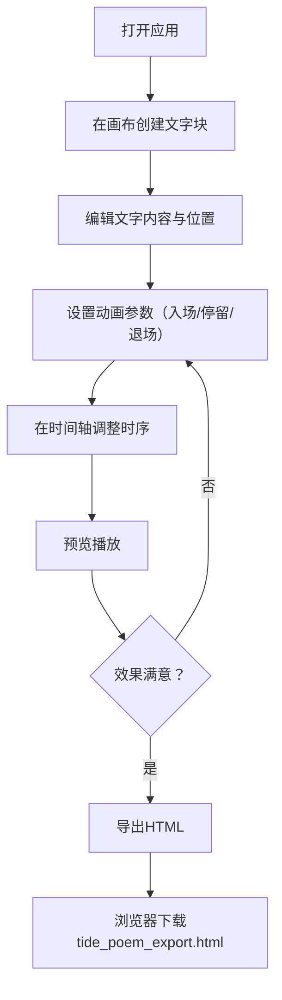

## 1. 产品概述

潮汐诗篇是一款互动式文字排版与诗意动画创作工具，用户可以在可视化界面中自由编排文字块、设定入场/停留/退场动画参数，并导出为可嵌入网页的自包含HTML文件。面向内容创作者、设计师和前端开发者，提供零代码的诗意动画制作体验。

## 2. 核心功能

### 2.1 功能模块

1. **主编辑页**：自由画布编排、动画时间轴编辑、实时预览播放、属性面板、文字块列表

### 2.2 页面详情

| 页面名称 | 模块名称 | 功能描述 |
|---------|---------|---------|
| 主编辑页 | 画布区域 | 1200x800px自由画布，点击/拖拽创建文字块，选中显示8个控制点，支持拖动改变位置，辅助网格线，鼠标悬停十字辅助线 |
| 主编辑页 | 时间轴区域 | 水平条形式展示在画布下方，每个文字块为着色条块，拖拽边缘调整持续时间，拖拽整体调整开始时间，播放指示标记同步移动，支持水平滚动 |
| 主编辑页 | 工具栏 | 新建文字块按钮、导出HTML按钮 |
| 主编辑页 | 左侧列表面板 | 文字块列表，缩略色块+文本预览，选中高亮显示 |
| 主编辑页 | 右侧属性面板 | 选中文字块的动画参数编辑：入场/退场持续时间滑块、缓动函数下拉选择 |
| 主编辑页 | 播放控件 | 播放、暂停、重置、速度滑块（0.5x/1x/2x），可拖拽时间指示标记跳转 |

## 3. 核心流程

用户打开应用 → 在画布上点击创建文字块 → 编辑文字内容 → 在属性面板设置动画参数 → 在时间轴调整各阶段时序 → 预览播放确认效果 → 点击导出生成自包含HTML文件

## 4. 用户界面设计

### 4.1 设计风格

- 主背景：#0F0F23，面板背景：#1A1A2E，边框：#2A2A4E
- 强调色：#6C63FF（紫蓝渐变至#8B83FF）
- 主要文字色：#E0E0E0
- 按钮样式：圆角6px，渐变背景，悬停亮度提升
- 字体：思源宋体/Noto Serif SC（展示用）+ 系统无衬线字体（UI用）
- 布局：左侧列表面板240px + 中间画布 + 右侧属性面板260px + 底部时间轴120px
- 画布毛玻璃投影效果，时间轴自定义滚动条

### 4.2 页面设计概览

| 页面名称 | 模块名称 | UI元素 |
|---------|---------|--------|
| 主编辑页 | 顶部工具栏 | 高度48px，背景#12122A，新建按钮渐变#6C63FF→#8B83FF，导出按钮背景#2A2A4E |
| 主编辑页 | 左侧列表面板 | 宽240px，背景#1A1A2E，选中项背景#2A2A4E+左侧4px #6C63FF竖条 |
| 主编辑页 | 中间画布 | 1200x800px，背景#1A1A2E，网格#2A2A4E透明度0.2，box-shadow毛玻璃效果，悬停十字线#6C63FF 0.3透明度 |
| 主编辑页 | 右侧属性面板 | 宽260px，背景#1A1A2E，滑块轨道6px手柄16px #6C63FF，下拉选择缓动函数 |
| 主编辑页 | 底部时间轴 | 高120px，背景#12122A，条块HSL色相按块ID生成，自定义滚动条 |

### 4.3 响应式

桌面优先设计，最小支持1280px宽度，画布区域自适应缩放

### 4.4 性能要求

- 100个文字块+3阶段动画下预览帧率≥40fps
- 拖拽时间轴指示标记响应延迟≤100ms
- 导出操作1秒内完成HTML生成和下载触发
