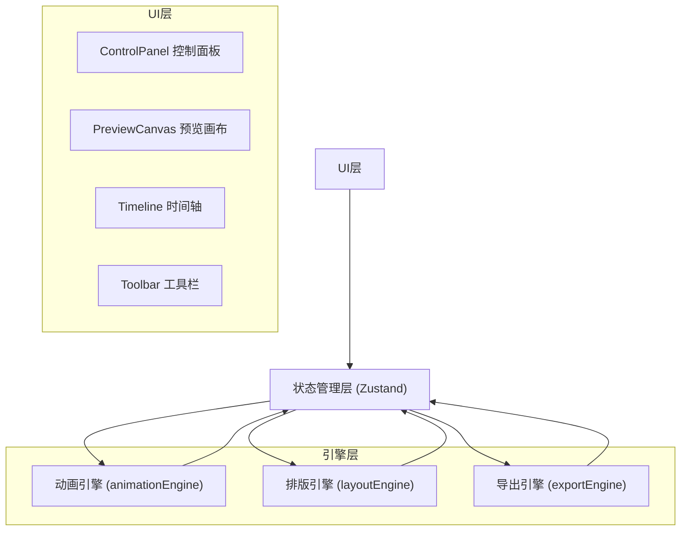

## 1. 架构设计



## 2. 技术说明

- 前端：React@18 + TypeScript + Vite
- 状态管理：Zustand
- 初始化工具：vite-init (react-ts模板)
- 依赖：react, react-dom, zustand, uuid, vite, @vitejs/plugin-react, typescript
- 后端：无
- 数据库：无

## 3. 路由定义

| 路由 | 用途 |
|------|------|
| / | 主编辑页面（单页应用） |

## 4. 模块职责

| 模块 | 文件路径 | 职责 |
|------|---------|------|
| 动画引擎 | src/engine/animationEngine.ts | 管理时间轴，计算文字块在不同时间点的位置/缩放/透明度，输出关键帧数据 |
| 排版引擎 | src/engine/layoutEngine.ts | 根据网格或自由模式计算文字块坐标和尺寸，支持对齐与间距约束 |
| 导出引擎 | src/export/exportEngine.ts | 将时间轴和布局数据序列化为自包含HTML文件字符串 |
| 控制面板 | src/ui/ControlPanel.tsx | 渲染文字块列表、动画参数面板、时间轴控件 |
| 预览画布 | src/ui/PreviewCanvas.tsx | 订阅引擎状态，实时渲染预览，处理鼠标交互选择文字块 |
| 状态管理 | src/stores/appStore.ts | Zustand管理文字块列表、时间轴状态、选中ID、导出历史 |

## 5. 数据模型

### 5.1 核心类型定义

```typescript
interface TextBlock {
  id: string;
  text: string;
  x: number;
  y: number;
  width: number;
  height: number;
  color: string;
  backgroundColor: string;
  borderRadius: number;
  borderColor: string;
  animation: AnimationConfig;
}

interface AnimationConfig {
  enter: AnimationPhase;
  stay: AnimationPhase;
  exit: AnimationPhase;
}

interface AnimationPhase {
  duration: number;
  easing: EasingType;
  type: 'fade-in-scale' | 'fade-out-slide';
}

type EasingType = 'ease' | 'ease-in' | 'ease-out' | 'ease-in-out' | 'linear';

interface TimelineState {
  currentTime: number;
  isPlaying: boolean;
  playbackSpeed: number;
  totalDuration: number;
}
```

## 6. 文件结构

```
src/
  engine/
    animationEngine.ts
    layoutEngine.ts
  export/
    exportEngine.ts
  ui/
    ControlPanel.tsx
    PreviewCanvas.tsx
    Timeline.tsx
    Toolbar.tsx
  stores/
    appStore.ts
  types/
    index.ts
  App.tsx
  main.tsx
```
