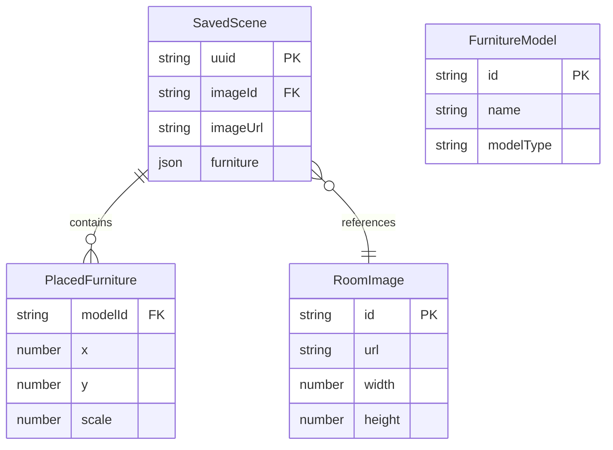

## 1. 架构设计

```mermaid
flowchart TB
    subgraph "前端 (React + Three.js)"
        "App.tsx" --> "uploadEngine.ts"
        "App.tsx" --> "placeEngine.ts"
        "App.tsx" --> "FurniturePanel"
        "App.tsx" --> "Scene3D"
        "App.tsx" --> "Toolbar"
        "uploadEngine.ts" -->|"POST /api/upload"| "后端API"
        "placeEngine.ts" --> "Scene3D"
        "Toolbar" -->|"POST /api/save"| "后端API"
    end
    subgraph "后端 (Express)"
        "server.ts" --> "uploadHandler.ts"
        "server.ts" --> "静态资源服务"
        "uploadHandler.ts" -->|"multer + sharp"| "uploads目录"
    end
    subgraph "数据存储"
        "uploads/" --> "压缩后的房间照片"
        "scenes/" --> "保存的场景JSON"
    end
```

## 2. 技术说明

- 前端：React@18 + TypeScript + Vite + Three.js + @react-three/fiber + @react-three/drei + Zustand + TailwindCSS
- 初始化工具：vite-init（react-express-ts模板）
- 后端：Express@4 + multer + sharp + uuid + cors
- 数据库：无数据库，使用文件系统存储（scenes目录保存JSON，uploads目录保存图片）

## 3. 路由定义

| 路由 | 用途 |
|------|------|
| / | 主页面：上传照片、放置家具、保存场景 |
| /share/:uuid | 分享页面：查看保存的搭配场景 |

## 4. API定义

### 4.1 上传图片

```typescript
// POST /api/upload
// Request: multipart/form-data, field: "roomPhoto", 最大5MB
// Response:
interface UploadResponse {
  id: string;
  url: string;
  width: number;
  height: number;
}
```

### 4.2 保存场景

```typescript
// POST /api/save
// Request:
interface SaveRequest {
  imageId: string;
  imageUrl: string;
  furniture: PlacedFurniture[];
}

interface PlacedFurniture {
  modelId: string;
  x: number;
  y: number;
  scale: number;
}

// Response:
interface SaveResponse {
  shareUrl: string;
  uuid: string;
}
```

### 4.3 获取场景

```typescript
// GET /api/scene/:uuid
// Response:
interface SceneResponse {
  imageId: string;
  imageUrl: string;
  furniture: PlacedFurniture[];
}
```

### 4.4 获取家具列表

```typescript
// GET /api/furniture
// Response:
interface FurnitureItem {
  id: string;
  name: string;
  thumbnail: string;
  modelType: string;
}

interface FurnitureListResponse {
  items: FurnitureItem[];
}
```

## 5. 服务器架构图

```mermaid
flowchart LR
    "Controller" --> "uploadHandler"
    "Controller" --> "sceneHandler"
    "uploadHandler" --> "multer中间件"
    "multer中间件" --> "sharp压缩"
    "sharp压缩" --> "uploads目录"
    "sceneHandler" --> "scenes目录"
```

## 6. 数据模型

### 6.1 数据模型定义



### 6.2 数据定义

场景数据以JSON文件存储在 `scenes/` 目录下，文件名为 `{uuid}.json`：

```json
{
  "uuid": "550e8400-e29b-41d4-a716-446655440000",
  "imageId": "abc123",
  "imageUrl": "/uploads/abc123.jpg",
  "furniture": [
    { "modelId": "sofa", "x": 0.5, "y": 0.3, "scale": 1.0 },
    { "modelId": "lamp", "x": 0.8, "y": 0.7, "scale": 0.8 }
  ],
  "createdAt": "2026-06-18T00:00:00.000Z"
}
```

家具模型为预设数据，6种模型：sofa（沙发）、coffeeTable（茶几）、floorLamp（落地灯）、tvStand（电视柜）、bookshelf（书架）、armchair（单人椅），使用程序化几何体在Three.js中生成。
