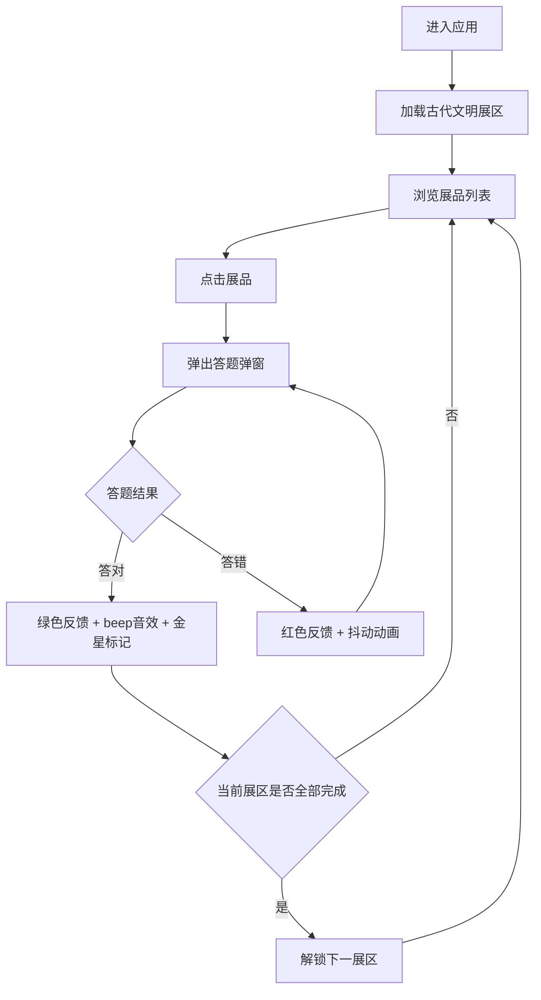

## 1. 产品概述

时空回廊是一个面向在线教育平台的交互式虚拟博物馆学习应用，让学生通过探索虚拟博物馆来复习历史知识。每个展品背后关联一道选择题，答对后解锁下一展区，以趣味化方式驱动学习。

- 目标用户：中学阶段学生及历史课教师
- 核心价值：将枯燥的历史知识复习转化为沉浸式博物馆探索体验，通过游戏化答题机制提升学习主动性和知识留存率

## 2. 核心功能

### 2.1 用户角色

| 角色 | 说明 |
|------|------|
| 学生 | 浏览展区、交互展品、答题解锁进度 |
| 教师 | 布置复习任务、查看学习进度（后续迭代） |

### 2.2 功能模块

1. **博物馆漫游**：展区切换、场景滑动动画、背景与展台渲染
2. **展品交互**：展品展示、悬浮信息标签、点击触发答题
3. **答题机制**：选择题弹窗、答对/答错反馈、解锁标记
4. **进度追踪**：进度条、展区解锁状态、答题记录

### 2.3 页面详情

| 页面名称 | 模块名称 | 功能描述 |
|----------|----------|----------|
| 博物馆主页 | 顶部导航栏 | 展区进度条（渐变色#FFD700到#FFA000）、已解锁展区名称列表（当前加粗白色、其他灰色#B0BEC5） |
| 博物馆主页 | 展区场景 | 暖黄色背景#F5E6C8、砖缝纹理地面、半透明亚克力展台、3个展品悬浮展示 |
| 博物馆主页 | 左右箭头切换 | 圆形按钮直径40px、背景#8B4513白色文字、切换时fade+slide组合动画400ms |
| 博物馆主页 | 展品卡片 | 背景#F9F6F0、圆角16px、阴影12px、悬浮放大1.1倍、半透明信息标签 |
| 博物馆主页 | 答题弹窗 | 宽420px、深蓝色背景#1A237E、白色文字16px、四选项按钮、答对绿色+音效、答错红色+抖动 |
| 博物馆主页 | 解锁标记 | 金色星星、旋转动画周期2s |
| 博物馆主页 | 底部操作栏 | 固定高度60px、白色半透明背景、返回/提示/退出按钮 |

## 3. 核心流程

用户打开应用 → 默认进入古代文明展区 → 浏览3个展品 → 点击展品触发答题弹窗 → 答对显示绿色+音效+解锁标记 → 答错显示红色+抖动 → 完成当前展区所有展品答题 → 解锁下一展区 → 通过左右箭头切换展区 → 进度条实时更新

## 4. 用户界面设计

### 4.1 设计风格

- **主色**：#3E2723（深木质色）— 导航栏、文字强调
- **辅色**：#F5E6C8（暖白）— 场景背景、卡片背景
- **强调色**：#FFD700（金色）— 进度条、解锁标记、交互高亮
- **按钮风格**：圆角按钮，主要操作为实心，次要操作为描边
- **字体**：思源宋体/衬线体作为标题字体，无衬线体作为正文字体
- **布局**：居中布局，最大宽1200px，自动边距
- **动画**：展区切换fade+slide组合（透明度0→1，水平位移-60px→0），展品悬浮放大，答题反馈动效

### 4.2 页面设计概览

| 页面名称 | 模块名称 | UI元素 |
|----------|----------|--------|
| 博物馆主页 | 顶部导航栏 | 进度条宽80%高6px圆角3px渐变色、展区名称横排间距16px |
| 博物馆主页 | 展区场景 | 暖黄色背景、砖缝纹理1px#C4A882、展台圆角12px阴影8px间距80px |
| 博物馆主页 | 展品卡片 | 背景#F9F6F0圆角16px阴影12px、悬浮1.1倍、信息标签白底圆角8px阴影4px |
| 博物馆主页 | 答题弹窗 | 宽420px背景#1A237E文字16px白色、选项圆角8px背景#283593悬停#3949AB |
| 博物馆主页 | 底部操作栏 | 高60px背景rgba(255,255,255,0.9)、按钮高40px圆角20px |

### 4.3 响应式设计

- **桌面端**（>768px）：展品三列网格布局，展台间距80px，弹窗宽420px
- **平板端**（481px-768px）：展品两列网格布局，弹窗宽度自适应
- **手机端**（≤480px）：展品单列布局，展台间距缩为40px，弹窗宽90%最大360px

### 4.4 性能要求

- 展区切换动画保持60FPS
- 答题弹窗从触发到显示完成不超过200ms
- SVG展品插图轻量化加载
