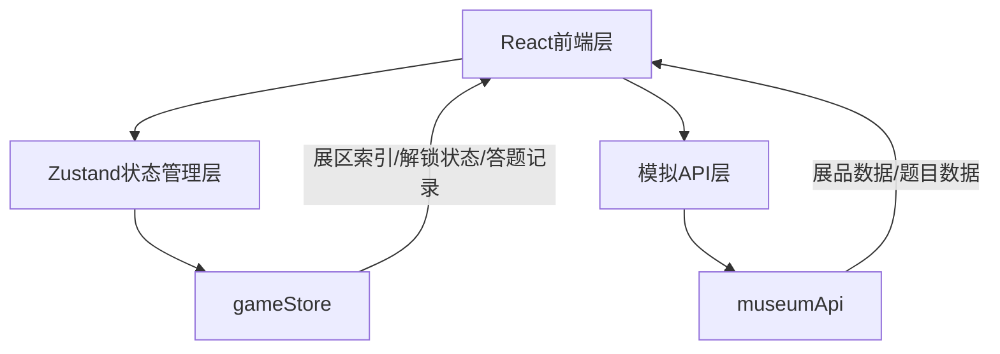

## 1. 架构设计



**数据流向**：
- `museumApi` → `Museum` / `Exhibit` / `Quiz`：提供展品和题目数据
- `Quiz` → `gameStore`：答题后更新进度
- `gameStore` → `Museum` / `App`：读取当前展区索引、已解锁展区、答题记录

**调用关系**：
- `App.tsx` → `Museum.tsx`：加载博物馆主场景
- `Museum.tsx` → `Exhibit.tsx`：渲染展品列表
- `Museum.tsx` → `Quiz.tsx`：弹出答题弹窗
- `Exhibit.tsx` → `Museum.tsx`：点击事件冒泡触发Quiz
- `Quiz.tsx` → `gameStore.ts`：答题结果写入store
- `Museum.tsx` → `gameStore.ts`：读取展区解锁状态
- `Museum.tsx` → `museumApi.ts`：获取展品数据
- `Quiz.tsx` → `museumApi.ts`：获取题目数据

## 2. 技术说明

- **前端**：React@18 + TypeScript + Vite + TailwindCSS
- **初始化工具**：vite-init（react-ts模板）
- **状态管理**：Zustand
- **后端**：无，使用模拟API模块
- **数据库**：无，内存模拟数据

## 3. 路由定义

| 路由 | 用途 |
|------|------|
| / | 博物馆主页，包含展区浏览、展品交互、答题弹窗 |

## 4. API定义（模拟）

### 4.1 类型定义

```typescript
interface Exhibit {
  id: string;
  name: string;
  era: string;
  description: string;
  svgIcon: string;
  zoneId: string;
}

interface QuizQuestion {
  id: string;
  exhibitId: string;
  question: string;
  options: string[];
  correctIndex: number;
}

interface Zone {
  id: string;
  name: string;
  order: number;
}
```

### 4.2 API方法

| 方法 | 返回值 | 说明 |
|------|--------|------|
| getExhibitsByZone(zoneId) | Exhibit[] | 返回指定展区的展品数组 |
| getQuizForExhibit(exhibitId) | QuizQuestion | 返回指定展品的题目对象 |

## 5. 状态模型

### 5.1 gameStore（Zustand）

```typescript
interface GameState {
  currentZoneIndex: number;
  unlockedZones: string[];
  answeredExhibits: Record<string, boolean>;
  setCurrentZone: (index: number) => void;
  unlockZone: (zoneId: string) => void;
  markExhibitAnswered: (exhibitId: string, correct: boolean) => void;
}
```

### 5.2 初始状态

- `currentZoneIndex`: 0（古代文明）
- `unlockedZones`: ['zone-1']（默认解锁第一个展区）
- `answeredExhibits`: {}（空记录）

## 6. 文件结构

```
├── package.json
├── index.html
├── vite.config.ts
├── tsconfig.json
├── src/
│   ├── main.tsx
│   ├── App.tsx              # 主组件，加载Museum
│   ├── components/
│   │   ├── Museum.tsx        # 博物馆主场景
│   │   ├── Exhibit.tsx       # 单个展品组件
│   │   ├── Quiz.tsx          # 答题弹窗组件
│   │   ├── ProgressBar.tsx   # 顶部进度条
│   │   └── BottomBar.tsx     # 底部操作栏
│   ├── store/
│   │   └── gameStore.ts      # Zustand全局状态
│   ├── api/
│   │   └── museumApi.ts      # 模拟API模块
│   └── types/
│       └── index.ts          # TypeScript类型定义
```
