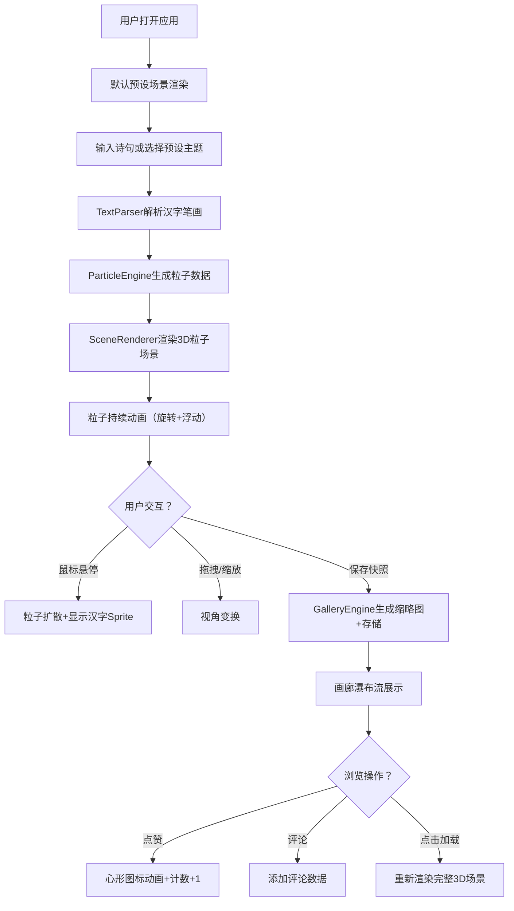

## 1. 产品概述

一款将用户输入的诗歌文本实时转化为3D抽象粒子画作的Web应用，解决传统诗歌阅读方式单一、缺乏沉浸感和视觉表达的问题。

- 主要用途：将诗歌文本可视化成3D粒子艺术，增强诗歌阅读的沉浸感和视觉表现力
- 目标用户：诗歌爱好者、艺术创作者、教育工作者
- 产品价值：让古典与现代诗歌以动态3D粒子形式呈现，提供可交互、可分享的沉浸式诗歌体验

## 2. 核心功能

### 2.1 功能模块

1. **3D粒子主场景**：全屏Canvas粒子渲染、文本输入与主题选择、粒子动画与交互
2. **场景控制栏**：预设诗句主题切换（春晓/秋思/星空/自由）、视角控制
3. **共享画廊**：作品快照保存、瀑布流展示、作品加载、点赞评论

### 2.2 页面详情

| 页面名称 | 模块名称 | 功能描述 |
|-----------|-------------|---------------------|
| 主场景页 | 3D粒子渲染区 | 全屏Three.js Canvas，渲染粒子云团，支持鼠标悬停扩散、拖拽旋转、滚轮缩放 |
| 主场景页 | 左侧浮动工具栏 | 诗句输入框（≤50字）、6种颜色主题下拉选择器 |
| 主场景页 | 底部控制栏 | 4个预设主题快捷切换按钮、场景淡入淡出过渡动画 |
| 画廊页 | 瀑布流卡片列表 | 280px宽卡片，内嵌缩略图Canvas，显示诗句文本与作者信息 |
| 画廊页 | 作品详情交互 | 点击卡片加载完整场景、心形点赞按钮、评论列表（头像首字母+用户名+文本） |

## 3. 核心流程

用户打开应用 → 默认展示预设诗句粒子场景 → 在左侧输入框输入自定义诗句 → 系统解析汉字笔画数 → 生成3D粒子云团（扁球体分布，每字一团） → 粒子自动动画（整体旋转+单个浮动）→ 鼠标悬停粒子云团 → 粒子向外扩散并显示对应汉字Sprite → 可保存为快照上传至画廊 → 浏览画廊作品 → 点赞/评论 → 点击作品加载完整3D场景

## 4. 用户界面设计

### 4.1 设计风格
- **主色调**：深空背景 #0A0A1A，粒子主题色6种渐变（晨曦暖黄、深海蓝调、森林秘境、暗夜星云、复古暖棕、清新薄荷）
- **强调色**：交互聚焦边框 #6C5CE7，点赞激活色 #E91E63
- **文字色**：#E0E0E0（正文）、#FFFFFF（汉字Sprite）
- **按钮样式**：毛玻璃半透明背景 rgba(20,20,40,0.8)，圆角12px，1px #2A2A4E 边框，悬停上移2px + 透明度0.9→1.0（0.2s ease）
- **字体**：Google Fonts 'Inter' 无衬线字体，14px
- **布局风格**：全屏沉浸式Canvas + 悬浮工具栏 + 底部控制栏 + 瀑布流画廊
- **图标风格**：Lucide图标库，线性简洁风格

### 4.2 页面设计概述

| 页面名称 | 模块名称 | UI元素 |
|-----------|-------------|-------------|
| 主场景 | 全屏Canvas | 100vw×100vh，深空#0A0A1A背景，粒子渲染覆盖下层 |
| 主场景 | 左侧工具栏 | 固定宽80px（展开后输入框200px），距左20px距顶100px，圆角12px，毛玻璃 rgba(20,20,40,0.8) |
| 主场景 | 底部控制栏 | 高60px，宽100%，毛玻璃 rgba(30,30,60,0.5)，内容居中，4个主题按钮 |
| 画廊 | 瀑布流卡片 | 宽280px，圆角12px，背景 rgba(255,255,255,0.05)，内嵌280x200缩略图Canvas |
| 画廊 | 点赞按钮 | 心形图标，未点赞#666666，点赞后#E91E63，scale 1.2回弹0.3s |
| 画廊 | 评论项 | 圆形首字母头像、用户名、评论文本 |

### 4.3 响应式设计
- **桌面端（≥768px）**：左侧浮动工具栏 + 底部控制栏 + 多列瀑布流
- **移动端（<768px）**：左侧工具栏折叠为底部浮动面板（高60px，宽90%），瀑布流改为单列布局
- 触摸操作：支持触摸拖拽旋转视角、双指缩放

### 4.4 3D场景指引
- **环境氛围**：深空暗色调，营造沉浸诗意空间，零HDRI以保持纯净背景
- **光源设置**：环境光强度0.4，方向光强度0.6，均匀柔和照明粒子
- **相机设置**：PerspectiveCamera，初始距离可观察全部粒子，支持OrbitControls拖拽旋转（灵敏度0.5），滚轮缩放范围0.5-3.0
- **构图与焦点**：粒子云团从左到右按阅读顺序排列，每字一团扁球体（半径3单位），悬停时成为视觉焦点
- **交互与动画**：
  - 整体绕Y轴缓慢旋转（0.01 rad/s）
  - 单个粒子正弦浮动（振幅0.1，频率0.5-2Hz随机）
  - 悬停扩散：半径3→5单位，0.8s ease-out，显示白色32px描边汉字Sprite朝向相机
  - 释放恢复：1.2s内回归原位并淡入
  - 场景切换：淡出淡入过渡0.5s
- **后处理效果**：粒子使用PointsMaterial，透明，vertexColors开启渐变
- **性能预算**：单场景最多2000粒子，稳定30FPS+，场景切换≤500ms
