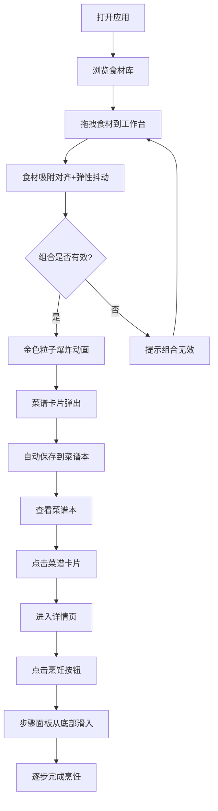

## 1. 产品概述

**配方炼金术** 是一款面向烹饪爱好者的交互式菜谱探索应用，用户通过拖拽食材卡片到工作台上组合，像玩合成游戏一样发现新菜谱。每次成功组合解锁新菜品并自动保存至个人菜谱本，菜谱本支持时间轴与类别双视图展示。

- 核心价值：将烹饪探索游戏化，降低菜谱发现门槛，让寻找新菜品变得有趣直观
- 目标用户：烹饪爱好者、厨房新手、喜欢探索新菜谱的家庭用户

## 2. 核心功能

### 2.1 用户角色

| 角色 | 注册方式 | 核心权限 |
|------|----------|----------|
| 普通用户 | 无需注册 | 浏览食材库、组合食材、查看菜谱本、搜索菜谱 |

### 2.2 功能模块

1. **主界面（炼金工作台）**：食材库 + 工作台 + 搜索框，拖拽组合核心交互
2. **个人菜谱本**：画廊网格 / 时间轴双视图，展示已解锁菜谱
3. **菜谱详情页**：菜品大图、食材列表、烹饪步骤互动面板
4. **搜索功能**：按食材或菜名搜索，实时匹配高亮

### 2.3 页面详情

| 页面名称 | 模块名称 | 功能描述 |
|----------|----------|----------|
| 主界面 | 食材库 | 左侧滚动卡片列表，按主食/蔬菜/肉类/调料四类色带标记，支持拖拽 |
| 主界面 | 工作台 | 右侧600×500px区域，虚线边框，食材吸附对齐（20px），组合成功触发粒子动画与菜谱卡片弹出 |
| 主界面 | 搜索框 | 右上角搜索，输入食材或菜名实时匹配，结果下拉高亮展示 |
| 菜谱本 | 画廊网格视图 | 每行4张卡片（240×320px），含菜品渐变色块、菜名、标签 |
| 菜谱本 | 时间轴视图 | 按解锁时间排列菜谱，时间线样式 |
| 菜谱详情 | 详情展示 | 左侧菜品大图300px正方形，右侧食材列表+烹饪按钮 |
| 菜谱详情 | 步骤面板 | 底部滑入面板，逐步展示烹饪过程，食材渐隐与半成品渐显动画 |

## 3. 核心流程

用户打开应用 → 浏览左侧食材库 → 拖拽食材卡片到工作台 → 食材自动吸附对齐并弹性抖动 → 判断组合是否有效 → 有效则金色粒子爆炸动画 + 菜谱卡片弹出 → 新菜自动保存到菜谱本 → 用户可切换到菜谱本查看已解锁菜品 → 点击卡片进入详情页 → 点击烹饪按钮启动步骤面板 → 逐步完成烹饪流程

## 4. 用户界面设计

### 4.1 设计风格

- **主色调**：暖棕金色系 — 主色 #D4A373，辅色 #C7A87B，强调色 #DAA520
- **背景色**：奶油暖白 — 主背景 #FAF8F5，工作台 #F5F0EB
- **按钮风格**：圆角渐变按钮，#D4A373→#B8875A，悬停亮度提升20%
- **字体**：中文使用系统字体，菜名22px #3A2A1A，标签13px，食材数量#6B4F32
- **布局风格**：左右分栏布局，左侧食材库滚动列表，右侧工作台
- **卡片风格**：圆角12-16px，奶油色背景，微阴影，悬停上抬动效
- **动效风格**：弹性过渡 cubic-bezier，粒子扩散，底部滑入面板

### 4.2 页面设计概览

| 页面名称 | 模块名称 | UI要素 |
|----------|----------|--------|
| 主界面 | 食材库 | 宽120px卡片，背景#FAF8F5，圆角12px，1px #E8E0D5边框，悬停上抬4px+#C7A87B阴影，过渡0.25s cubic-bezier，四类色带#D4A373/#8CB369/#A52A2A/#DAA520 |
| 主界面 | 工作台 | 600×500px，背景#F5F0EB，虚线边框#C7A87B，吸附距离20px，弹性抖动scale1.05回弹0.3s |
| 主界面 | 粒子动画 | 36粒子，中心扩散，半径100px，透明度1→0，速度0.8s，金色 |
| 主界面 | 搜索框 | 宽260px高40px，背景#FAFAFA，圆角20px，边框#E0D6C8→聚焦#C7A87B 2px，占位符#B0A090，高亮#D4A373 |
| 菜谱本 | 画廊网格 | 每行4张，卡片240×320px，背景#FFF，圆角16px，顶部160px渐变色块#E8C89A→#D4A373，菜名22px#3A2A1A居中，标签背景#F5E6D3圆角20px字体13px |
| 详情页 | 详情展示 | 左侧300px正方形圆角16px，阴影0 4px 20px rgba(0,0,0,0.1)，右侧食材列表#6B4F32，烹饪按钮渐变#D4A373→#B8875A圆角8px |
| 详情页 | 步骤面板 | 从底部滑入0.4s ease-out，食材渐隐消失，中央出现半成品图片 |

### 4.3 响应式

- 桌面优先设计，主要面向PC浏览器
- 最小支持宽度1280px
- 拖拽交互需要鼠标操作，移动端暂不作为首要适配目标

### 4.4 性能要求

- 搜索响应时间 < 100ms
- 卡片拖拽帧率稳定60fps
- 粒子动画使用Canvas或requestAnimationFrame确保流畅
