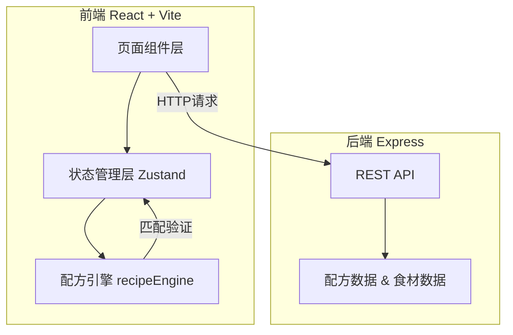
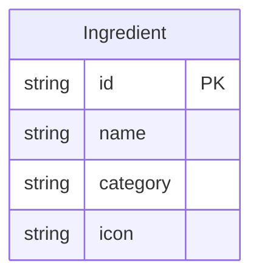
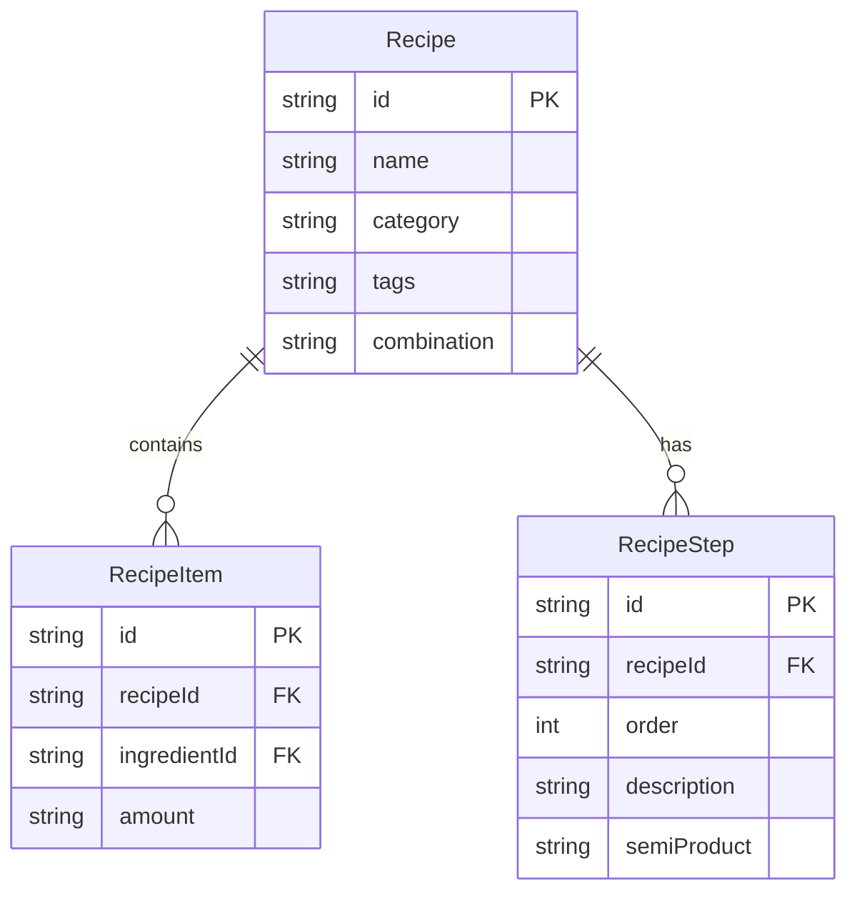

## 1. 架构设计



## 2. 技术说明

- **前端**：React 18 + TypeScript + Vite
- **构建工具**：Vite（端口3000）
- **状态管理**：Zustand
- **样式方案**：CSS Modules / 内联样式（精确控制动画与像素值）
- **后端**：Express + TypeScript + CORS
- **数据存储**：内存数据（配方库硬编码在服务端），无数据库依赖
- **拖拽实现**：原生 HTML5 Drag & Drop API + 自定义吸附逻辑
- **粒子动画**：Canvas API + requestAnimationFrame

## 3. 路由定义

| 路由 | 用途 |
|------|------|
| `/` | 主界面 — 食材库 + 工作台 + 搜索 |
| `/recipe-book` | 个人菜谱本 — 画廊网格 / 时间轴双视图 |
| `/recipe/:id` | 菜谱详情页 — 食材列表 + 烹饪步骤 |

## 4. API 定义

### 4.1 TypeScript 类型定义

```typescript
interface Ingredient {
  id: string;
  name: string;
  category: "staple" | "vegetable" | "meat" | "seasoning";
  icon: string;
}

interface Recipe {
  id: string;
  name: string;
  category: string;
  tags: string[];
  ingredients: { id: string; name: string; amount: string }[];
  steps: { description: string; semiProduct?: string }[];
  combination: string[];
}

interface SearchResult {
  recipes: Recipe[];
  matchedField: "name" | "ingredient";
}
```

### 4.2 接口定义

| 方法 | 路径 | 请求体 | 响应 | 说明 |
|------|------|--------|------|------|
| GET | `/api/ingredients` | — | `Ingredient[]` | 获取全部食材列表 |
| GET | `/api/recipes` | — | `Recipe[]` | 获取全部菜谱列表 |
| POST | `/api/recipes/search` | `{ query: string }` | `SearchResult` | 按菜名或食材搜索菜谱 |

## 5. 服务端架构图


## 6. 数据模型

### 6.1 食材数据



### 6.2 菜谱数据



## 7. 文件结构

```
project/
├── package.json
├── vite.config.js
├── tsconfig.json
├── index.html
├── src/
│   ├── engine/
│   │   └── recipeEngine.ts     # 配方匹配逻辑
│   ├── stores/
│   │   └── appState.ts         # Zustand 状态管理
│   ├── pages/
│   │   ├── MainPage.tsx        # 主界面
│   │   └── RecipeDetail.tsx    # 菜谱详情页
│   └── server/
│       └── server.ts           # Express 服务端
```
