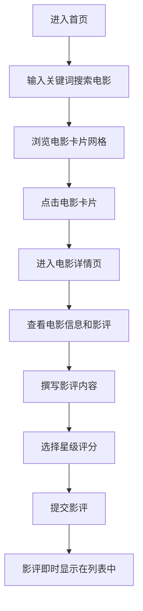

## 1. 产品概述

影评聚焦是一个全栈Web应用，提供电影浏览、搜索和影评撰写功能。用户可以搜索经典电影、查看电影详情、撰写带星级评分的影评，并按评分或日期排序查看。

- 目标用户：电影爱好者，希望发现经典电影并分享观影感受
- 产品价值：提供简洁优雅的电影信息浏览和影评社区体验

## 2. 核心功能

### 2.1 用户角色

| 角色 | 注册方式 | 核心权限 |
|------|----------|----------|
| 普通用户 | 无需注册 | 浏览电影、搜索电影、撰写影评、查看影评排序 |

### 2.2 功能模块

1. **首页/搜索页**：导航栏、搜索框、电影网格列表、排序选项
2. **电影详情页**：电影信息展示、影评列表、评分统计、影评撰写表单

### 2.3 页面详情

| 页面名称 | 模块名称 | 功能描述 |
|----------|----------|----------|
| 首页/搜索页 | 导航栏 | 固定顶部，毛玻璃效果，包含Logo和搜索框 |
| 首页/搜索页 | 搜索框 | 关键词搜索电影，聚焦时展开动画，放大镜图标 |
| 首页/搜索页 | 电影网格 | 每行3张卡片，响应式布局，悬停放大效果 |
| 首页/搜索页 | 排序控制 | 按评分从高到低或按日期最新排序 |
| 电影详情页 | 电影信息 | 海报、标题、简介、年份、导演展示 |
| 电影详情页 | 评分统计 | 圆形进度条显示平均评分，总评数展示 |
| 电影详情页 | 影评列表 | 按时间倒序展示所有影评，包含评分和内容 |
| 电影详情页 | 影评表单 | 文本输入区域，五星评分组件，提交按钮 |

## 3. 核心流程

用户在首页搜索电影 → 浏览电影卡片网格 → 点击卡片进入详情页 → 查看电影信息和已有影评 → 撰写影评并评分 → 提交后影评即时显示

## 4. 用户界面设计

### 4.1 设计风格

- 主色调：深色主题，背景 `#0F172A`，卡片背景 `#1E293B`
- 辅助色：文字 `#F1F5F9`，边框 `#D1D5DB`，搜索聚焦边框 `#3B82F6`
- 强调色：星星评分渐变 `#F59E0B` → `#FCD34D`，评分进度条渐变 `#EF4444` → `#10B981`
- 按钮风格：圆角设计，点击后缩小至0.95再弹回的微过渡效果
- 字体：现代无衬线字体，清晰可读
- 布局风格：卡片式网格布局，顶部固定导航栏
- 图标风格：简洁线性图标，使用 lucide-react

### 4.2 页面设计概述

| 页面名称 | 模块名称 | UI元素 |
|----------|----------|--------|
| 首页/搜索页 | 导航栏 | 高度64px，毛玻璃效果 `rgba(15,23,42,0.8)`，圆角Logo |
| 首页/搜索页 | 搜索框 | 圆角24px，放大镜图标，聚焦展开动画，聚焦边框 `#3B82F6` |
| 首页/搜索页 | 电影卡片 | 宽度280px，悬停 `scale(1.03)` 放大，阴影加深，海报+标题+年份+评分 |
| 首页/搜索页 | 排序按钮 | 圆角按钮，选中状态高亮，微过渡动画 |
| 电影详情页 | 电影海报 | 宽度400px，圆角12px，阴影效果 |
| 电影详情页 | 评分统计 | 直径44px圆形进度条，1s ease-out动画填充，颜色渐变 |
| 电影详情页 | 影评卡片 | 卡片背景 `#1E293B`，圆角8px，星级评分显示 |
| 电影详情页 | 文本区域 | 高度120px，圆角8px，边框 `#D1D5DB` |
| 电影详情页 | 星级组件 | 悬停放大1.2倍，弹出评分提示，渐变色填充 |

### 4.3 响应式设计

- 桌面端（>1024px）：电影网格3列布局
- 平板端（768px-1024px）：电影网格2列布局
- 移动端（<768px）：电影网格1列布局
- 所有交互元素支持触摸操作
- 所有微过渡时长0.2s-0.3s，使用ease-in-out缓动函数

