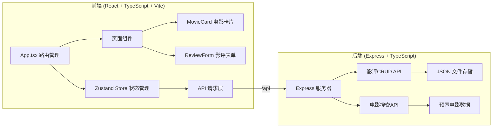
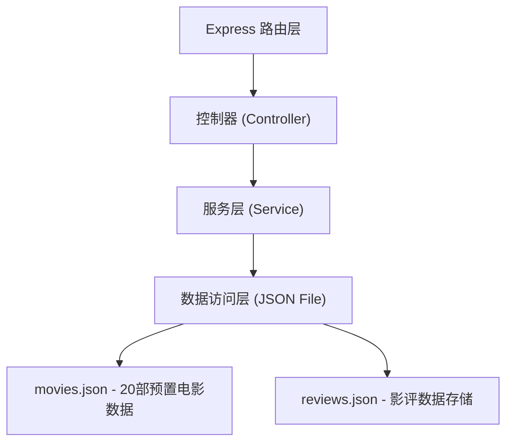
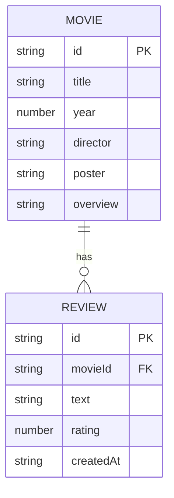

## 1. 架构设计



## 2. 技术选型说明

- **前端**：React 18 + TypeScript + Vite
  - UI构建：React 函数组件 + Hooks
  - 状态管理：Zustand
  - 路由管理：React Router DOM
  - 图标库：lucide-react
- **后端**：Express 4 + TypeScript
  - 数据存储：本地 JSON 文件
  - 唯一标识：uuid
  - 跨域处理：cors
- **构建工具**：Vite，配置 React 插件和 API 代理
- **初始化方式**：使用 vite-init react-express-ts 模板

## 3. 路由定义

| 路由路径 | 页面/用途 |
|----------|-----------|
| `/` | 首页，电影搜索和网格列表展示 |
| `/movie/:id` | 电影详情页，展示电影信息和影评 |

## 4. API 定义

### 4.1 类型定义

```typescript
interface Movie {
  id: string;
  title: string;
  year: number;
  director: string;
  poster: string;
  overview: string;
}

interface Review {
  id: string;
  movieId: string;
  text: string;
  rating: number; // 1-5
  createdAt: string;
}

interface ReviewStats {
  averageRating: number;
  totalReviews: number;
}
```

### 4.2 接口定义

| 方法 | 路径 | 说明 | 请求体 | 响应 |
|------|------|------|--------|------|
| GET | `/api/movies/search?q=关键词` | 搜索电影 | - | `Movie[]` |
| GET | `/api/movies/:id` | 获取单部电影详情 | - | `Movie` |
| GET | `/api/reviews?movieId=xxx` | 获取电影影评列表 | - | `Review[]` |
| GET | `/api/reviews/stats?movieId=xxx` | 获取影评统计数据 | - | `ReviewStats` |
| POST | `/api/reviews` | 创建影评 | `{ movieId, text, rating }` | `Review` |
| PUT | `/api/reviews/:id` | 更新影评 | `{ text, rating }` | `Review` |
| DELETE | `/api/reviews/:id` | 删除影评 | - | `{ success: true }` |

## 5. 服务端架构图



## 6. 数据模型

### 6.1 数据模型ER图



### 6.2 初始数据

预置20部经典电影数据，包含电影ID、标题、年份、导演、海报URL和简介。影评数据初始为空，由用户创建后写入 JSON 文件。

