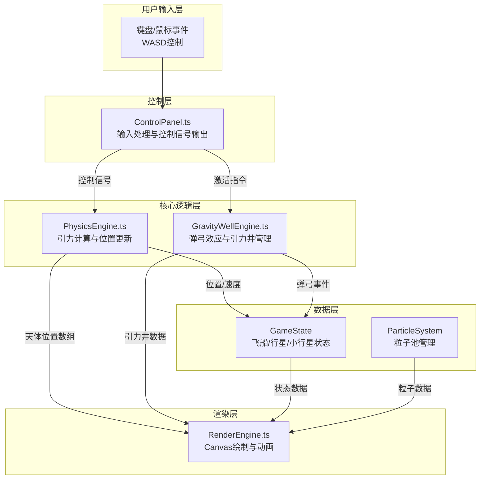

## 1. 架构设计



**模块调用关系与数据流向：**
1. `ControlPanel.ts` 接收用户输入 → 输出控制信号给 `PhysicsEngine.ts` 和 `GravityWellEngine.ts`
2. `PhysicsEngine.ts` 每帧调用：输入飞船状态和行星位置 → 计算万有引力 → 更新飞船位置/速度 → 输出天体位置数组给 `RenderEngine.ts`
3. `GravityWellEngine.ts` 每帧调用：输入飞船位置 → 检测引力井范围 → 计算弹弓效应 → 输出弹弓事件数据给 `RenderEngine.ts` 和 `PhysicsEngine.ts`
4. `RenderEngine.ts` 每帧调用：接收所有渲染数据 → 绘制Canvas画面

## 2. 技术描述
- **前端技术栈**：TypeScript + Vite + Canvas 2D API
- **构建工具**：Vite 5.x + @vitejs/plugin-basic
- **语言版本**：TypeScript 5.x，target ES2020，严格模式
- **无后端依赖**：纯前端游戏，所有逻辑在浏览器端执行
- **动画系统**：requestAnimationFrame驱动60FPS主循环

**文件结构：**
```
├── package.json          # 依赖与脚本
├── vite.config.js        # Vite构建配置
├── tsconfig.json         # TypeScript配置
├── index.html            # 入口页面
└── src/
    ├── main.ts           # 游戏入口，初始化主循环
    ├── types/
    │   └── index.ts      # 类型定义（飞船、行星、小行星等）
    ├── core/
    │   ├── PhysicsEngine.ts      # 物理引擎
    │   └── GravityWellEngine.ts  # 引力井引擎
    ├── ui/
    │   └── ControlPanel.ts       # 控制面板
    ├── render/
    │   └── RenderEngine.ts       # 渲染引擎
    └── utils/
        ├── ParticleSystem.ts     # 粒子系统
        └── MathUtils.ts          # 数学工具函数
```

## 3. 核心数据类型定义

```typescript
// 向量
interface Vector2D {
  x: number;
  y: number;
}

// 飞船状态
interface Spaceship {
  position: Vector2D;
  velocity: Vector2D;
  angle: number;        // 旋转角度（弧度）
  thrust: number;       // 推力值 0-1
  isInGravityWell: boolean;
  trail: Vector2D[];    // 尾迹点数组
}

// 行星
interface Planet {
  id: number;
  position: Vector2D;
  radius: number;       // 30-80px
  color: string;        // 5种预设颜色之一
  orbit: {
    centerX: number;
    centerY: number;
    semiMajor: number;  // 半长轴
    semiMinor: number;  // 半短轴
    angle: number;      // 当前轨道角度
    speed: number;      // 轨道角速度
  };
  gravityWell: {
    radius: number;     // 行星半径 × 3
    strength: number;   // 引力系数 1.5
  };
  rotation: number;     // 表面纹理旋转角度
}

// 小行星
interface Asteroid {
  id: number;
  position: Vector2D;
  velocity: Vector2D;   // 0.5-1.5 px/帧
  radius: number;       // 10-25px
  vertices: Vector2D[]; // 6-10个顶点
  color: string;        // #8B8B8B 到 #5A5A5A
}

// 粒子
interface Particle {
  id: number;
  position: Vector2D;
  velocity: Vector2D;
  color: string;
  size: number;
  life: number;         // 剩余生命周期
  maxLife: number;      // 最大生命周期
  type: 'thruster' | 'explosion' | 'victory';
}

// 弹弓事件
interface SlingshotEvent {
  planetId: number;
  enterTime: number;
  exitTime?: number;
  velocityBoost: Vector2D;
}

// 游戏状态
type GameStatus = 'playing' | 'failed' | 'victory';
interface GameState {
  status: GameStatus;
  score: number;
  spaceship: Spaceship;
  planets: Planet[];
  asteroids: Asteroid[];
  particles: Particle[];
  finishLineX: number;
}
```

## 4. 性能优化设计

### 4.1 对象池模式
- 粒子系统采用对象池，预先创建500个粒子对象
- 超出数量时淘汰生命周期最早结束的粒子
- 避免频繁的对象创建与垃圾回收

### 4.2 空间分区
- 采用网格空间分区加速碰撞检测
- 将画布划分为100×100px的网格单元
- 仅检测相邻网格内的对象碰撞

### 4.3 渲染优化
- 静态星空背景使用离屏Canvas缓存
- 行星旋转纹理预先生成
- 粒子使用批量绘制减少API调用

### 4.4 计算优化
- 引力计算使用平方距离比较，避免开方运算
- 向量运算使用原地修改，减少临时对象
- 物理计算与渲染分离，可独立调节帧率
