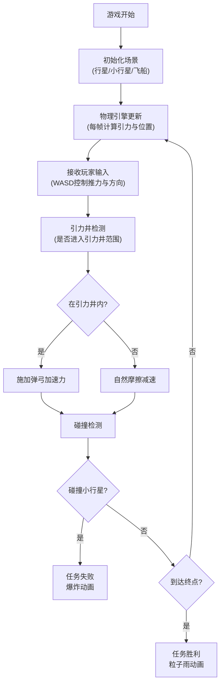

## 1. 产品概述
引力弹弓模拟器是一款基于2D Canvas的太空探险交互游戏，玩家通过操控飞船利用行星引力弹弓效应穿越小行星带，体验真实的太空物理模拟。
- 核心目的：提供沉浸式的引力弹弓物理模拟体验，让玩家在游戏中学习天体力学知识
- 目标用户：对太空探索、物理模拟感兴趣的玩家和学习者
- 产品价值：将复杂的物理概念转化为直观可玩的交互体验，兼具教育性和娱乐性

## 2. 核心功能

### 2.1 用户角色
| 角色 | 注册方式 | 核心权限 |
|------|----------|----------|
| 玩家 | 无需注册，直接进入 | 操控飞船、体验游戏全部功能 |

### 2.2 功能模块
1. **物理引擎模块**：万有引力计算、飞船运动模拟、碰撞检测
2. **引力井系统**：引力井范围检测、弹弓效应计算、速度叠加
3. **飞船控制模块**：键盘输入处理、推力控制、方向偏转
4. **渲染引擎模块**：星空背景、行星动画、粒子效果、UI绘制
5. **游戏状态管理**：任务目标判定、计分系统、胜负状态

### 2.3 页面详情
| 页面名称 | 模块名称 | 功能描述 |
|---------|----------|----------|
| 游戏主界面 | 顶部状态栏 | 显示飞船状态（速度、推力、引力井状态） |
| 游戏主界面 | 游戏画布 | 渲染太空场景、飞船、行星、小行星、引力井 |
| 游戏主界面 | 计分面板 | 右上角实时显示当前得分 |
| 游戏主界面 | 速度指示器 | 左下角显示速度矢量箭头 |
| 游戏主界面 | 结果弹窗 | 任务失败/胜利时显示动画和提示信息 |

## 3. 核心流程
玩家通过WASD控制飞船推进器，利用行星周围的引力井进行弹弓加速，在躲避小行星的同时飞向右侧终点线。飞船进入引力井范围时自动获得向心力加速，离开时速度叠加实现无燃料加速。碰撞小行星则任务失败，成功飞越终点线则任务胜利。

## 4. 用户界面设计

### 4.1 设计风格
- **主色调**：深空蓝紫配色，背景#0B0B1A，顶部UI栏rgba(15,15,35,0.8)
- **强调色**：飞船#00E5FF，行星从#FF6B6B、#4ECDC4、#FFD93D、#6C5CE7、#A29BFE中选取，引力井光晕与行星同色
- **字体**：monospace等宽字体，状态文字14px，标题24px，计分18px
- **布局**：全屏Canvas，顶部60px状态栏，左下角速度矢量，右上角计分面板
- **视觉效果**：行星发光效果、引力井径向渐变、飞船尾迹粒子、推进器火焰、闪烁光晕

### 4.2 页面设计概述
| 页面名称 | 模块名称 | UI元素 |
|---------|----------|--------|
| 游戏主界面 | 星空背景 | 随机分布星点，深邃太空感 |
| 游戏主界面 | 行星系统 | 5颗椭圆轨道行星，半透明轨道虚线，行星旋转纹理 |
| 游戏主界面 | 引力井 | 圆形渐变区域，半径为行星3倍，透明度从中心0.4向外递减 |
| 游戏主界面 | 飞船 | 三角形，边长40px，颜色#00E5FF，带推进器粒子 |
| 游戏主界面 | 小行星 | 30颗不规则多边形，6-10个顶点，颜色#8B8B8B到#5A5A5A渐变 |
| 游戏主界面 | 终点线 | 垂直发光虚线，#00E5FF，线宽4px，0.8s闪烁周期 |
| 游戏主界面 | 顶部状态栏 | 背景rgba(15,15,35,0.8)，1px #2A2A4E底部边框 |
| 游戏主界面 | 速度指示器 | 左下角黄色箭头，长度代表速度大小 |
| 游戏主界面 | 失败动画 | 20颗红色碎片飞散，1s后渐隐，红色提示面板 |
| 游戏主界面 | 胜利动画 | 全屏金色粒子雨，持续3s |

### 4.3 响应式
- 桌面端优先设计，Canvas自适应窗口大小
- 游戏区域保持16:9比例，自动居中
- 触摸设备支持虚拟摇杆（可选扩展）

### 4.4 性能约束
- 主循环帧率稳定60FPS
- 粒子数量峰值不超过500颗（超出时淘汰最旧粒子）
- 物理计算每帧耗时≤2ms
- Canvas渲染每帧耗时≤8ms
- 输入响应时间≤50ms
