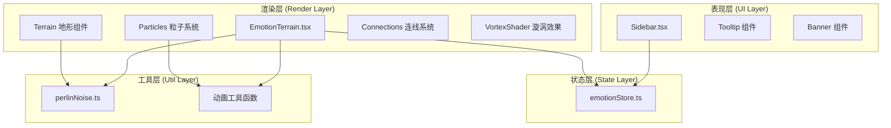
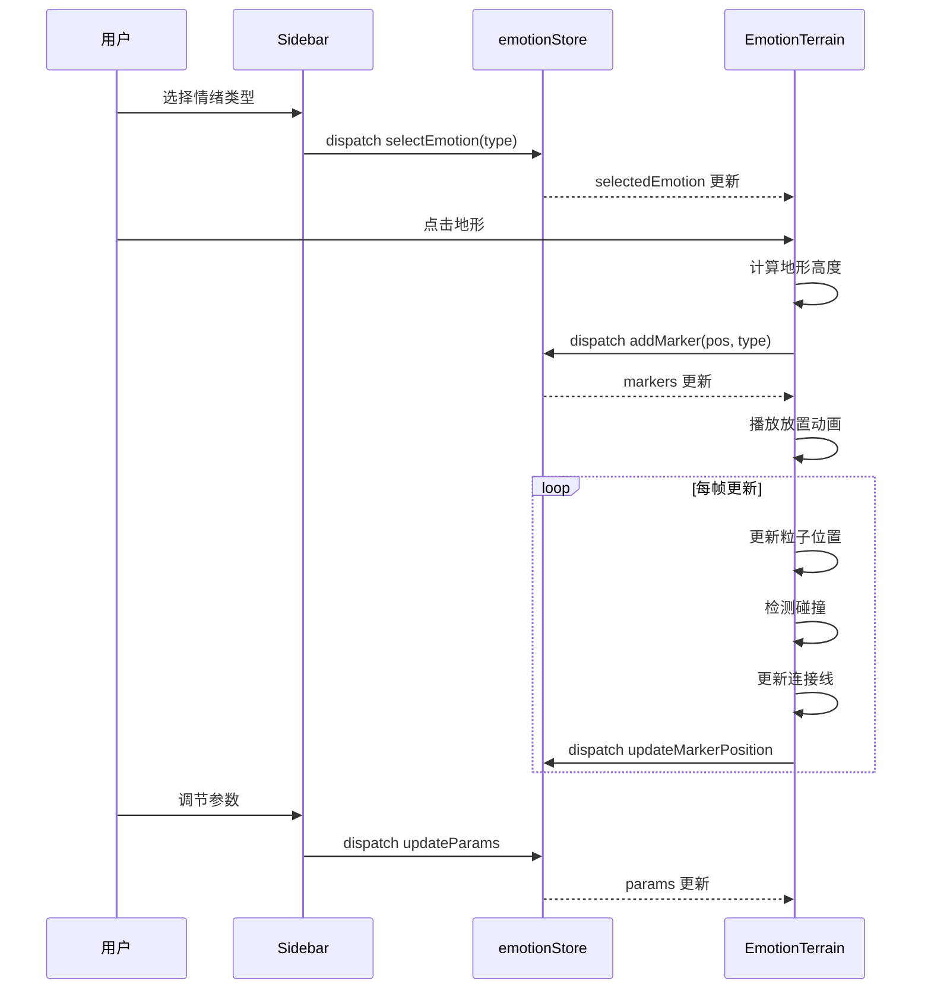

# 情绪地形 - 技术架构文档

---

## 1. 整体架构设计

### 1.1 架构分层



### 1.2 目录结构

```
src/
├── App.tsx                 # 主应用组件
├── store/
│   └── emotionStore.ts   # Zustand 状态管理
├── scene/
│   └── EmotionTerrain.tsx  # Three.js 3D场景
├── ui/
│   └── Sidebar.tsx      # 右侧边栏UI
├── utils/
│   └── perlinNoise.ts    # Perlin噪声工具
└── index.css               # 全局样式
```

---

## 2. 核心模块设计

### 2.1 状态管理模块 (emotionStore)

**状态结构**

```typescript
interface EmotionMarker {
  id: string;
  type: 'happy' | 'sad' | 'angry' | 'calm';
  position: { x: number; y: number; z: number };
  velocity: { x: number; y: number; z: number };
  size: number;
  createdAt: number;
}

interface TerrainParams {
  flowSpeed: number;
  collisionRadius: number;
}

interface UIState {
  selectedEmotion: EmotionType | null;
  showVortex: boolean;
  showBanner: boolean;
}
```

**Actions**
- `addMarker(position: Vector3, type: EmotionType)`
- `removeMarker(id: string)`
- `updateMarkerPosition(id: string, position: Vector3)`
- `updateParams(params: Partial<TerrainParams>)`
- `triggerVortex()`
- `reset()`
- `selectEmotion(type: EmotionType | null)`

### 2.2 3D场景模块 (EmotionTerrain)

**组件职责**
- 管理Three.js场景、相机、渲染器
- 渲染地形网格
- 管理粒子系统
- 处理用户交互（点击放置、悬停）
- 实现粒子流动物理
- 处理粒子碰撞与融合
- 实现集体漩涡动画
- 渲染连接线
- 渲染星点背景

**核心子组件

| 组件 | 职责 |
|------|------|
| TerrainMesh | 生成Perlin噪声地形 |
| EmotionParticles | 管理所有情绪标记点 |
| ConnectionLines | 粒子间连接线 |
| StarField | 星点背景 |
| VortexEffect | 漩涡动画效果 |
| ParticleShader | 粒子扭曲Shader |

### 2.3 UI模块 (Sidebar)

**组件职责**
- 情绪类型选择按钮
- 参数调节滑块
- 重置/导出按钮
- 交互反馈动效

### 2.4 工具模块

**perlinNoise.ts**
- `noise2D(x: number, y: number): number`
- `getTerrainHeight(x: number, z: number): number`

---

## 3. 数据流设计

### 3.1 数据流向



### 3.2 性能优化策略

1. **渲染优化**
- 使用 instancedMesh 渲染多个粒子
- 按需更新粒子矩阵
- 合理的剔除不可见对象

2. **计算优化**
- 使用 useFrame 节流
- 空间分区加速碰撞检测
- 粒子位置计算使用 requestAnimationFrame

3. **内存优化**
- 及时释放几何体和材质
- 对象池复用粒子对象

---

## 4. 关键技术实现

### 4.1 地形生成

```
算法：Perlin噪声 + 圆形衰减
- 基础高度 = noise(x * 频率, z * 频率) * 振幅
- 圆形衰减因子 = 1 - (距离中心 / 半径)^2
- 最终高度 = 基础高度 * 衰减因子
```

### 4.2 粒子流动物理

```
每帧更新：
1. 根据Perlin噪声获取流动方向
2. 应用速度 = 噪声方向 * 流动速度
3. 限制在地形边界内
4. 检测与其他粒子的碰撞
5. 同类融合：距离 < 碰撞半径时，合并体积相加
6. 异类碰撞：产生粒子爆发效果
```

### 4.3 漩涡动画

```
Shader实现：
- 粒子位置 = 中心 + 旋转矩阵 * 偏移
- 扭曲因子 = sin(time) * 强度
- 颜色混合 = 各情绪比例加权
```

### 4.4 截图导出

```
实现步骤：
1. 隐藏UI元素
2. 渲染一帧
3. 读取canvas像素
4. 导出为PNG
5. 恢复UI显示
```

---

## 5. 开发规范

### 5.1 TypeScript规范

- 启用严格模式 (strict: true)
- 启用 esModuleInterop: true
- 所有组件使用函数式组件 + TypeScript
- Props 使用 interface 定义

### 5.2 代码风格

- 组件命名：PascalCase
- 函数命名：camelCase
- 常量命名：UPPER_SNAKE_CASE
- 文件名：与组件名一致

### 5.3 Git规范

- 提交信息使用中文
- 格式：<类型>: <描述>
- 类型：feat / fix / docs / style / refactor / perf / test

---

## 6. 部署与构建

### 6.1 构建命令

| 命令 | 说明 |
|------|------|
| `npm install` | 安装依赖 |
| `npm run dev` | 启动开发服务器 (端口3000) |
| `npm run build` | 生产构建 |

### 6.2 依赖清单

```json
{
  "dependencies": {
    "react": "^18.2.0",
    "react-dom": "^18.2.0",
    "zustand": "^4.4.0",
    "three": "^0.160.0",
    "@react-three/fiber": "^8.15.0",
    "@react-three/drei": "^9.92.0",
    "perlin-simplex": "^0.3.0"
  },
  "devDependencies": {
    "typescript": "^5.3.0",
    "vite": "^5.0.0",
    "@vitejs/plugin-react": "^4.2.0",
    "@types/three": "^0.160.0"
  }
}
```

---

## 7. 风险与应对

| 风险 | 影响 | 应对措施 |
|------|------|----------|
| 性能问题 | 粒子过多导致帧率下降 | 使用InstancedMesh，限制最大粒子数 |
| 兼容性问题 | 部分浏览器不支持WebGL | 提供降级提示 |
| Shader复杂度 | 漩涡效果可能性能开销大 | 提供性能检测，低性能设备降级 |
