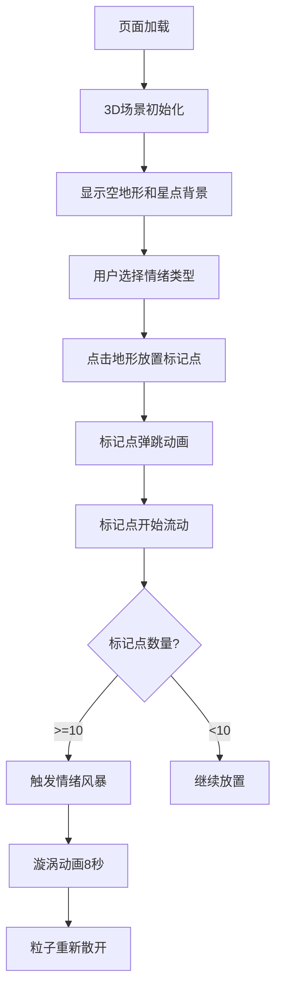
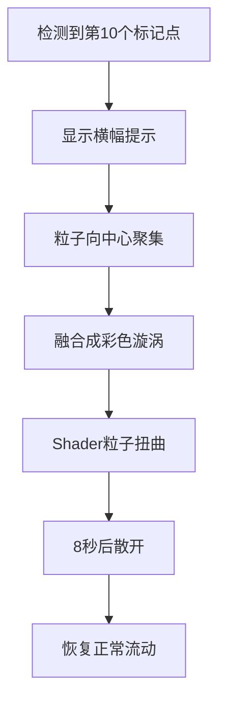

# 情绪地形 - 产品需求文档

## 1. 产品概述

**产品名称：情绪地形 (Emotion Terrain)

**产品定位**：一款沉浸式情绪可视化艺术装置，用户通过在3D地形上放置情绪标记，记录和探索个人情绪旅程。

**核心价值**：将抽象的情绪转化为具象的视觉体验，通过粒子互动和动态演化，帮助用户觉察和理解自己的情绪模式。

---

## 2. 功能需求

### 2.1 3D场景渲染

**地形系统
- 半径8单位的圆形丘陵地形
- Perlin噪声生成地形高度（频率0.8，振幅2单位）
- 背景颜色从底部#0A0E27渐变到顶部#2A1B4A
- 地面半透明网格（透明度0.2）

**相机设置**
- 初始位置：原点上方15单位
- 角度：俯视30度

**情绪标记点**
- 四种情绪：快乐(#FFD93D)、悲伤(#6C5CE7)、愤怒(#FF6B6B)、平静(#00B894)
- 球形粒子，半径0.4单位
- 放置动画：从地面升起并弹跳两次（弹跳高度0.5单位，阻尼0.6，过渡0.6s cubic-bezier）
- 悬停提示：显示情绪名称和停留时长
- Tooltip样式：圆角8px，背景rgba(20,20,40,0.85)，字体白色

### 2.2 粒子互动系统

**粒子流动**
- 标记点随时间在地形上缓慢流动
- 流动速度可调节（0-2，默认0.5）

**粒子互动**
- 同类情绪靠近时融合变大
- 不同类情绪碰撞时产生颜色混合和粒子爆发效果
- 碰撞半径可调节（0.3-1，默认0.6）

**连接系统**
- 标记点之间用半透明曲线连接
- 连接距离阈值5单位
- 曲线透明度0.25
- 颜色取两端标记点颜色的混合

**集体迁移动画**
- 放置第10个标记点时自动触发
- 所有标记点向地形中心聚集并融合成多层彩色漩涡
- 漩涡颜色由各情绪比例决定
- 持续8秒后重新散开
- 使用shader实现粒子扭曲效果

### 2.3 星点背景
- 150颗星点
- 大小1-2px随机
- 透明度0.3-0.6随机
- 缓慢旋转

### 2.4 右侧边栏UI

**情绪选择按钮**
- 四个圆形按钮（直径44px）
- 激活状态有脉动光晕动画（周期1.5s）

**参数调节滑块**
- 粒子流动速度：范围0-2，初始值0.5
- 碰撞半径：范围0.3-1，初始值0.6
- 自定义渐变轨道：高4px，圆角2px，#3A3A5E到#6C63FF
- 拖动手柄直径18px，有阴影

**操作按钮**
- 重置按钮：清空所有标记点
- 导出按钮：导出PNG截图（隐藏界面元素）

**交互效果**
- 所有按钮悬停时亮度提升20%
- 点击有0.15s的缩放反馈

### 2.5 情绪风暴横幅
- 高度60px
- 背景#1A1A2E
- 底部1px #6C5CE7光晕
- 显示"情绪风暴已触发"文字
- 字体#FFD93D，居中
- 3秒后自动渐隐

### 2.6 状态管理
- 标记点列表管理
- 地形参数管理
- UI状态管理

---

## 3. 技术栈需求

### 3.1 核心技术

| 技术 | 用途 |
|------|------|
| React 18 | UI框架 |
| TypeScript | 类型安全 |
| Vite | 构建工具 |
| Three.js | 3D渲染 |
| @react-three/fiber | React Three.js集成 |
| @react-three/drei | Three.js辅助组件 |
| Zustand | 状态管理 |
| perlin-simplex | Perlin噪声 |

### 3.2 开发环境
- Node.js 18+
- npm 开发服务器端口：3000

---

## 4. 用户交互流程

### 4.1 主流程

### 4.2 情绪风暴流程

---

## 5. 视觉设计规范

### 5.1 配色方案

| 名称 | 色值 | 用途 |
|------|------|------|
| 背景底部 | #0D0B14 | 画布背景 |
| 渐变底部 | #0A0E27 | 地形渐变底部 |
| 渐变顶部 | #2A1B4A | 地形渐变顶部 |
| 边栏背景1 | #1A1A2E | 边栏背景渐变起点 |
| 边栏背景2 | #16213E | 边栏背景渐变终点 |
| 边栏边框 | #2A2A4E | 边栏边框 |
| 快乐 | #FFD93D | 快乐情绪 |
| 悲伤 | #6C5CE7 | 悲伤情绪 |
| 愤怒 | #FF6B6B | 愤怒情绪 |
| 平静 | #00B894 | 平静情绪 |
| 强调色 | #6C63FF | 滑块、光晕 |

### 5.2 排版规范
- 主字体：现代无衬线字体
- 标题：粗体，较大字号
- 正文：常规字重，适中字号
- Tooltip：小号字体，白色

### 5.3 动效规范
- 放置动画：0.6s cubic-bezier
- 悬停动画：亮度+20%
- 点击反馈：0.15s缩放
- 脉动光晕：1.5s周期
- 横幅渐隐：3秒

---

## 6. 非功能需求

### 6.1 性能需求
- 稳定60fps渲染
- 支持至少50个标记点同时流畅运行
- 响应式交互延迟<100ms

### 6.2 兼容性需求
- 支持WebGL 2.0的现代浏览器
- Chrome、Firefox、Safari最新版本

### 6.3 可维护性
- 代码模块化拆分
- TypeScript严格类型检查
- 组件职责单一
