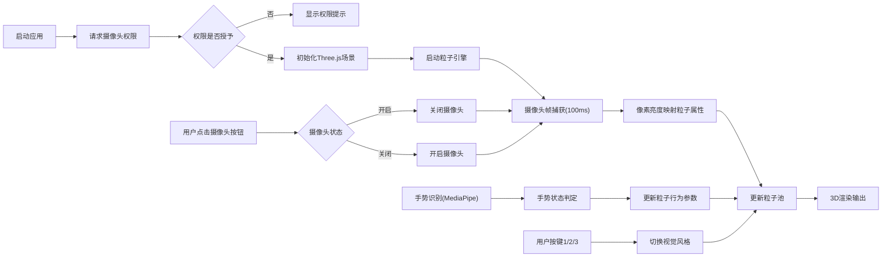

## 1. 产品概述

实时摄像头粒子化艺术应用，将用户摄像头捕获的实时画面转化为动态几何粒子流艺术效果。解决传统视频特效缺乏沉浸式空间交互、粒子形态单一无法随用户动作实时变化的问题。

- 面向创意爱好者、视觉艺术家、直播内容创作者
- 提供沉浸式3D粒子化视觉体验，支持手势交互和多风格切换
- 核心价值：将普通摄像头画面转化为富有艺术感的动态粒子效果，带来新颖的视觉体验

## 2. 核心功能

### 2.1 功能模块
1. **主场景页面**：全屏3D粒子场景，实时摄像头画面粒子化渲染
2. **控制面板**：风格切换按钮、摄像头开关、FPS显示
3. **手势交互系统**：基于MediaPipe的实时手势识别与粒子行为控制

### 2.2 功能详情

| 页面名称 | 模块名称 | 功能描述 |
|---------|---------|---------|
| 主场景 | 摄像头粒子化 | 每100ms捕获一帧画面，将像素亮度映射为3D粒子的Z轴位置和大小，形成粒子化实时视频流 |
| 主场景 | 手势交互 | 左手举起粒子扩散、右手举起粒子收缩、双手举起粒子旋转，放下手恢复初始状态 |
| 主场景 | 风格切换 | 霓虹/水墨/像素三种视觉风格，按键1/2/3切换，0.5s过渡动画 |
| 控制面板 | FPS显示 | 实时显示当前帧率，绿色#4ECDC4 |
| 控制面板 | 风格按钮 | 三个40x40px风格切换按钮，悬停效果 |
| 控制面板 | 摄像头开关 | 圆形按钮，开启红色关闭深色，点击缩放动画 |

## 3. 核心流程

### 3.1 主流程
用户打开应用 → 请求摄像头权限 → 初始化Three.js场景 → 启动粒子引擎 → 实时捕获摄像头帧 → 生成粒子数据 → 渲染3D场景 → 手势识别更新粒子行为 → 用户切换风格/开关摄像头

### 3.2 流程图

## 4. 用户界面设计

### 4.1 设计风格
- **主色调**：深色科技感主题，背景#0A0A0F
- **强调色**：霓虹青#4ECDC4（FPS）、珊瑚红#FF6B6B（摄像头开启）
- **按钮风格**：圆角方形，半透明背景，悬停亮色反馈
- **字体**：现代无衬线字体，数字使用等宽字体
- **布局风格**：沉浸式全屏3D场景，悬浮控制面板

### 4.2 页面设计

| 页面名称 | 模块名称 | UI元素 |
|---------|---------|-------|
| 主场景 | 3D粒子场 | 8000-12000个粒子，根据像素亮度分布Z轴深度，颜色采样自摄像头 |
| 主场景 | 控制面板 | 右下角悬浮，宽240px，毛玻璃效果，圆角16px，1px边框 |
| 控制面板 | FPS显示 | 顶部绿色数字显示当前帧率 |
| 控制面板 | 风格按钮 | 一行三个40x40px按钮，分别代表霓虹/水墨/像素风格 |
| 控制面板 | 摄像头开关 | 底部居中圆形按钮，直径48px，开启红色关闭深色 |

### 4.3 响应式设计
- **桌面端**：控制面板固定右下角，宽240px
- **移动端**（<768px）：面板移至顶部，宽度减为200px，按钮间距缩小
- **触摸优化**：按钮最小点击区域44px，适当增加间距

### 4.4 3D场景设计
- **环境**：深色背景#0A0A0F，粒子自发光
- **光照**：粒子使用Additive Blending，无需额外光源
- **相机**：PerspectiveCamera，fov 75，初始位置Z轴10单位
- **后期处理**：霓虹风格启用Bloom效果，强度0.8
- **粒子系统**：THREE.Points + BufferGeometry，高性能粒子渲染

## 5. 性能指标

| 指标 | 目标值 |
|------|--------|
| 粒子更新帧率 | ≥ 55 FPS（中档GPU） |
| 手势识别延迟 | ≤ 200ms |
| 摄像头启动时间 | ≤ 2秒 |
| 粒子总数 | 8000-12000个 |
| 风格切换过渡 | 0.5s平滑过渡 |
| 手势状态过渡 | 1s ease-out动画 |
