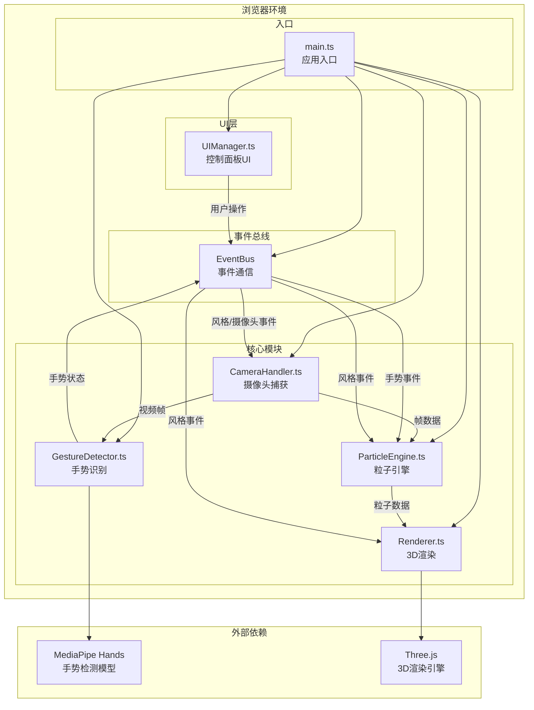

## 1. 架构设计



## 2. 技术描述

### 2.1 技术栈
- **前端框架**：原生 TypeScript (无框架)
- **构建工具**：Vite 5
- **3D渲染**：Three.js 0.160+
- **手势识别**：@mediapipe/hands
- **编程语言**：TypeScript 5.0+
- **目标版本**：ES2020

### 2.2 模块职责

| 模块 | 文件路径 | 核心职责 |
|------|---------|---------|
| 摄像头模块 | src/camera/CameraHandler.ts | 初始化摄像头流、按100ms间隔捕获帧、提供像素数据 |
| 粒子引擎模块 | src/particle/ParticleEngine.ts | 管理粒子池、更新粒子位置/颜色/大小、输出渲染数据 |
| 手势识别模块 | src/gesture/GestureDetector.ts | MediaPipe视频帧检测、手势状态判定、事件分发 |
| 渲染模块 | src/render/Renderer.ts | Three.js场景初始化、粒子渲染、Bloom后期处理 |
| UI模块 | src/ui/UIManager.ts | 控制面板HTML渲染、事件绑定、FPS显示 |
| 主入口 | src/main.ts | 初始化所有模块、启动主循环、协调数据流 |

### 2.3 事件总线设计

| 事件名称 | 触发方 | 接收方 | 数据 |
|---------|-------|-------|------|
| camera:frame | CameraHandler | ParticleEngine, GestureDetector | ImageData / VideoFrame |
| gesture:change | GestureDetector | ParticleEngine | GestureState |
| style:change | UIManager | ParticleEngine, Renderer | StyleType |
| camera:toggle | UIManager | CameraHandler | boolean |
| fps:update | Renderer | UIManager | number |

## 3. 核心数据结构

### 3.1 粒子数据

```typescript
interface Particle {
  x: number;
  y: number;
  z: number;
  size: number;
  color: { r: number; g: number; b: number };
  baseX: number;
  baseY: number;
  baseZ: number;
  baseSize: number;
}
```

### 3.2 手势状态

```typescript
type GestureState = {
  leftHand: boolean;
  rightHand: boolean;
  bothHands: boolean;
};
```

### 3.3 视觉风格

```typescript
type StyleType = 'neon' | 'ink' | 'pixel';

interface StyleConfig {
  bloom: boolean;
  bloomIntensity: number;
  saturation: number;
  opacity: number;
  jitter: number;
  fixedSize: number | null;
  pixelated: boolean;
}
```

### 3.4 粒子行为参数

```typescript
interface ParticleBehavior {
  spreadRadius: number;
  rotationSpeed: number; // degrees per second around Y axis
  transitionDuration: number;
}
```

## 4. 关键技术方案

### 4.1 高性能粒子渲染
- 使用 `THREE.BufferGeometry` + `THREE.Points` 实现批量粒子渲染
- 粒子位置/颜色/大小存储在 TypedArray 中，每帧统一更新
- 粒子总数控制在8000-12000，根据画面分辨率动态调整采样密度

### 4.2 像素亮度映射算法
- 将摄像头画面缩放到合适分辨率（如120x90）
- 遍历像素，计算亮度：`luminance = 0.299*R + 0.587*G + 0.114*B`
- 亮度0-255映射到Z轴-5到5单位
- 亮度0-255映射到粒子大小0.1-1.2单位

### 4.3 手势识别策略
- 使用MediaPipe Hands检测双手关键点
- 通过检测手腕Y坐标与中指指尖Y坐标的相对位置判断手是否举起
- 手势状态变化采用防抖处理，避免抖动
- 手势状态变化触发事件，粒子参数使用ease-out动画过渡

### 4.4 视觉风格切换
- 使用材质uniform变量控制风格参数
- 风格切换时参数在0.5s内平滑过渡
- Bloom后期处理通过EffectComposer实现
- 水墨风格的模糊抖动通过顶点shader实现

### 4.5 性能优化
- 摄像头帧捕获使用setTimeout 100ms间隔，与渲染循环解耦
- 粒子数据更新使用Float32Array直接操作缓冲区
- 手势识别与渲染在不同的事件循环中，避免阻塞
- 使用requestAnimationFrame驱动渲染循环

## 5. 文件组织结构

```
project/
├── package.json
├── vite.config.js
├── tsconfig.json
├── index.html
├── public/
│   └── hand_landmark_full.tflite
└── src/
    ├── main.ts
    ├── camera/
    │   └── CameraHandler.ts
    ├── particle/
    │   └── ParticleEngine.ts
    ├── gesture/
    │   └── GestureDetector.ts
    ├── render/
    │   └── Renderer.ts
    ├── ui/
    │   └── UIManager.ts
    └── utils/
        └── EventBus.ts
```

## 6. 依赖说明

| 依赖包 | 版本 | 用途 |
|-------|------|------|
| typescript | ^5.3.0 | TypeScript编译器 |
| vite | ^5.0.0 | 构建开发服务器 |
| @vitejs/plugin-basic | ^1.0.0 | Vite基础插件 |
| three | ^0.160.0 | 3D渲染引擎 |
| @mediapipe/hands | ^0.4.1675469240 | 手部关键点检测 |
| @types/three | ^0.160.0 | Three.js类型定义 |
