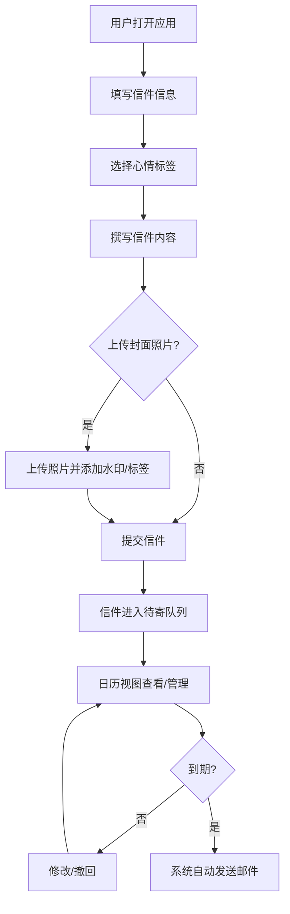

## 1. 产品概述

时光慢递是一款数字时间胶囊应用，让用户给未来的自己或他人写一封数字信件，设定未来寄出日期，系统届时自动通过邮件送达。用户可在寄出前随时修改或撤回信件，并附上当天天气照片和心情标签作为时间胶囊封面。

- 核心价值：将此刻的情感封存，在未来某天重新唤醒，创造跨越时间的情感连接
- 目标用户：希望向未来传递心意的普通用户、纪念日提醒需求者、情感记录爱好者

## 2. 核心功能

### 2.1 用户角色
| 角色 | 注册方式 | 核心权限 |
|------|----------|----------|
| 普通用户 | 无需注册，直接使用 | 写信、查看待寄信件、修改/撤回信件 |

### 2.2 功能模块
1. **写信页面**：月相进度条、收件人/主题/日期表单、毛玻璃写信区、心情选择器
2. **照片上传**：拖放/点击上传封面照片、自动添加日期水印和心情标签
3. **日历视图**：按月查看待寄信件、光点标记、点击预览信件详情
4. **信件管理**：修改信件内容、撤回信件（7天回收站保留）

### 2.3 页面详情
| 页面名称 | 模块名称 | 功能描述 |
|----------|----------|----------|
| 写信页面 | 月相进度条 | CSS动画从新月到满月循环，周期29.5天，背景#1A1A2E，月相颜色#F0E68C |
| 写信页面 | 表单区域 | 收件人邮箱、主题行、预期寄出日期（渐变圆角日期选择器，选中放大旋转0.3s） |
| 写信页面 | 写信区 | 毛玻璃textarea，宽70%，焦点时紫色发光阴影 |
| 写信页面 | 心情选择栏 | 四个圆形按钮（快乐#FFD93D、平静#78C2AD、忧伤#A29BFE、思念#FF6B6B），选中缩放1.2倍跳动 |
| 写信页面 | 照片上传 | 200x200虚线框上传区，拖入闪烁两次，添加日期水印和心情标签 |
| 日历视图 | 月历网格 | 按月展示日历，有待寄信件日期显示渐变光点 |
| 日历视图 | 信件预览卡片 | 300px宽，暗色背景，悬停上移4px加深阴影，含撤回按钮 |
| 信件管理 | 撤回确认弹窗 | 毛玻璃背景，抖动动画0.1s警示 |
| 信件管理 | 修改功能 | 在预览卡片中直接修改信件内容并保存 |

## 3. 核心流程

用户打开应用 → 填写收件人邮箱和主题 → 选择预期寄出日期 → 选择心情标签 → 撰写信件内容 → 可选上传封面照片（自动添加水印和标签）→ 提交信件进入待寄队列 → 在日历视图中查看/管理信件 → 到期系统自动发送邮件 → 寄出前可修改或撤回

## 4. 用户界面设计

### 4.1 设计风格
- 主色调：深蓝黑#1A1A2E，文字#E0E0E0
- 按钮风格：紫色渐变（#6C5CE7到#A29BFE），暖色点缀#FF6B6B
- 字体：正文使用系统无衬线字体，标题使用细体营造柔和感
- 布局风格：居中布局，卡片式内容展示
- 动画过渡：统一0.3s cubic-bezier(0.4, 0, 0.2, 1)

### 4.2 页面设计概览
| 页面名称 | 模块名称 | UI元素 |
|----------|----------|--------|
| 写信页面 | 月相进度条 | CSS动画，新月到满月循环，#1A1A2E背景，#F0E68C月相色 |
| 写信页面 | 日期选择器 | #FF6B6B到#FFD93D渐变圆角按钮，选中放大旋转0.3s ease |
| 写信页面 | 写信区 | 毛玻璃textarea，70%宽，焦点#6C5CE7发光阴影 |
| 写信页面 | 心情按钮 | 四色圆形按钮，选中1.2倍缩放跳动 |
| 写信页面 | 照片上传 | 200x200虚线框#A29BFE，拖入变实线闪烁两次 |
| 日历视图 | 光点标记 | #FF6B6B到#4ECDC4渐变动画 |
| 日历视图 | 预览卡片 | 300px宽，#2D2D44背景，悬停上移4px |
| 信件管理 | 撤回按钮 | #E53935红色，确认弹窗毛玻璃+抖动0.1s |

### 4.3 响应式设计
- 桌面优先设计，移动端自适应
- 移动端写信区宽度70% → 90%
- 移动端日历视图改为纵向列表
- 移动端所有卡片边距缩小为8px

### 4.4 性能要求
- 页面加载完成时间不超过2秒
- 信件列表滚动流畅60FPS
- 动画帧率保持一致
