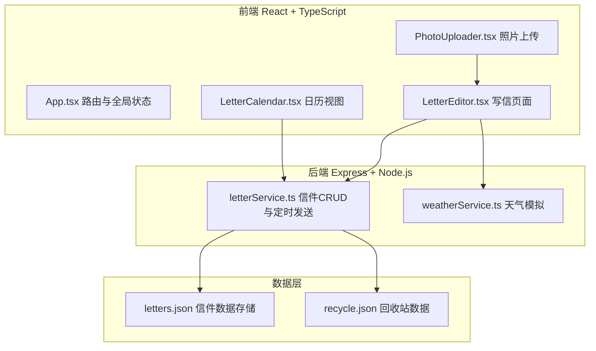
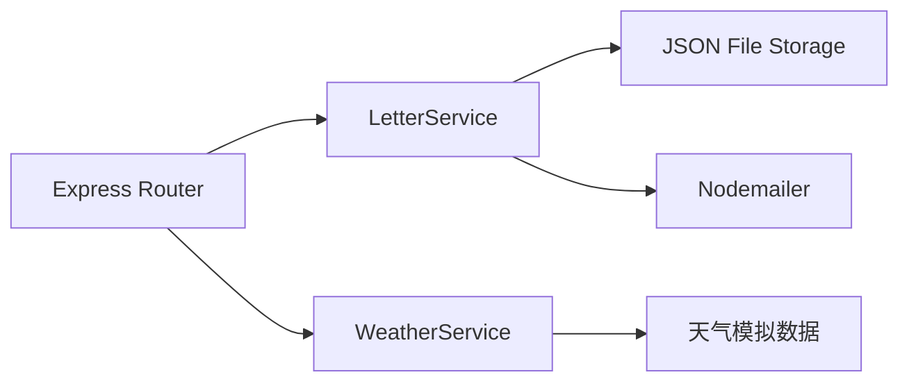
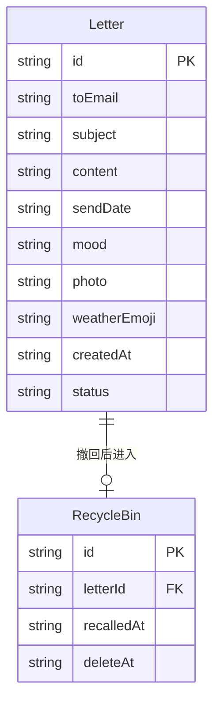

## 1. 架构设计



## 2. 技术说明
- 前端：React@18 + TypeScript + Vite + Zustand
- 初始化工具：vite-init (react-express-ts 模板)
- 后端：Express@4 + TypeScript
- 数据库：JSON文件存储（letters.json, recycle.json）
- 构建工具：Vite

## 3. 路由定义
| 路由 | 用途 |
|------|------|
| / | 写信主页面（月相进度条、表单、心情选择器） |
| /calendar | 日历视图，查看待寄信件 |
| /preview/:id | 信件预览（从日历点击进入） |

## 4. API定义

### 4.1 信件相关
```typescript
interface Letter {
  id: string;
  toEmail: string;
  subject: string;
  content: string;
  sendDate: string;
  mood: 'happy' | 'calm' | 'sad' | 'miss';
  photo?: string;
  weatherEmoji: string;
  createdAt: string;
  status: 'pending' | 'sent' | 'recalled';
}

// POST /api/letters - 创建信件
// Body: { toEmail, subject, content, sendDate, mood, photo? }
// Response: Letter

// GET /api/letters - 获取所有待寄信件
// Response: Letter[]

// GET /api/letters/:id - 获取单个信件
// Response: Letter

// PUT /api/letters/:id - 修改信件
// Body: Partial<Letter>
// Response: Letter

// DELETE /api/letters/:id - 撤回信件（移至回收站）
// Response: { success: boolean }

// GET /api/letters/recycle - 获取回收站信件
// Response: Letter[]
```

### 4.2 天气相关
```typescript
// GET /api/weather - 获取模拟天气
// Response: { emoji: string, description: string }
```

### 4.3 照片上传
```typescript
// POST /api/upload - 上传照片
// Body: FormData (multipart/form-data)
// Response: { url: string }
```

## 5. 服务端架构图



## 6. 数据模型

### 6.1 数据模型定义



### 6.2 数据存储
- 信件数据存储于 `data/letters.json`
- 回收站数据存储于 `data/recycle.json`
- 定时任务每分钟检查待寄信件，到期则触发邮件发送
- 回收站信件7天后自动删除
